# Back in Canada - 1 Apr 2024

* cyrsullivan
* May 9, 2024
* 2 min read

Updated: Sep 28, 2025

After 6 months enjoying Australia, we boarded our flight to Vancouver. Upon touchdown, we headed off to rouse our car from it's six month slumber. With much enthusiasm, it sprung to life and spirited us away. Unfortunately, the slight cold I thought I had left in Sydney returned with a vengeance. Our Pacific Northwest Tour was put on hold while I slept away the early part of April.

Finally, in mid-April, we motored south to Seattle and checked into the newly minted Sonder's hotel located next to the Starbucks Flagship Roastery, very Seattle. We passed the time exploring the downtown neighbourhoods on foot. We also strayed a little farther out to Ballard, a lovely area with a vibrant Sunday Street Market. The nearby Hiram M Chittenden Locks were also worth the visit.

Sidewalk plaque near Pier 50 Seattle Dock

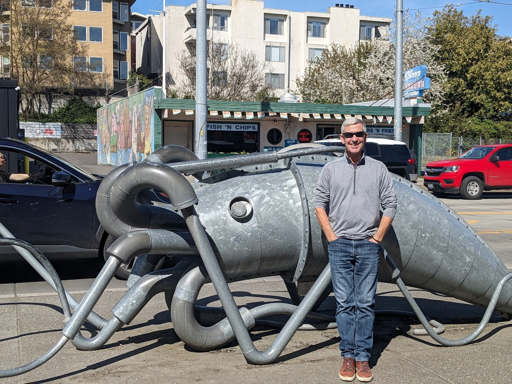

Street art in Ballard

With Seattle in the rear-view mirror, we ventured west to Lake Quinault in the Olympic National Forest. A beautiful secluded area with a smattering of accommodations, the region is littered with lovely trails throughout the only Temperate Rain Forest in the USA. We hunkered down at the Rain Forest Resort, in a basic room with sweeping views of the lake and nearby mountains. Our two day visit was definitely too short.

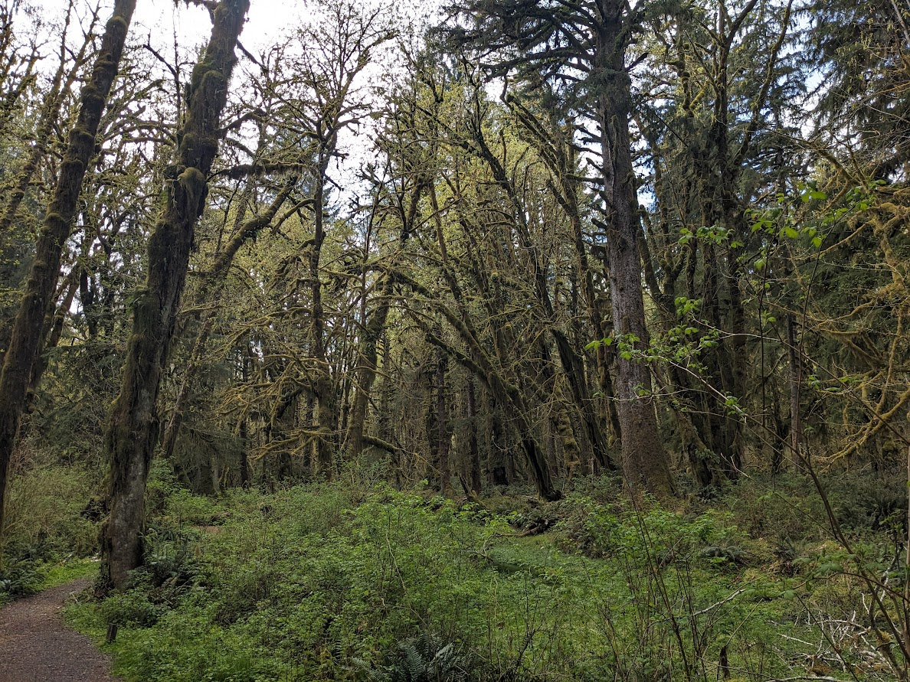

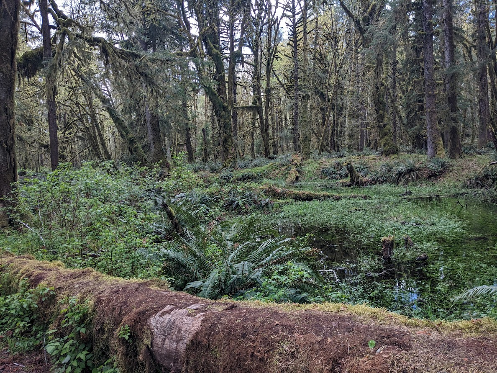

Pics from our walks through the breathtaking and serene rain forest near Lake Quinault

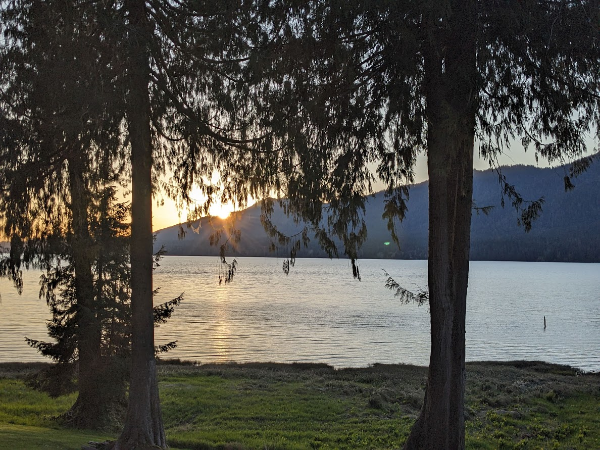

View of Lake Quinault from our window at Rain Forest Resort

Next stop was Port Angeles, a jumping off point for the nearby Olympic National Park. On our way, we stopped for a marvellous hike to Marymere Falls, adjacent to Lake Crescent. Unfortunately, our plans to hike in Olympic Park were thwarted as snow still covered most of the higher altitude trails. That said, the drive up and down the mountain was spectacular.

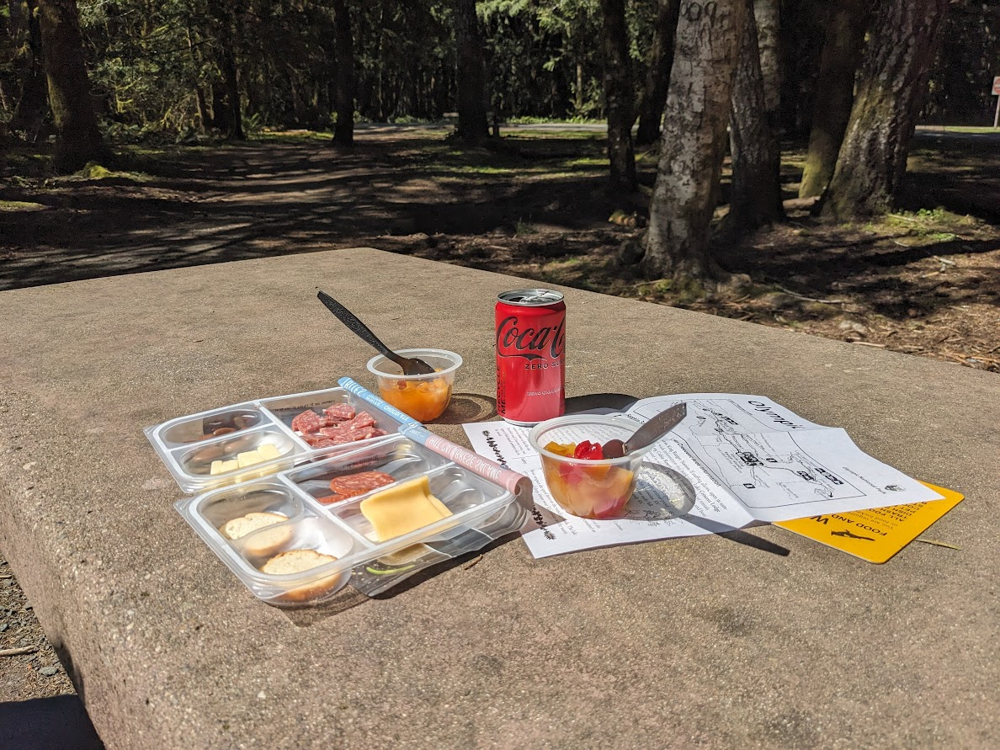

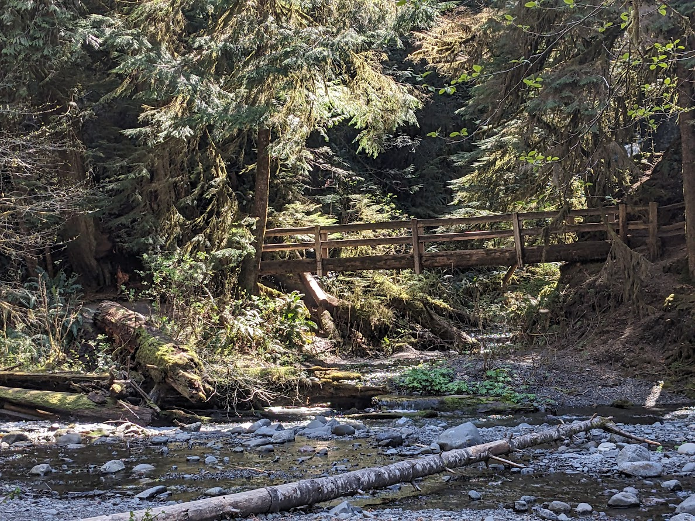

A healthy snack before hiking to Marymere Falls near Port Angeles

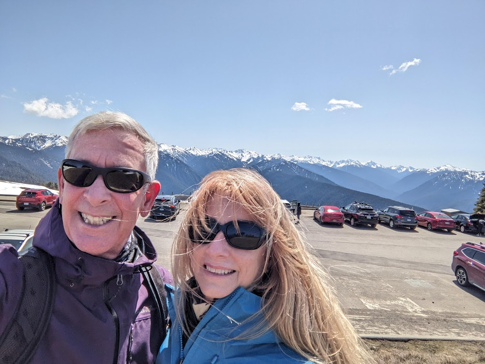

View from the windy Hurricane Ridge Visitor Centre in Olympic National Park

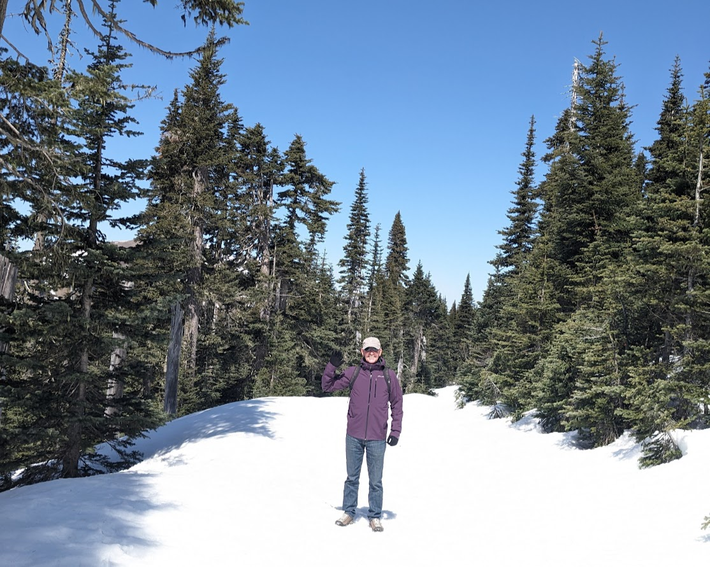

Sporting only hiking shoes, our outing was easily foiled by the persistent snow.

Port Angeles was followed by Port Townsend. A pretty coastal village chock a block full of restaurants, coffee shops and art galleries. We spent two nights at the Steven King-esque Manresa Castle Hotel (reportedly haunted) while we explored the area. Port Townsend also serves as the terminus for the Whidbey Island ferry, which we boarded for an early morning crossing. We spent the day touring the southern part of the island, enjoying breakfast in Langley (too cute!) and hiking a number of short trails. The evening was spent at the Captain Whidbey Inn, a historic log cabin on the shore of Penn Cove. Without doubt, a step back in time.

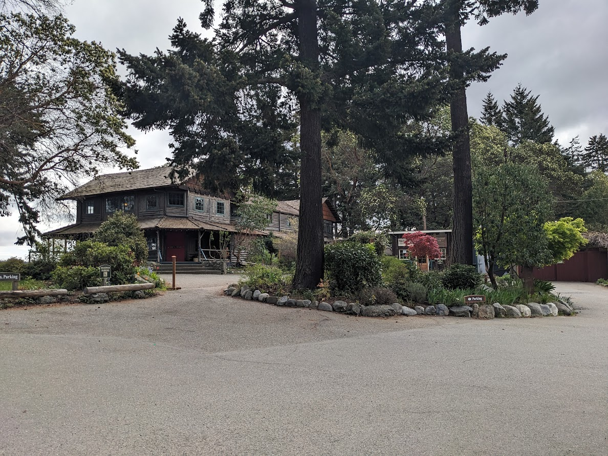

Captain Whidbey Inn. Memories of a bygone era.

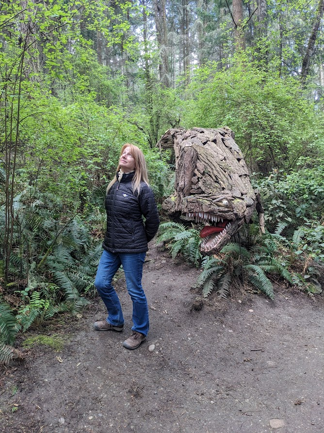

Price Sculpture Forest near Captain Whidbey Inn (not worried about snakes anymore!)

From there, we packed up and returned to North Vancouver where we passed a few rainy days before my brother Brian arrived to join us for a week of hiking, golfing and skiing in Whistler. Before we knew it, we were waving Brian goodbye as we headed for Kitsilano where we'll spend the month of May in a lovely Airbnb on West Broadway.

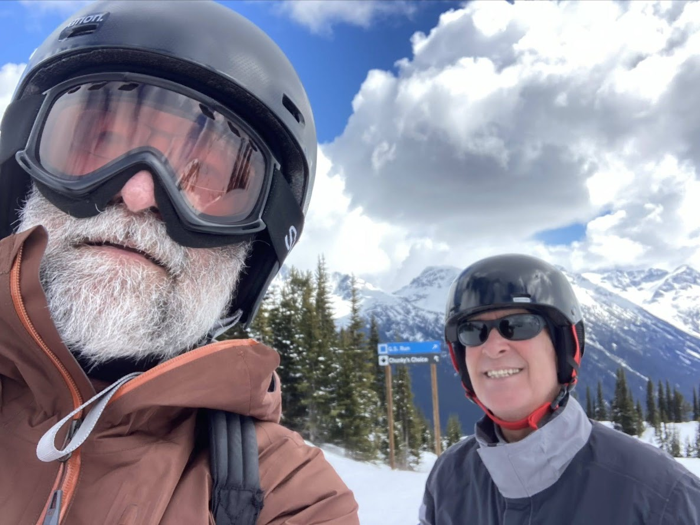

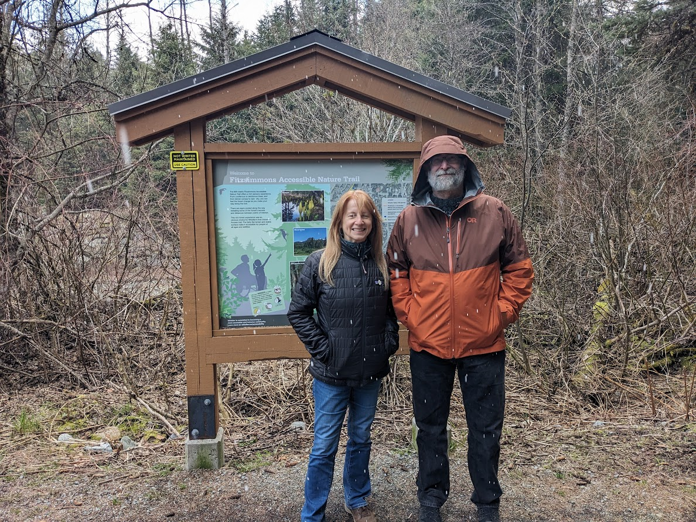

Skiing and hiking in Whistler