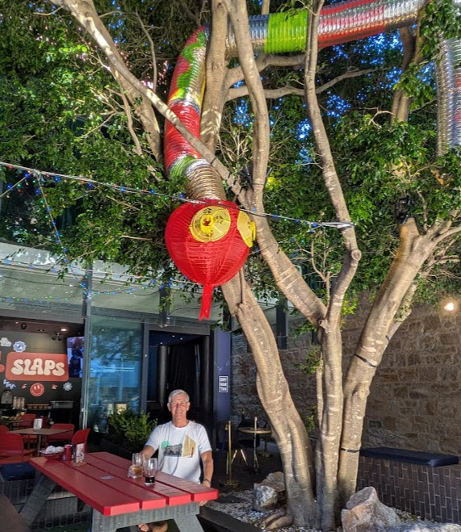
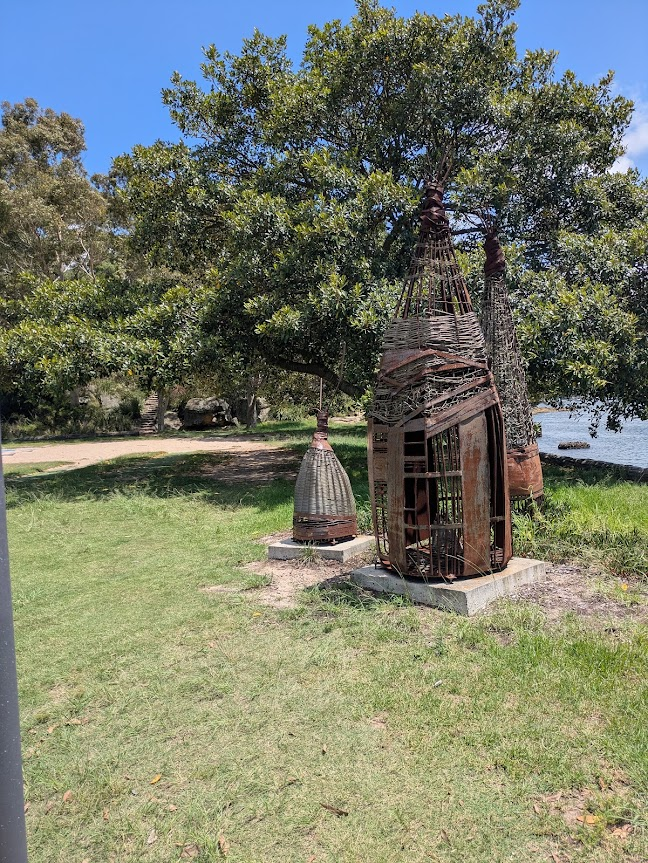
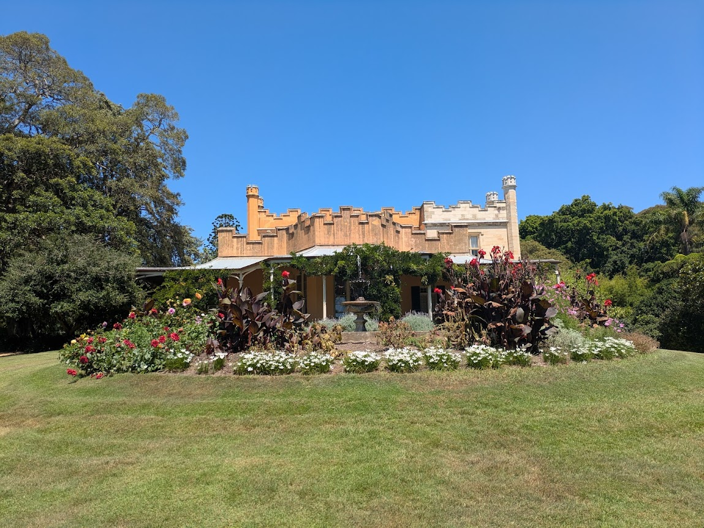
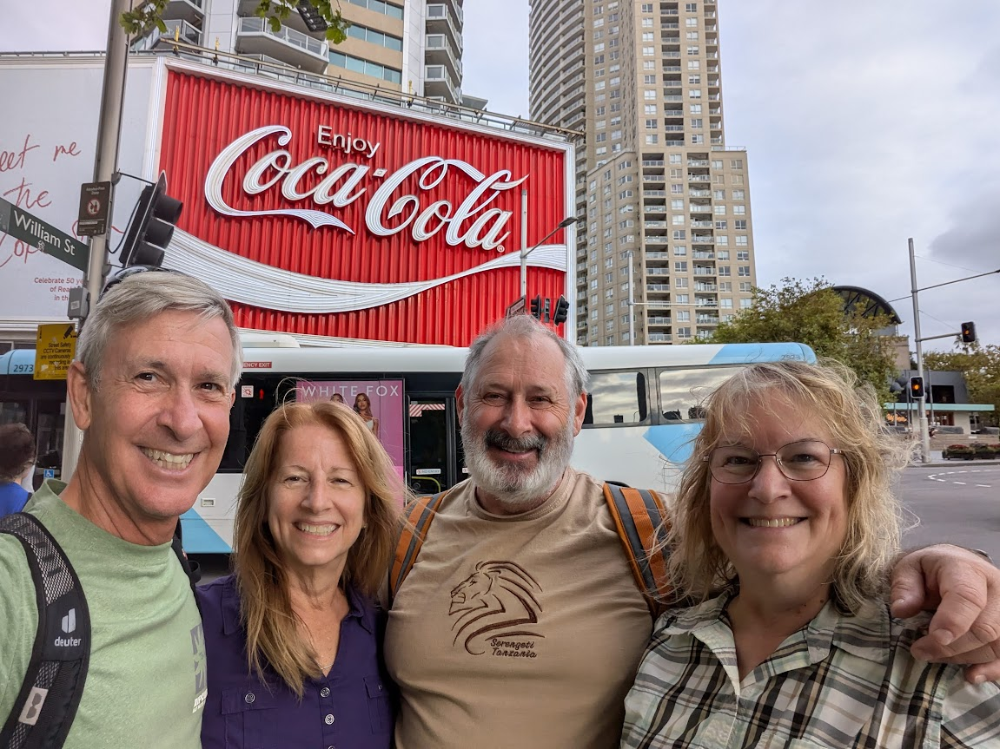
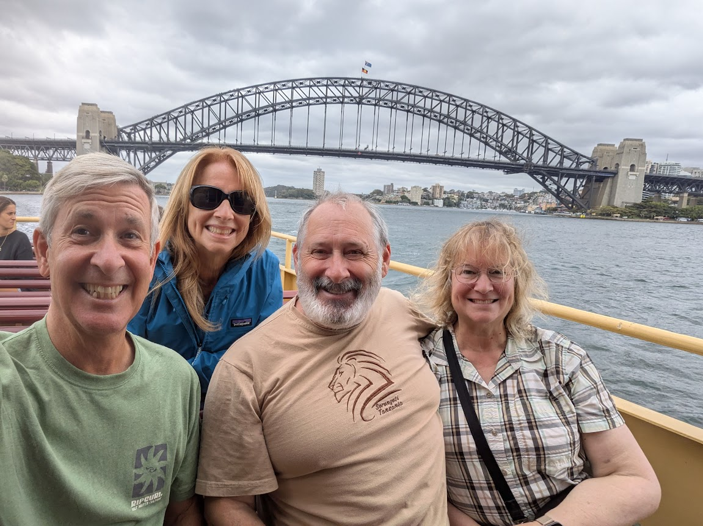

# Back in Potts Point, Sydney - Jan/Feb 2025

* cyrsullivan
* Mar 6, 2025
* 2 min read

Updated: Oct 2, 2025

Following an exciting month in South America and a smooth flight over the South Pacific, we  arrived back in Sydney, Australia. As planned, we headed to Potts Point, one of our favourite eclectic neighbourhoods, and spent a month revisiting many of the sites and hikes we explored last winter. Alongside our well-known itinerary, we attended performances of Hamilton and the newest version of Jesus Christ Superstar, both of which were outstanding.

Connecting with family and friends while travelling is always a delight. In this case, we had the pleasure of spending a few days with Sandy's sister and brother-in-law, Anne and Fred, as they visited Sydney during their Australia/New Zealand vacation. We all had a wonderful time exploring the botanical gardens, touring Sydney Harbour, hiking the cliffs north of Bondi Beach, and rambling about the city.

After enjoying a few days with Anne and Fred, they set off to continue their adventure, while Sandy and I travelled south to Tasmania.

We once more enjoyed the energy of the Sydney's Lunar New Year celebration, the biggest outside of China. This year marks the Year of the Snake.

During our walk along the Rozelle Waterfront, we came across a fascinating sculpture commissioned by the Gadigal Wangal Wayfinding Project. Created by Edward Clarke, the sculpture represents fish traps traditionally used by the Aboriginal Torres Strait Islanders.

The gardens surrounding Vaucluse House. This 19th-century mansion, once the residence of statesman William Charles Wentworth and his family, now serves as a museum and a tranquil picnic location.

While hiking from Vaucluse House to Rose Bay, we decided to stop for a swim at Shark Beach in Shark Bay. At first, the name struck us as odd for a public beach, but the presence of a Shark Net soon clarified that "Shark Beach" was indeed fitting.

After a full day of exploring Sydney, we stopped for a quick family snap in front of the iconic Giant Coke sign in Potts Point.

Throughout their visit, we enjoyed several crossings of the Sydney Harbour as we navigated around the city. It's a fantastic way to see Sydney from the water. Next stop, Tasmania.