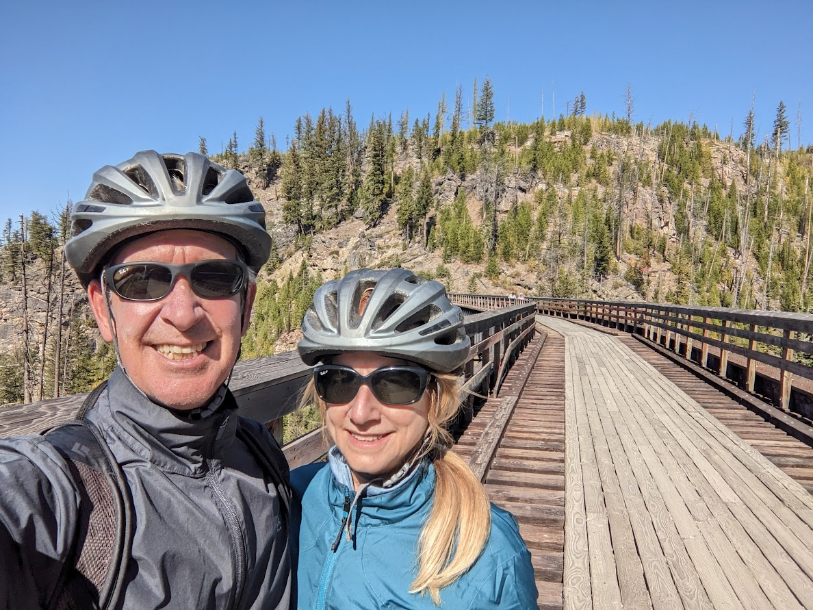

# Canadian Rockies - 17 to 21 Sept

* cyrsullivan
* Sep 27, 2023
* 1 min read

Updated: Oct 2, 2025

It's time to head north. On Tuesday we crossed back into Canada to finish our Wagons West tour through the Canadian Rockies. We spent the first couple of days in Kimberly, hiking and enjoying lattes before moving on to Nelson, BC. Nelson, a hidden jewel in the West Kootenays, is home to a vibrant downtown with classic hotels, indie coffee shops and a thriving restaurant scene. We stayed at the wonderful String Suites Hotel, a lovely place to lay your head if visiting Nelson [https://www.stirlingsuites.com/).](https://www.stirlingsuites.com/) I would be remiss if I didn't mention Oso Negro Cafe (<https://osonegrocoffee.com/>). An amazing space to enjoy a coffee.

From Nelson we headed west to Kelowna where we rented bikes and cycled the Myra Canyon Trestles trail. A 22 km out and back, the ride has spectacular views of the Myra Canyon. (<https://www.bcrailtrails.com/rail-trail/myra-canyon>)

.