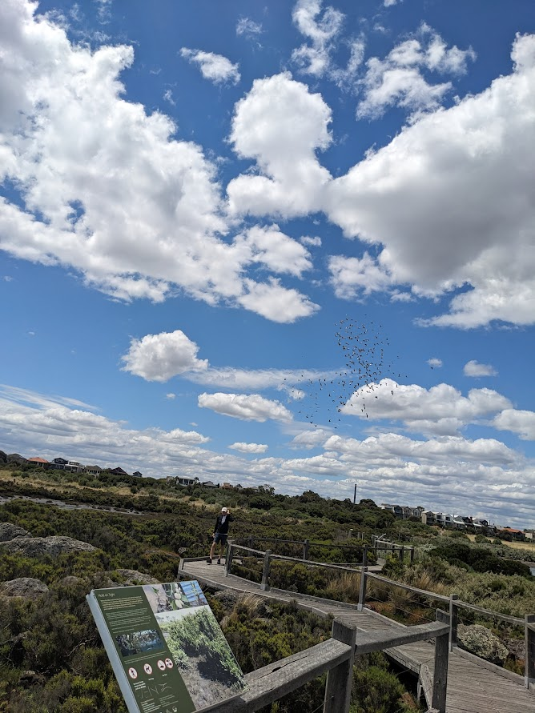
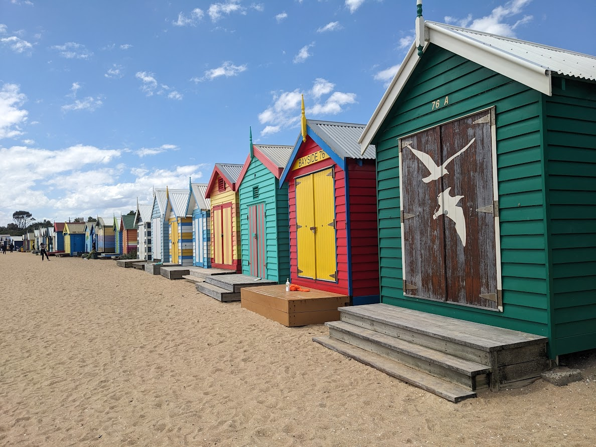
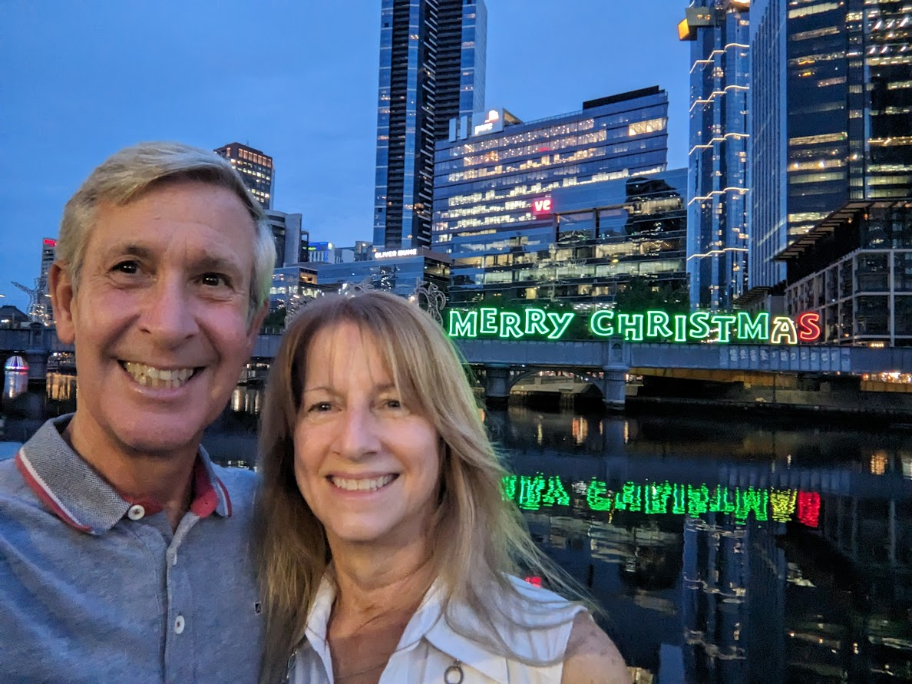

# Christmas in Melbourne

* cyrsullivan
* Dec 23, 2023
* 2 min read

Updated: Oct 2, 2025

It's been a few weeks since we arrived in Melbourne. We’re currently residing in Richmond,a neighbourhood just east of the Central Business District (CBD). It’s similar to Ottawa’s Hintonburg, with the proximity of the bustle of the ByWard Market. Melbourne is a sprawling city of ~5 million. It’s centre clusters around the Yarra River and all its tributaries, while south of the city it’s beach side suburbs hug Port Phillip, a large “bay’ with a bounty of beaches and active wetlands. Like Sydney, much of Melbourne’s river banks and bay shoreline offer walking, hiking and bike paths. So far, this is where we’ve been spending much of our time. Also like Sydney, Melbourne's extensive public transit system allows us to easily access its trails.

Some of the highlights include the Yarra River Trail (<https://www.alltrails.com/trail/australia/victoria/main-yarra-trail>) the Darebin Creek Trail (<https://www.alltrails.com/trail/australia/victoria/darebin-creek-trail>) and The Hobsons Bay Trail (<https://www.alltrails.com/trail/australia/victoria/hobsons-bay-coastal-trail-full-route>). These extensive trail systems offer days of exploration. Of note, the trail in the Yarra River Park meanders through a Flying Fox Bat colony. The colony has anywhere from 15 to 50 thousand bats, hanging from the tress along and above the ~1 km of trail. Makes for an interesting walk.

The ever present snake warning sign found on most of the city trails. So far, no sightings!

The active wetlands along the The Hobsons Bay Trail, where we saw pelicans and a large number of black swans

The beautiful Brighton Beach Bathing Boxes

So Christmas, is it different down-under? The short answer, yes. With a 9 pm sunset and 23℃ temperatures, city streets lined with Christmas light are practically non-existent and street corner Santa's are also absent, likely too warm for the suit. There are Christmas trees about and a plethora of scantily clad Santa's or his missus dotting the beaches and patios throughout the city. Never under estimate the magic of a white Christmas. All that aside, Christmas down under in shorts and a t-shirt definitely has its charm.

The spirit of an Aussie Christmas captured on a bus stop poster.

