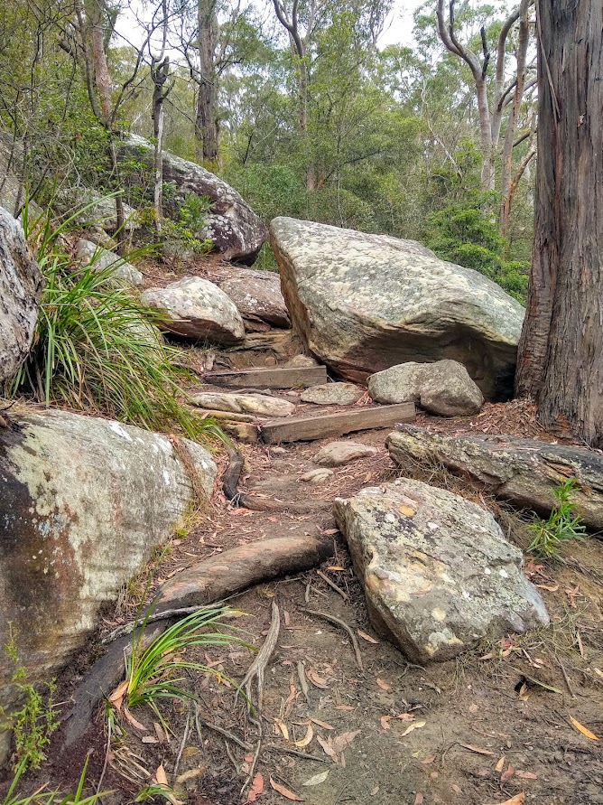
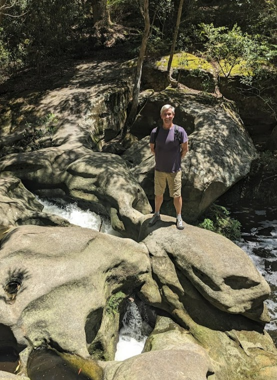
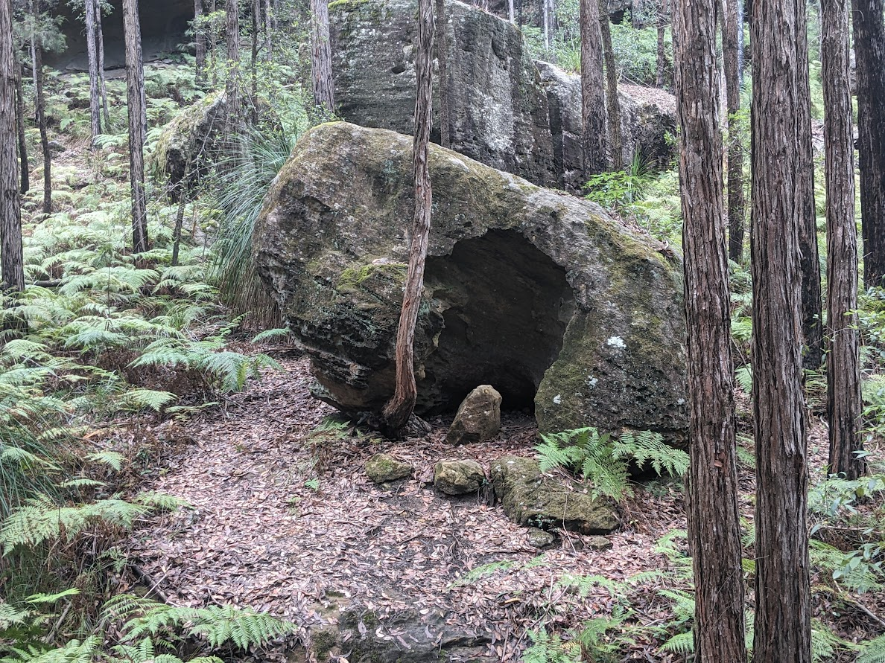
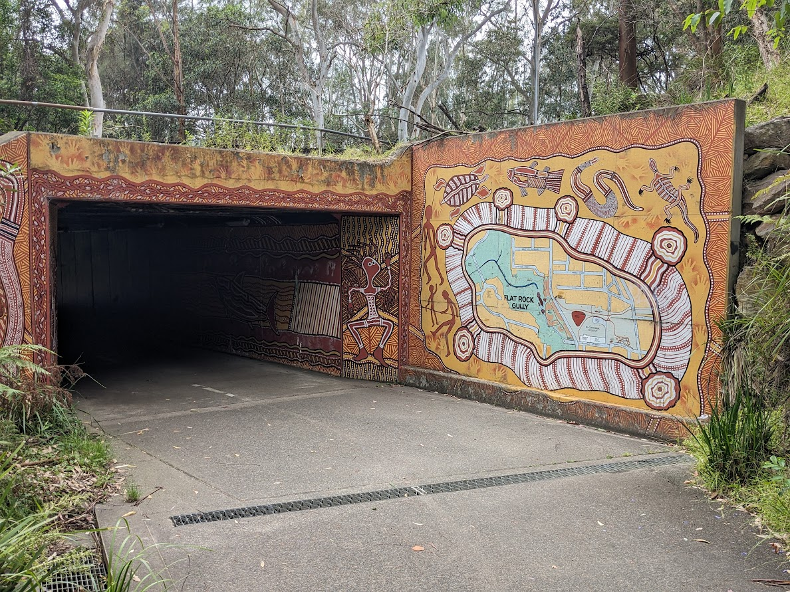
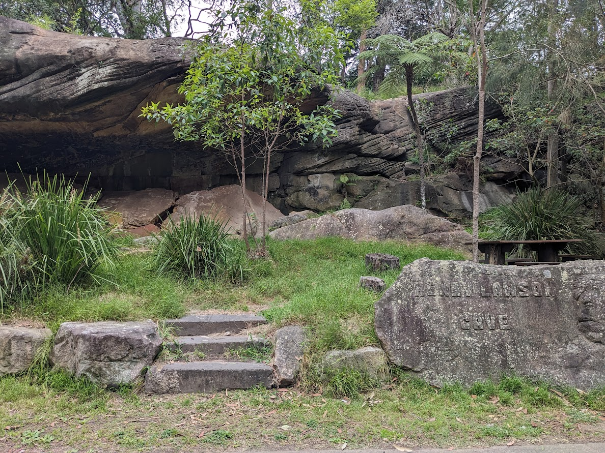
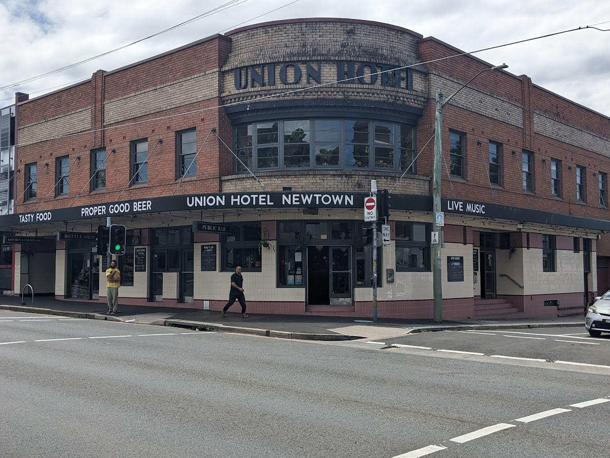
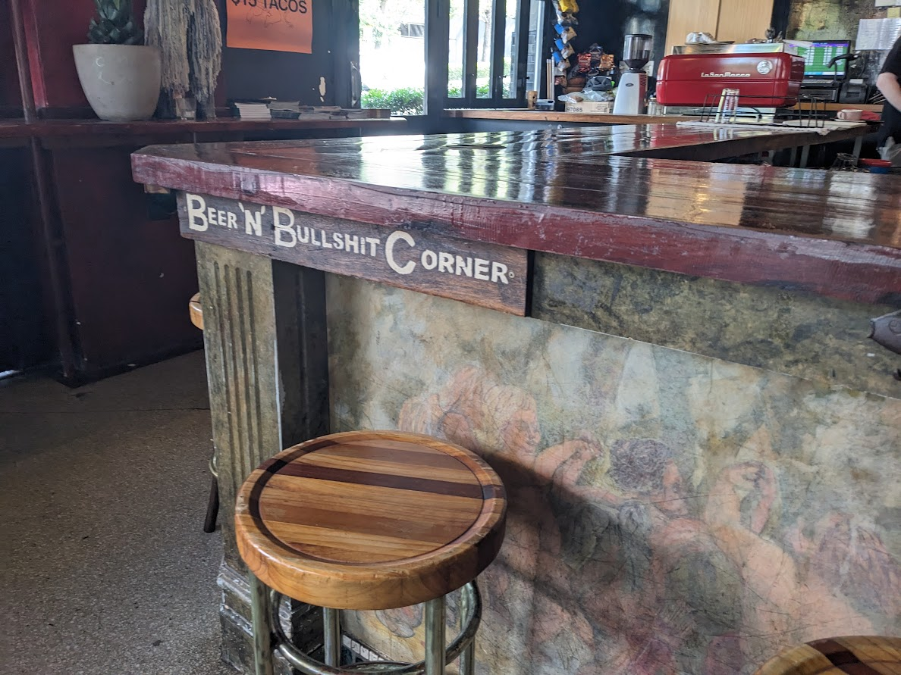
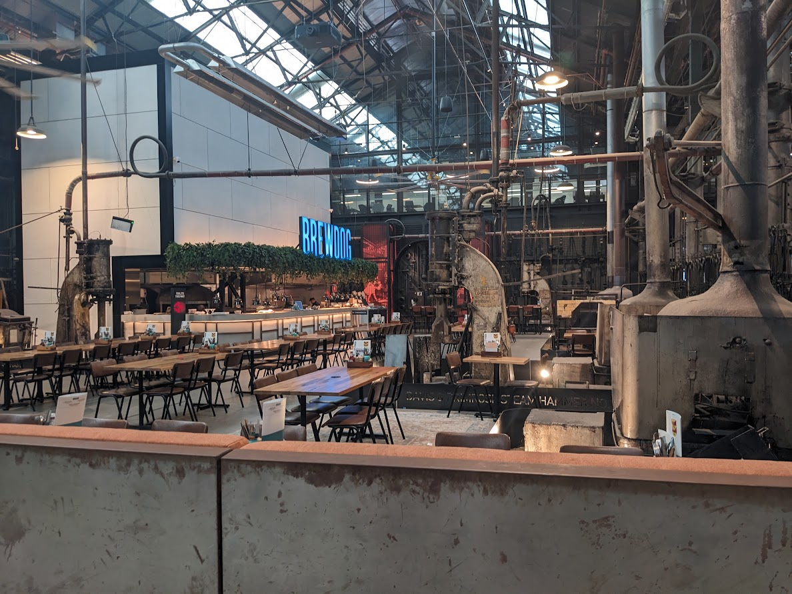
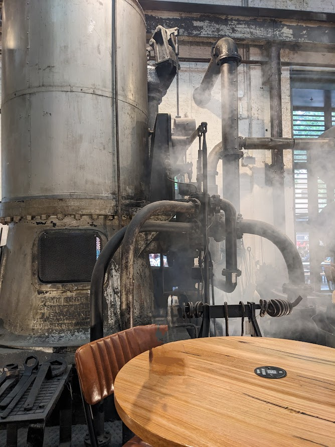
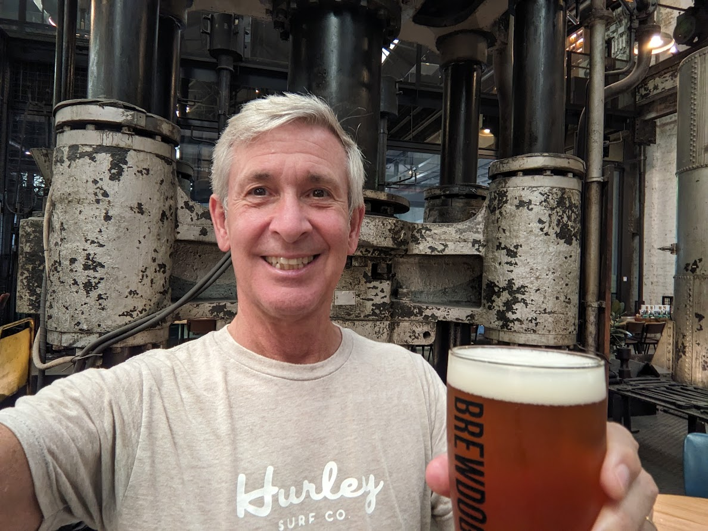

# Farewell Sydney - 28 November 2023

* cyrsullivan
* Nov 29, 2023
* 2 min read

Updated: Oct 2, 2025

Well, we've been in Sydney for two months and it's been just super. The city is a bustling metropolis with an eclectic mix of cultures, architecture, and public green spaces. Throughout the downtown and clustered around suburban subway stops, we discovered cool neighbourhoods full of shops and restaurants waiting to be explored.

As discussed in some of our earlier posts, Sydney and its surroundings are chock a block full of hikes and walks. Here are a few more we enjoyed that are worth mentioning:

***Lane Cove National Park*** (<https://www.nationalparks.nsw.gov.au/visit-a-park/parks/lane-cove-national-park>). Here we found a secluded bushland track that follows a meandering river full of a variety of fish. It even had a fish ladder. Along the way we were accompanied by the sound of kookaburras, cockatoos and lorikeets overhead.

***Blue Gum Walk*** (<https://discoverhornsby.com/walking/blue-gum-walk/>). This walk was well outside the city centre, but is accessible by public transit. It's a great walk with sweeping views of the forest valley below. You feel miles away from the bustle of the city.

***Artarmon Reserve and Flat Rock Gully Walk*** (<https://www.visitsydneyaustralia.com.au/WalkingTrackFlatRock.pdf>). This is an inner city bush walk along a combination of bike paths and single track trails. The Flat Rock Gully ravine was once a garbage tip back in the mid 20th century but has been reclaimed and is now a dense bushland escape. It was an interesting hike for sure.

Sydney has no shortage of vibrant neighbourhoods. Places like Potts Point, Surry Hills, Newtown, Glebe, and Darling Harbour in the city centre are absolutely worth a peek. But as we ventured father afield in search of hiking trails, neighbourhoods like Hunters Hill, Rozelle, Leichhardt, and Marrickville were a treat to discouver.

One element common to most neighbourhoods we visited was ever present corner pub. Often the heart of the community, they're a grand place for a pint, a bite, conversation and often some local music.

With the weather usually sunny and comfortable, we didn't visit as many museums as we'd hoped. A few we did visited are: The Australian Museum (<https://australian.museum/>), The Powerhouse Museum (<https://powerhouse.com.au/>) and The Vaucluse House (<https://mhnsw.au/visit-us/vaucluse-house/>).

Although not a museum, the South Eveleigh Foundry (<https://thegrounds.com.au/south-eveleigh/>) was once a sprawling locomotive manufacturing plant that has since been repurposed as modern office space. Much of the original equipment/tools are displayed throughout the buildings that includes a hidden treat, the Brew Dog Brew Pub. The Foundry space was definitely worth the visit.

