# Flora, Fauna, Food and Fun - XV

* cyrsullivan
* May 11, 2025
* 1 min read

Updated: Oct 2, 2025

## FLORA

Tiger's Claw Tree flowering in the Sydney Botanic Garden

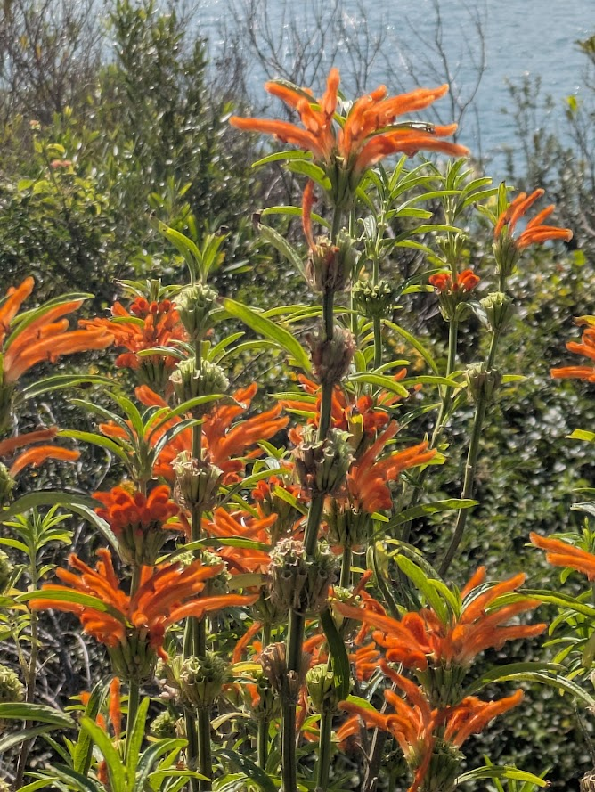

Lion's Claw plant also residing in the Sydney Botanic Garden

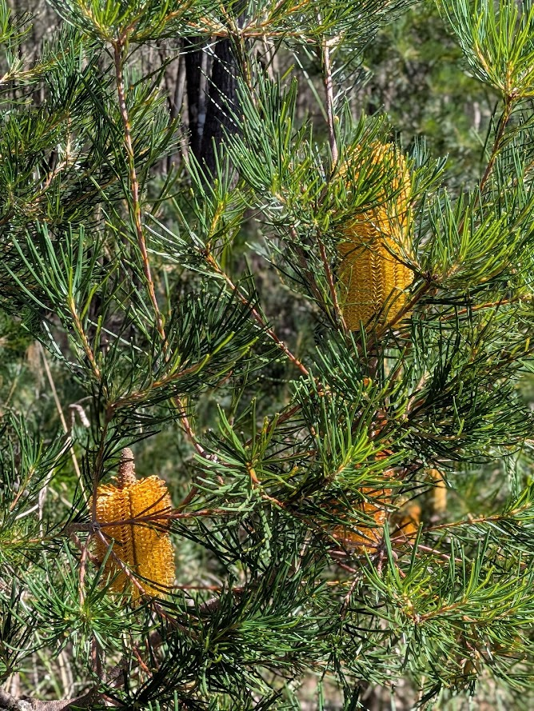

Banksia, the corn-on-the-cob of the Australian bush

## FAUNA

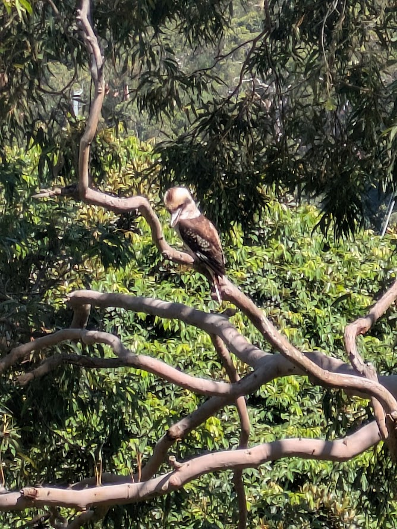

I've posted a Kookaburra before but this mullet hairdo and Blue Steel look deserves a spot here.

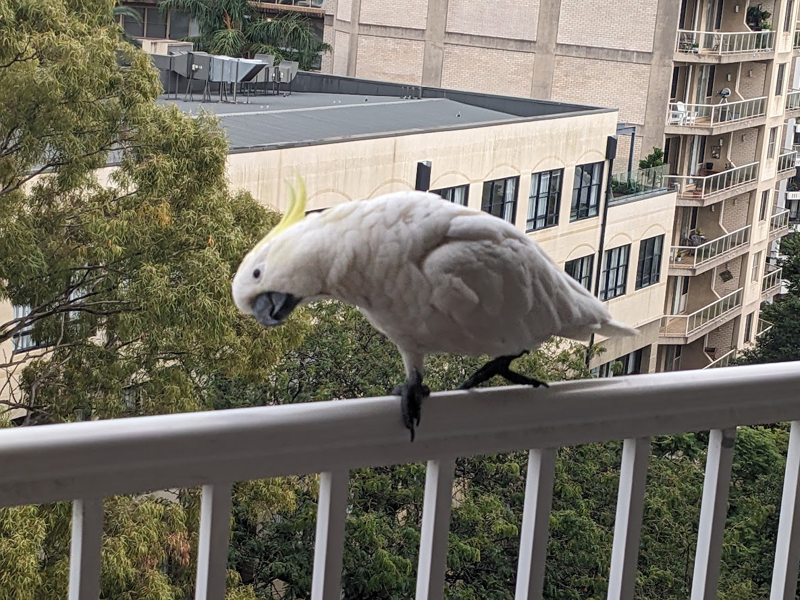

Big Buddy bird checking us out

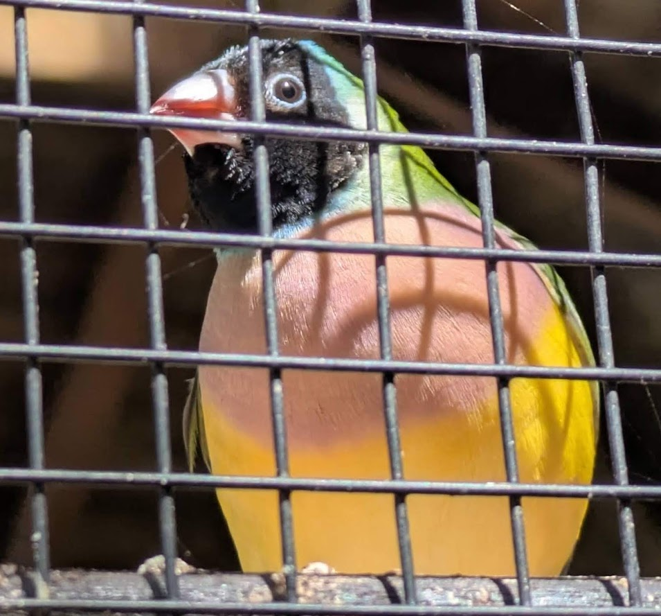

Australian Gouldian Finch

## FOOD

Enjoying a cappuccino and Portuguese tart at Toby Estate Roasters, voted ‘World’s Best’ coffee shop for 2025 by CNN Travel

## FUNNY

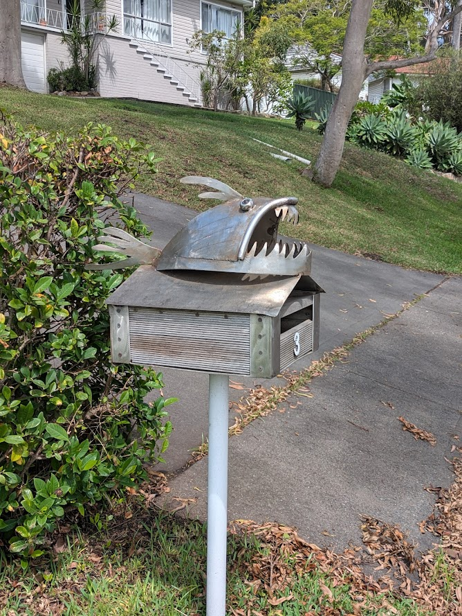

The Mailbox of Truth. Put your hand in its mouth if you honestly feel honest. Or just put mail in the slot.

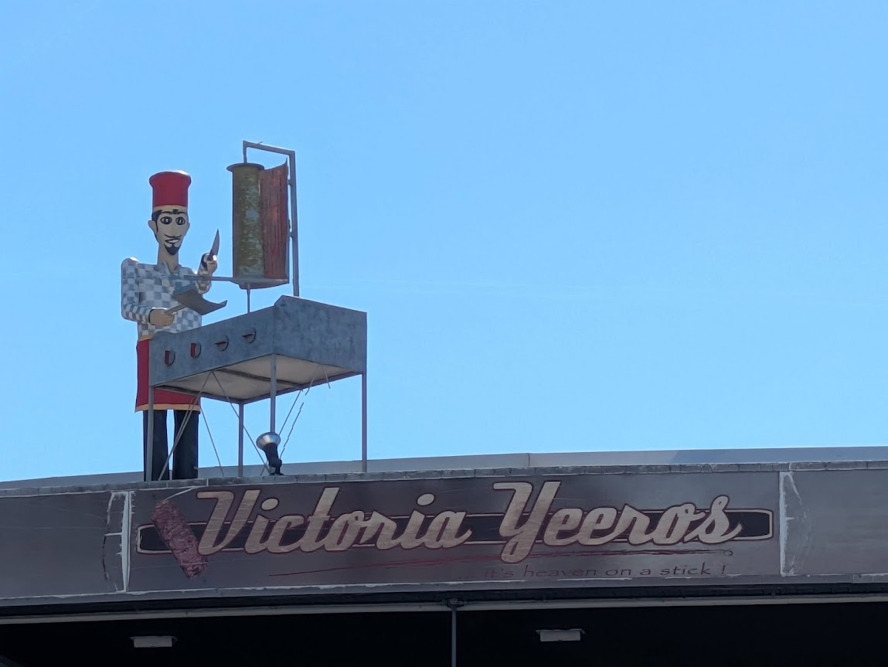

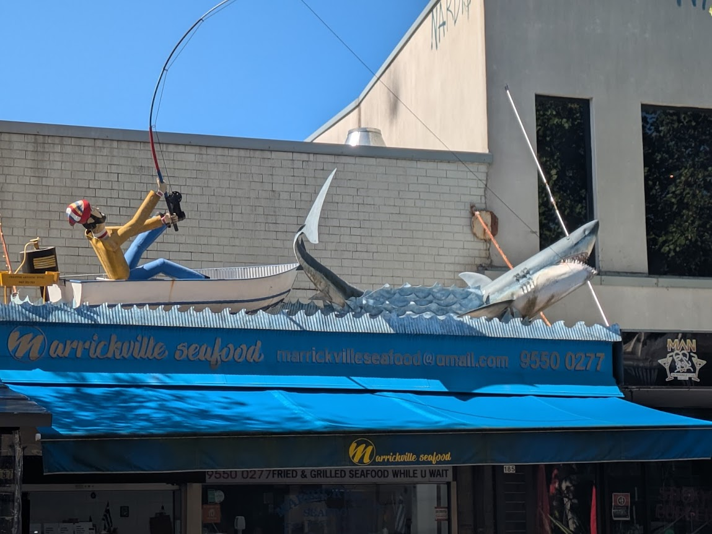

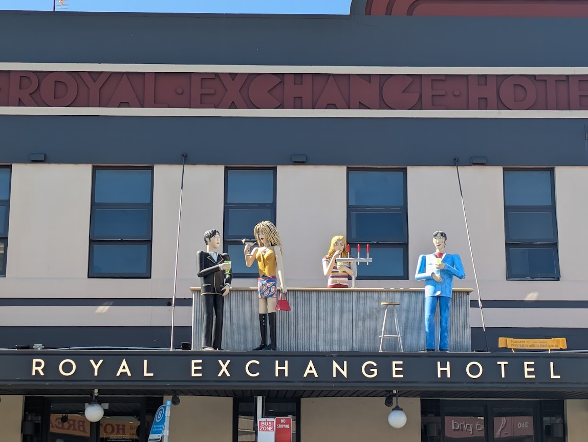

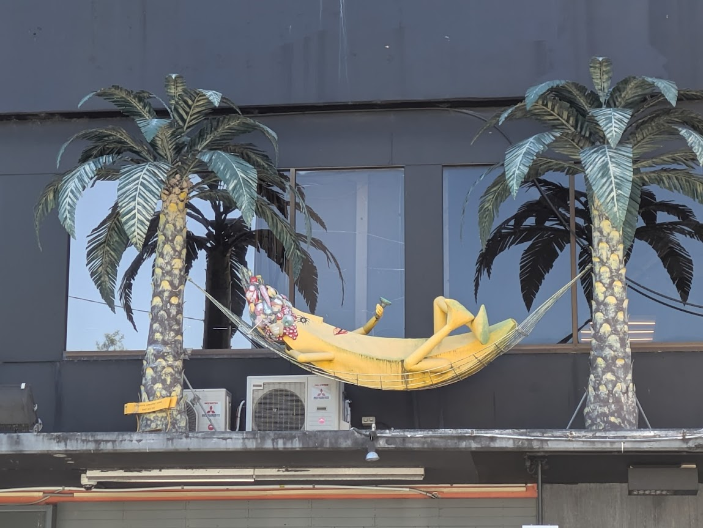

In Marrickville, a suburb of Sydney, art decorates the rooftops of buildings, promoting the products and services of the businesses below.

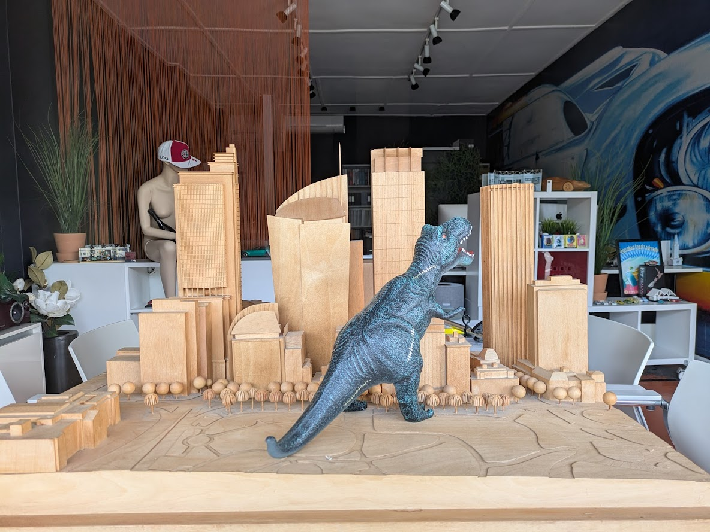

Caught this diorama in a shop window in Rozelle, a neighbourhood of North Sydney, "Godzilla Attacks Sydney". A harbinger of things to come in Asia?