# Flora, Fauna, Food and Funny IV

* cyrsullivan
* Apr 3, 2024
* 1 min read

Updated: Oct 2, 2025

## FLORA

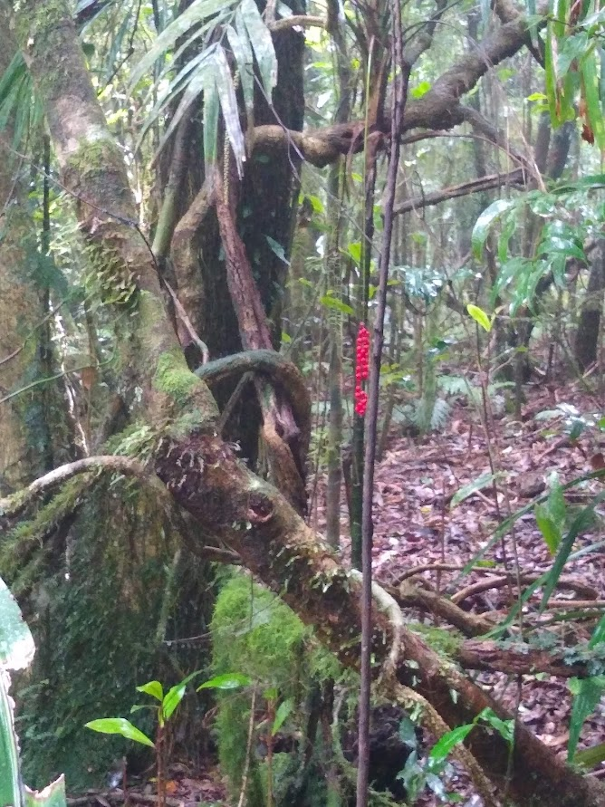

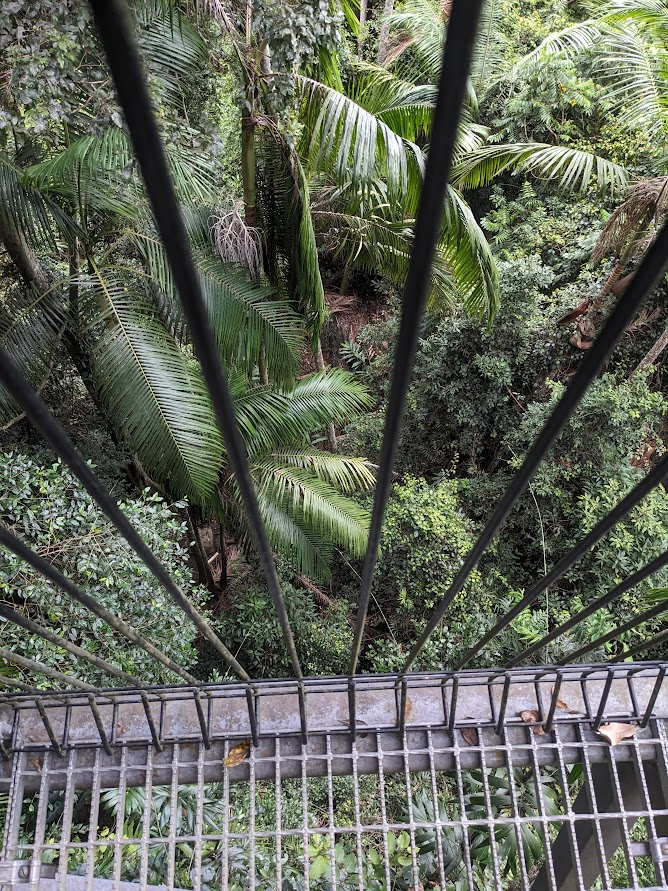

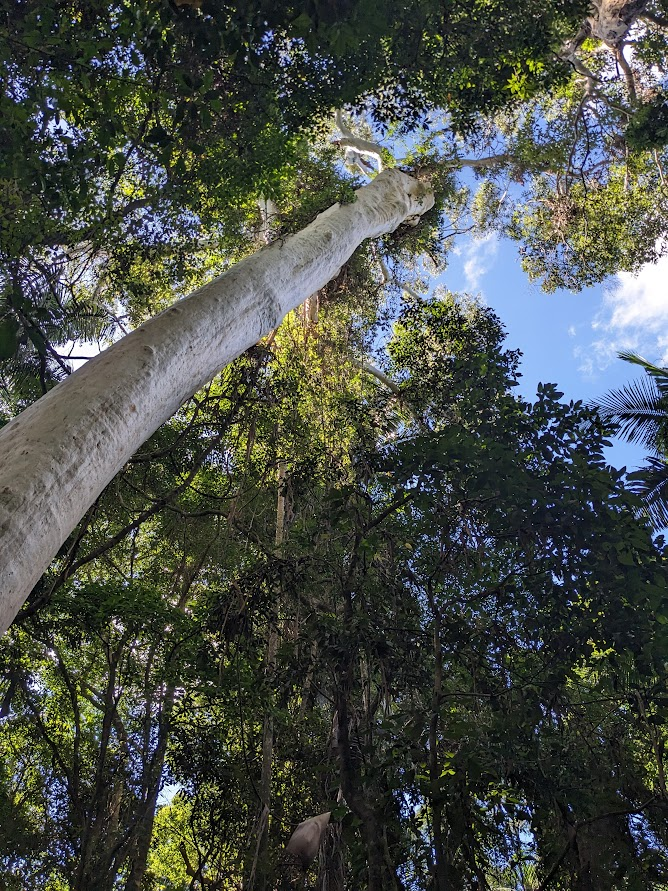

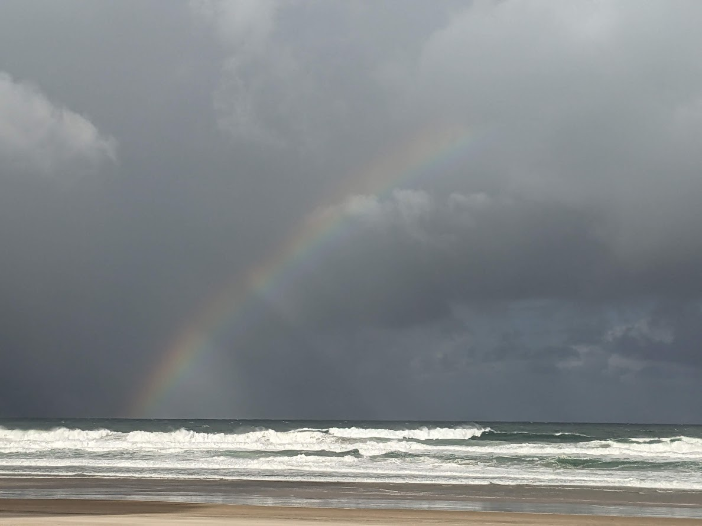

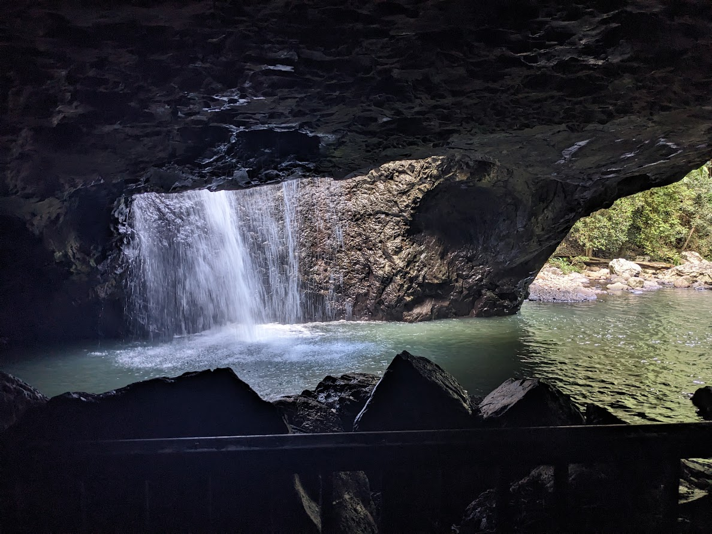

## FAUNA

...gone are the soft animals

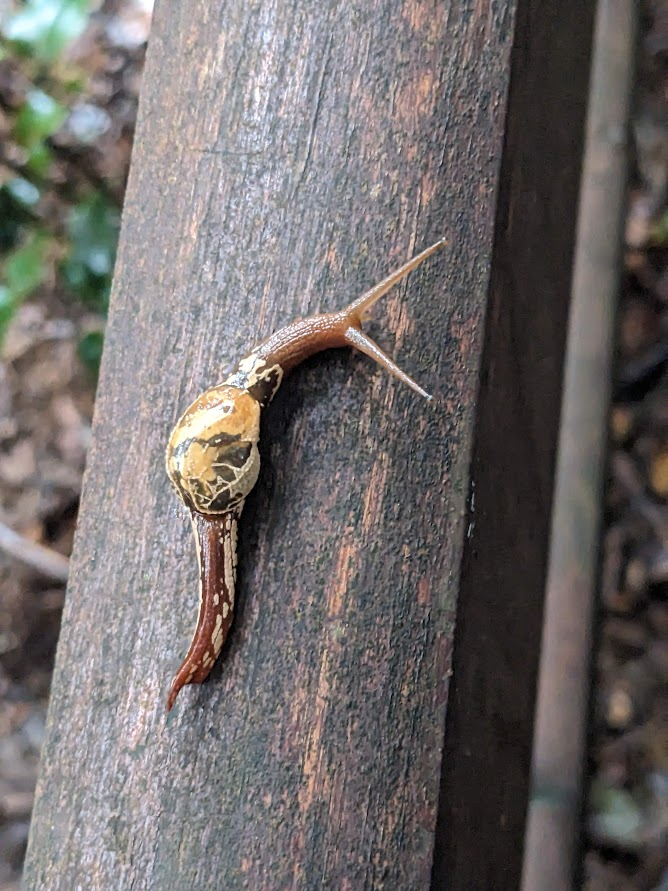

Land snail a.k.a. semi-slug Golden Orb

## FOOD

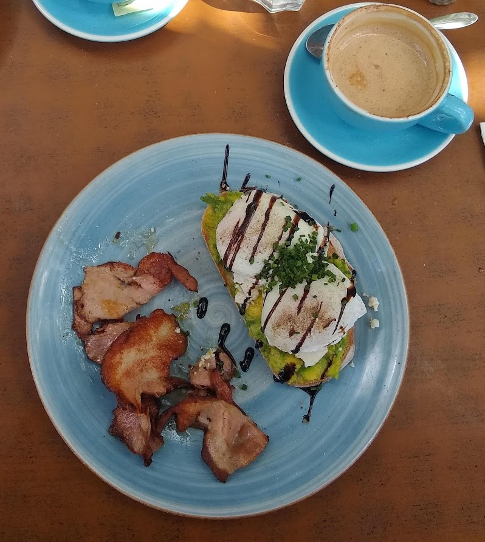

Terry's ongoing search for the ultimate eggs Benedict. I thought it

was chocolate, so I dipped in. NOT chocolate, vegemite! Wasn't the worst...

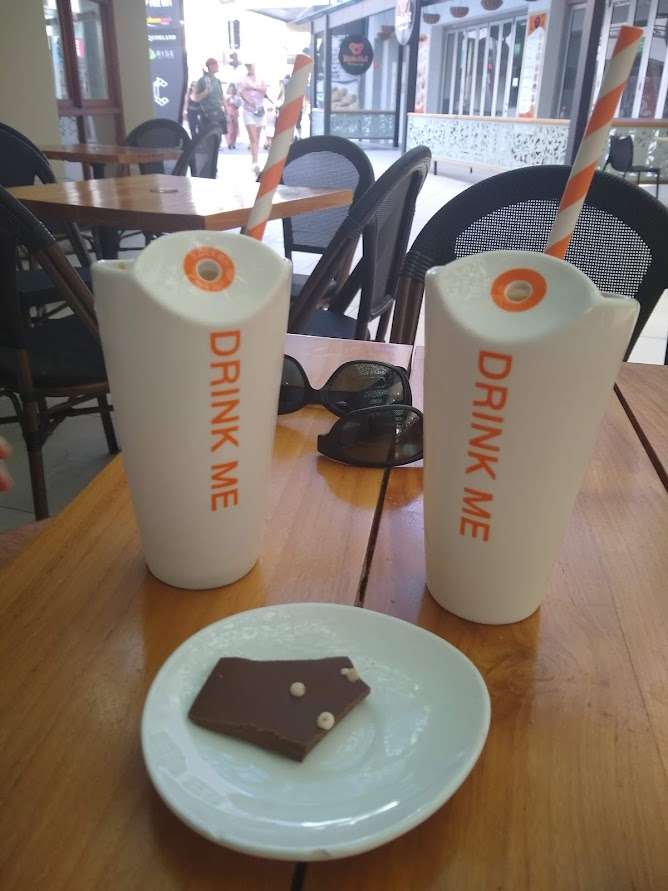

We did as instructed!

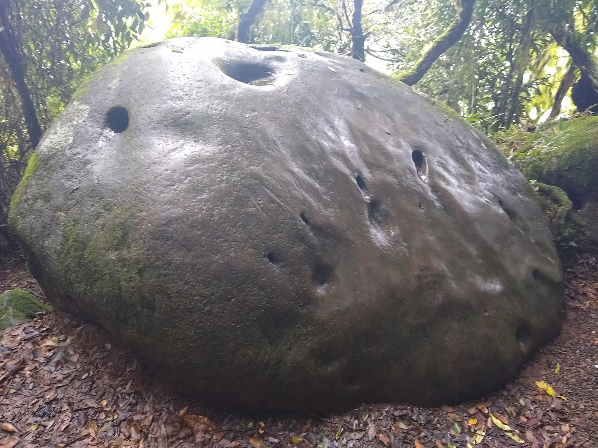

Oops, rock - not a potato

FUNNY

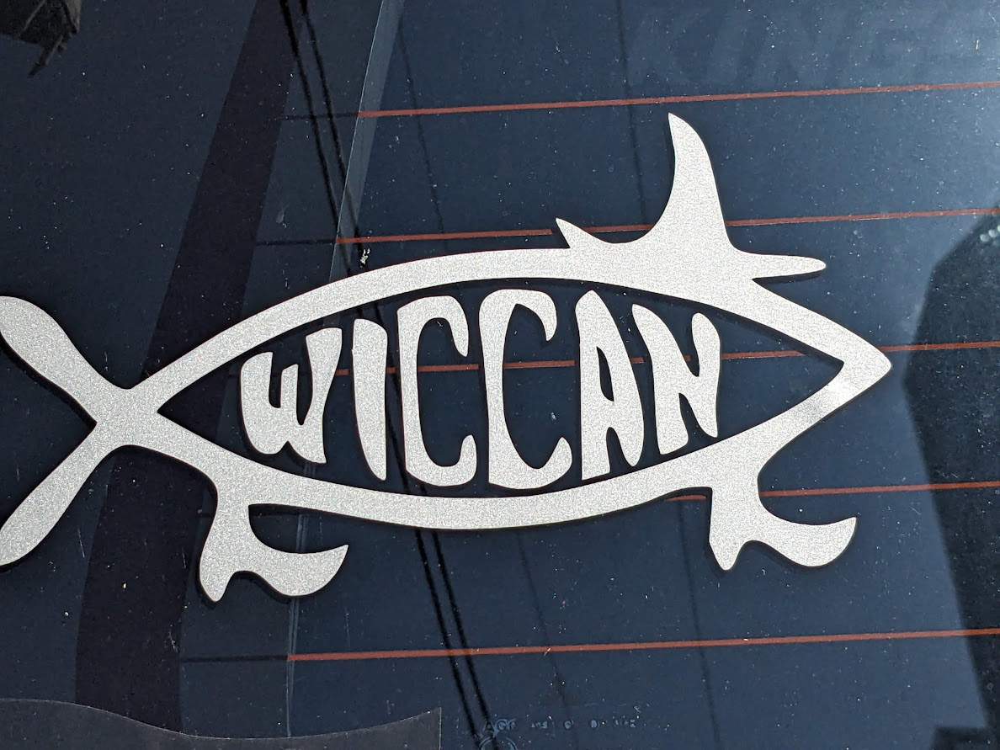

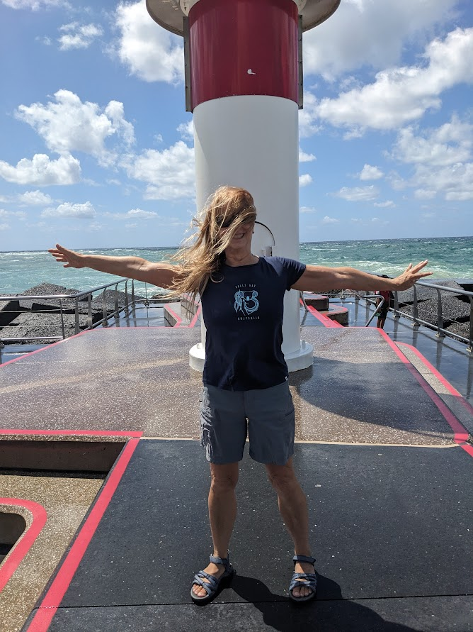

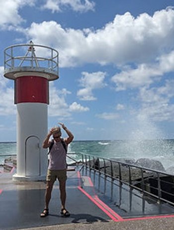

Not only were the winds strong, but we were also sand blasted as we rode our bikes along the Main Beach foreshore.