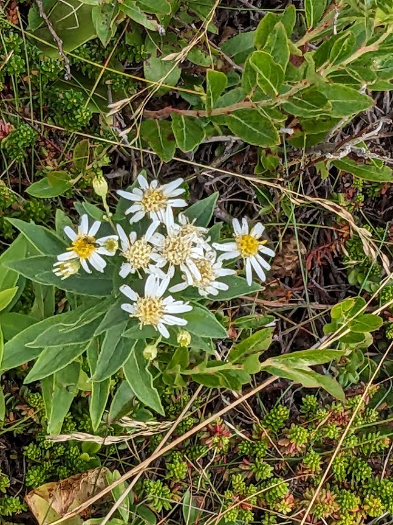
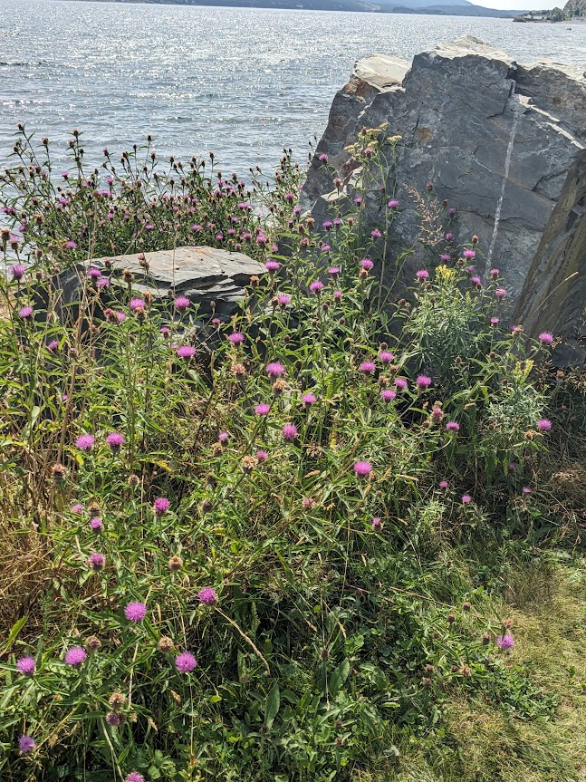
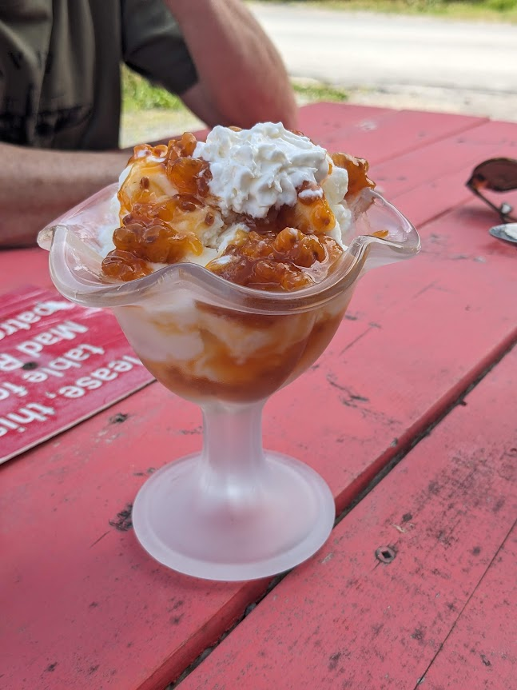
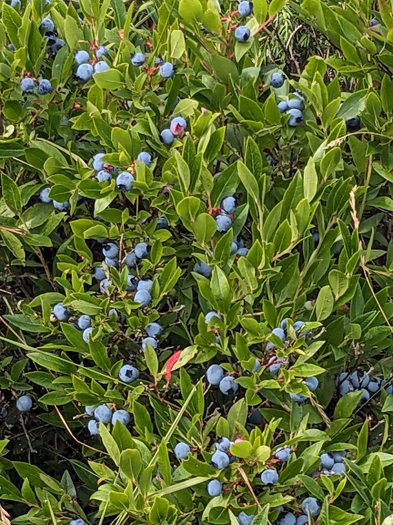
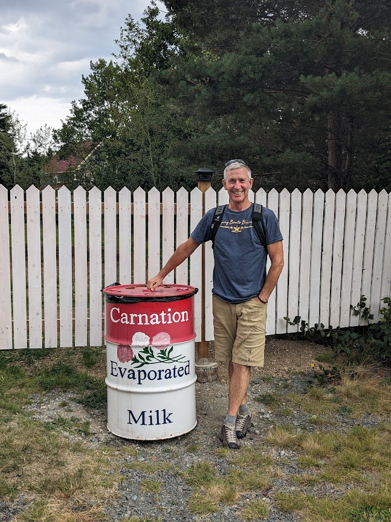
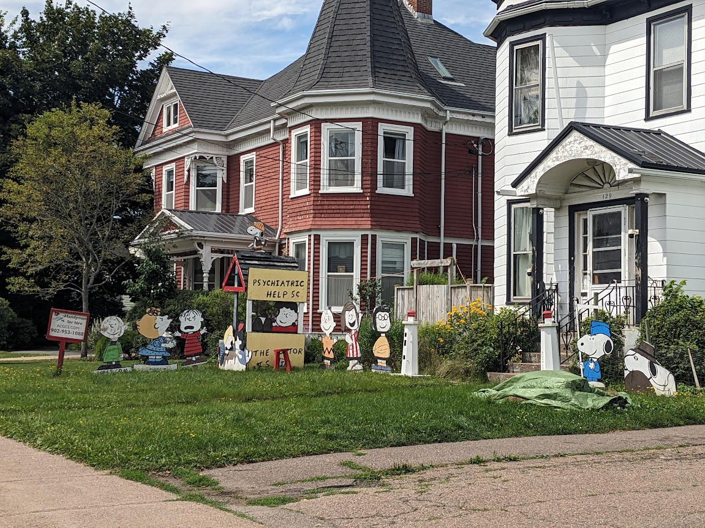
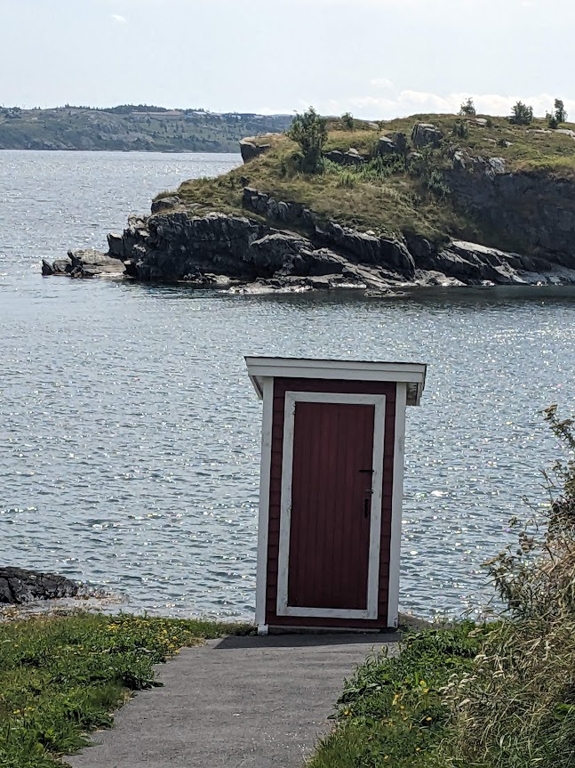

# Flora, Fauna, Food and Funny - IX

* cyrsullivan
* Oct 27, 2024
* 1 min read

**Flora**

Ground cover along our stroll in Shediac, NB

Daisies dotting the shoreline of Mad Rocks, Bay Roberts, NL

Wild flowers in Brigus, Newfoundland

**Fauna**

Well, we saw - but did not capture - a couple of garter snakes, a few rabbits and a coyote. Not even a bug photo to post. Better luck next time!

**Food**

Bake apple ice-cream, Brigus, Newfoundland - Super tasty!

Wild blueberries, best baked in a pie

Terry's fond childhood memory of Carnation milk. This can, likely from large contented cows!

**Funny**

Some people have great lawn ornaments

Terry on a typical childhood "beach" in Newfoundland

Easy waste disposal