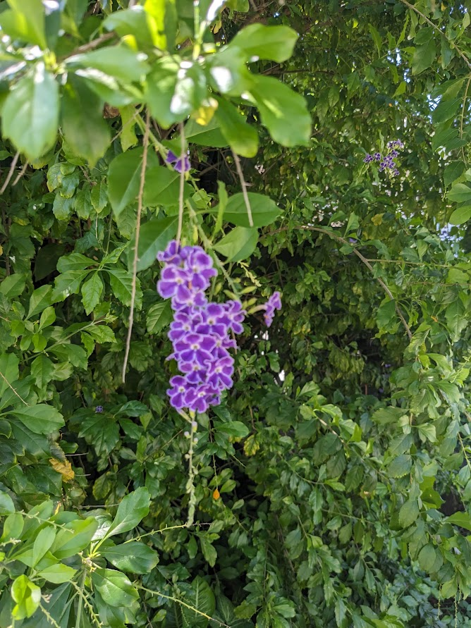
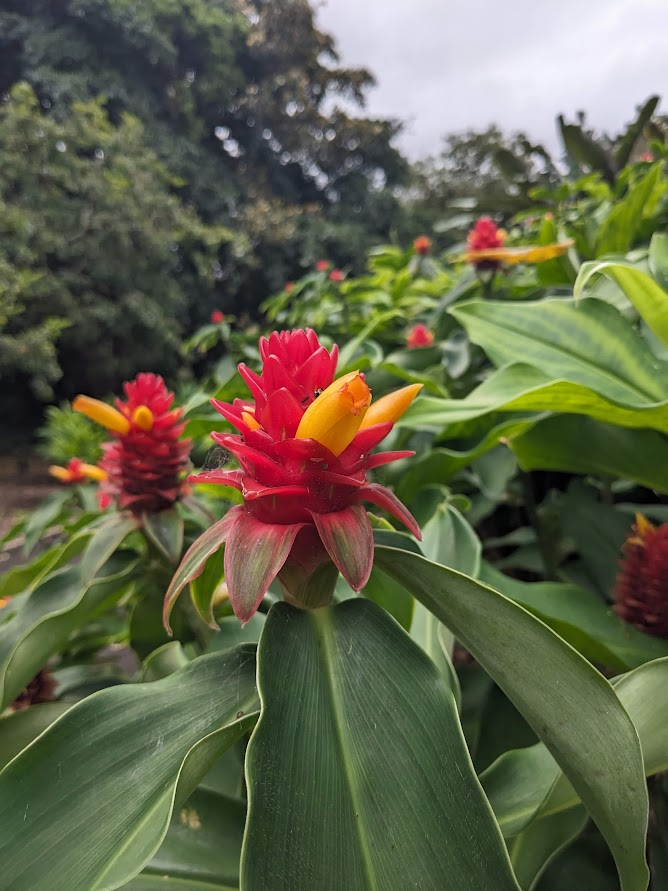
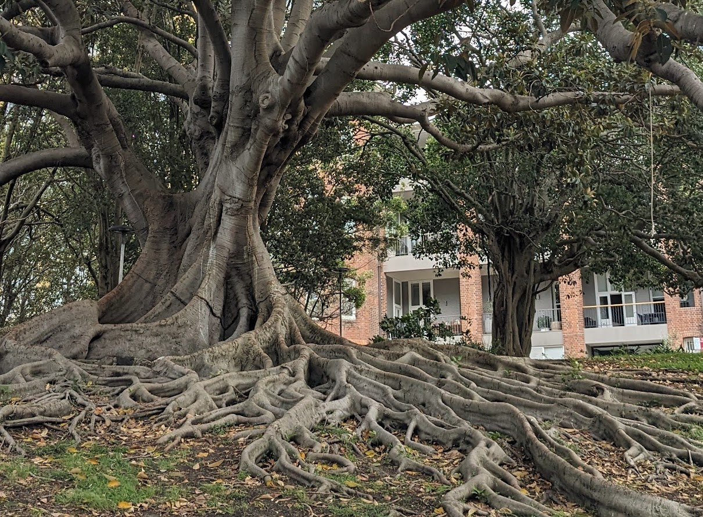
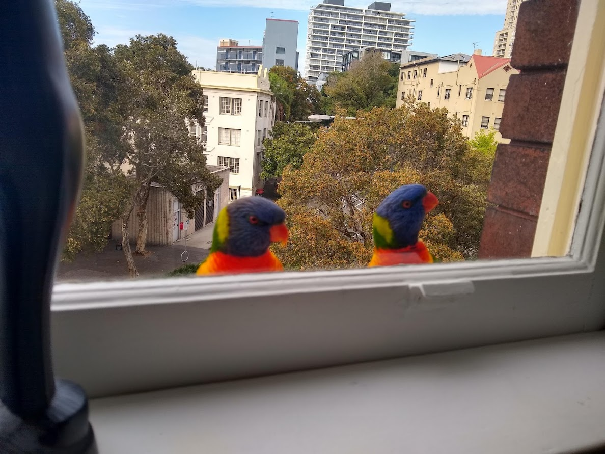
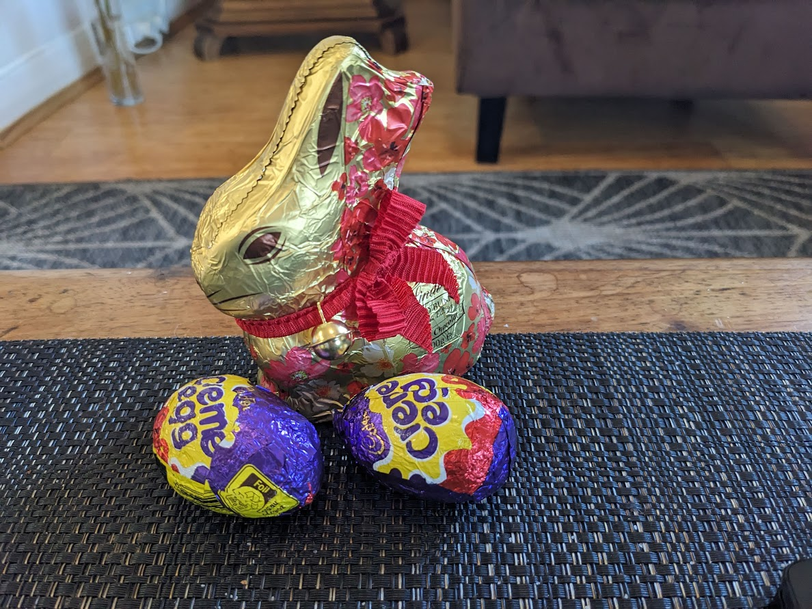
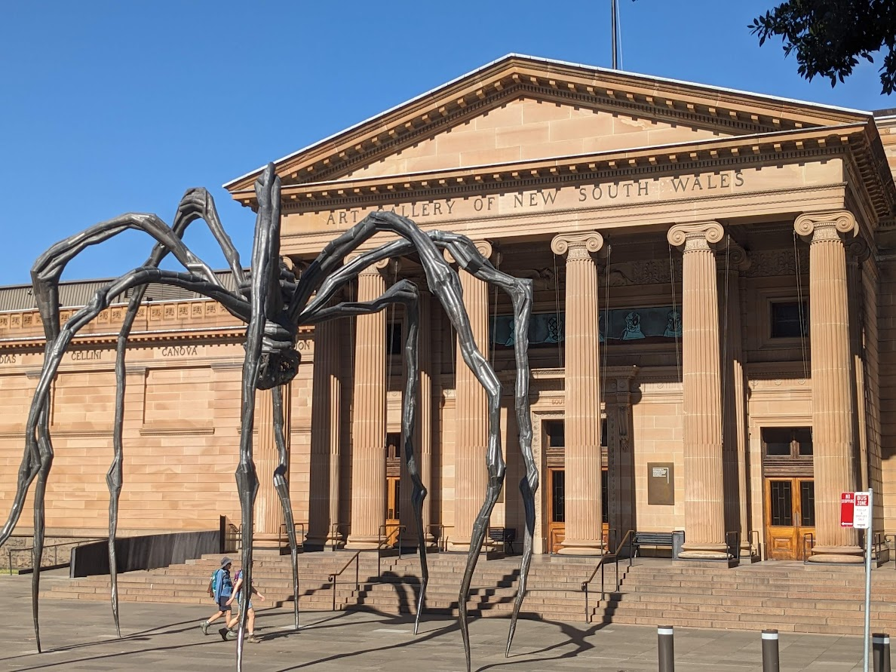
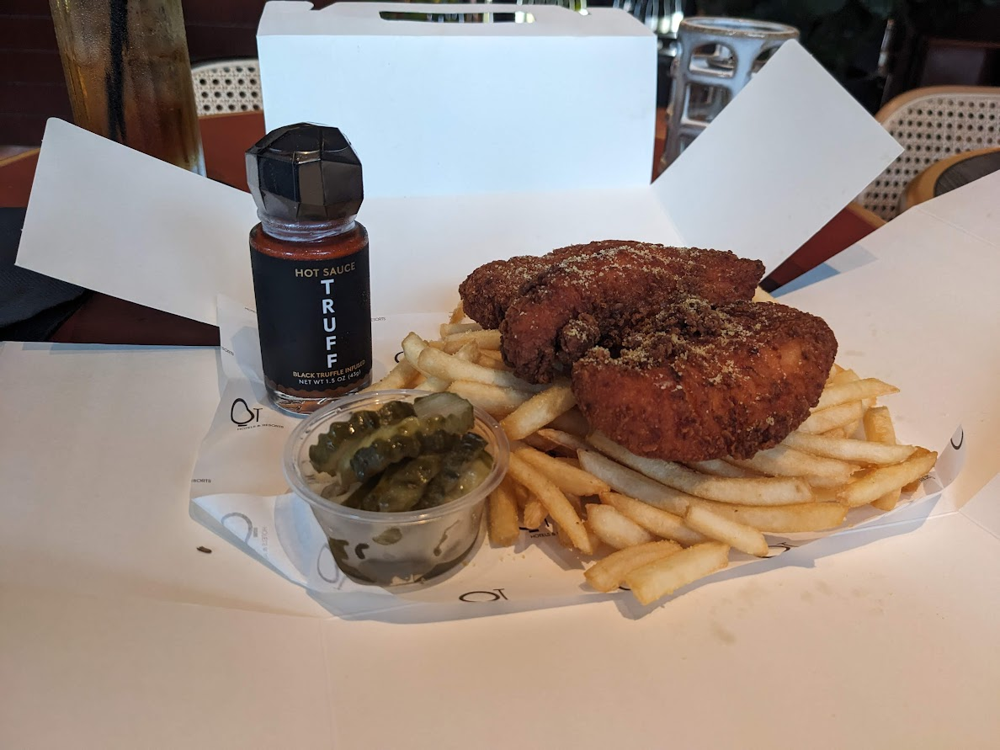
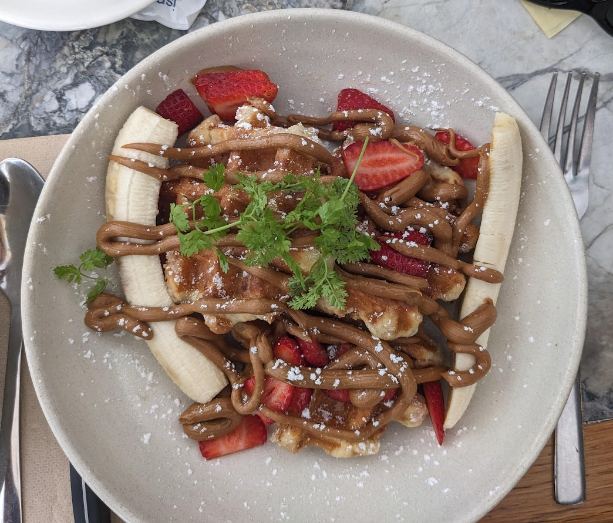
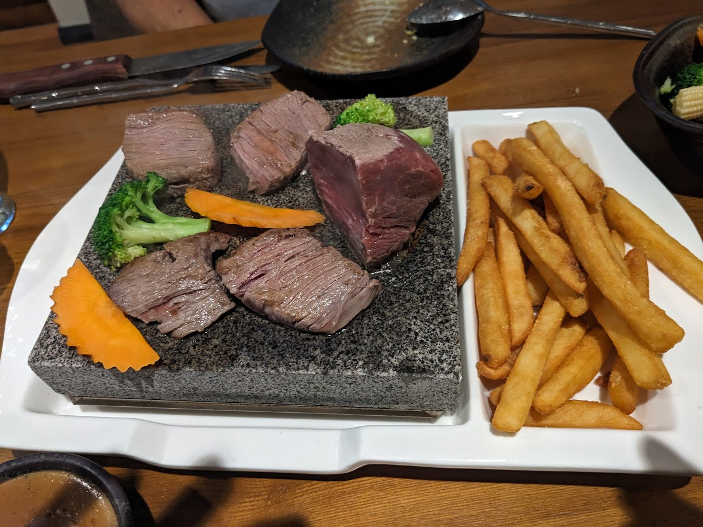

# Flora, Fauna, Food and Funny V

* cyrsullivan
* May 8, 2024
* 1 min read

Updated: Oct 2, 2025

## Newcastle to Sydney

## FLORA

## FAUNA

Daily visitors at our AirB&B

Easter bunny counts, right? Anyway, it was "removed" later the same day.

Mother, this insect looked familiar.

Whale spotting in Newcastle.

## FOOD

As a splurge, I ordered the spicy chicken with truffle sauce and side potato and veg. It came in it's own box! Ha!

This breakfast waffle (can you see it?) came with a side of ice-cream covered in the same biscoff sauce, delicious. No, I didn't eat it all.

Had to check out the "Thai Rock".

## FUNNY

Eye get it!

Dad's get it!