# Flora, Fauna, Food and Funny VI

* cyrsullivan
* Jun 12, 2024
* 1 min read

**FLORA**

Vancouver

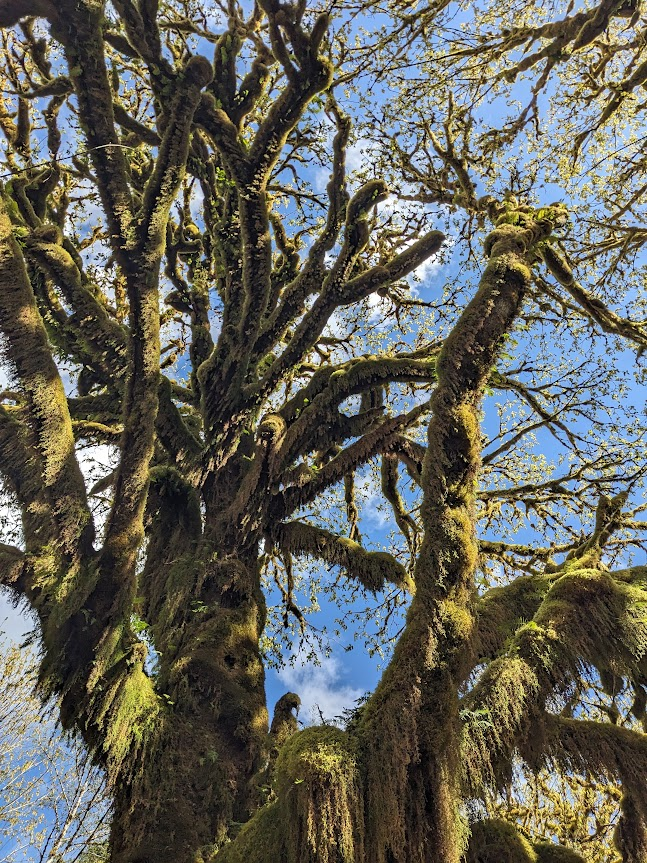

Washington State National Rain Forest

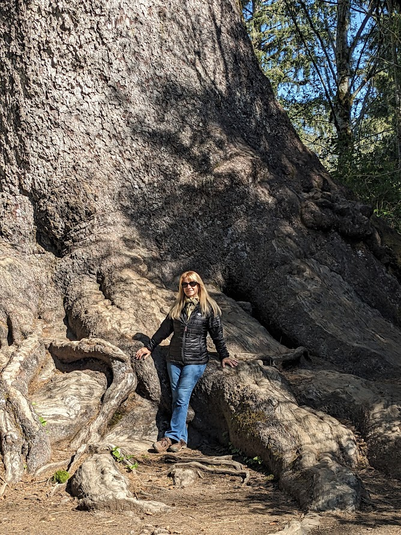

They make you feel very small

**FAUNA**

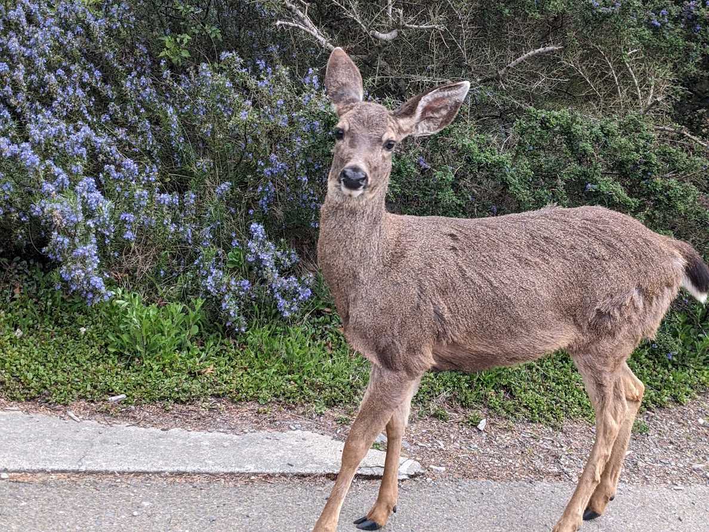

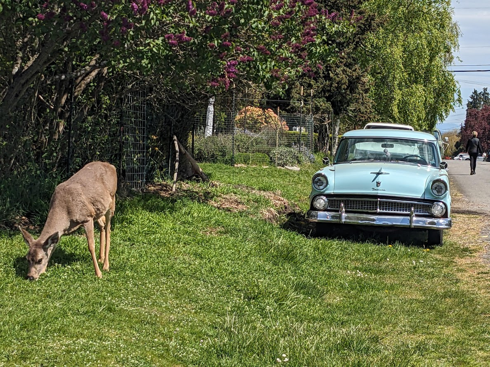

The black tail deer were everywhere in Washington!

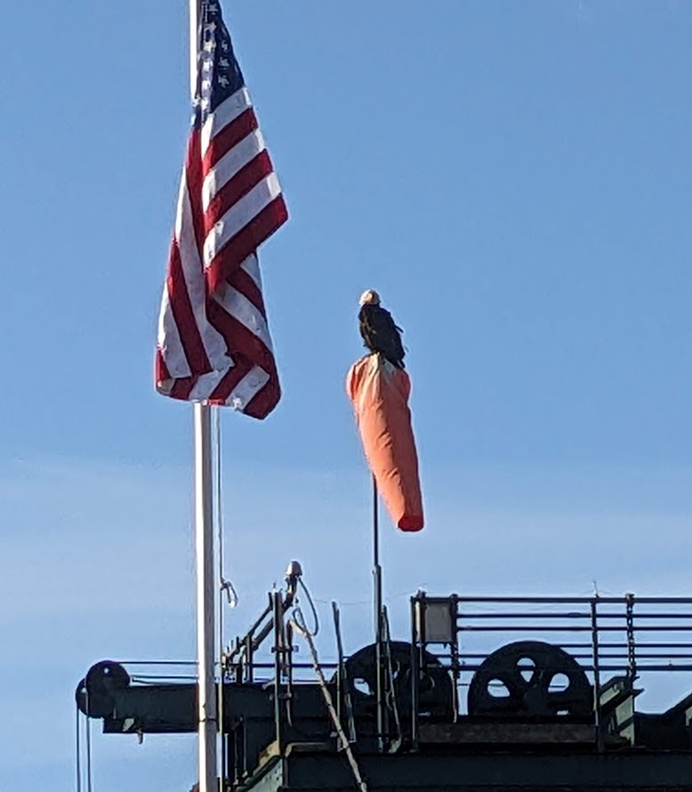

As were the eagles.

**FOOD**

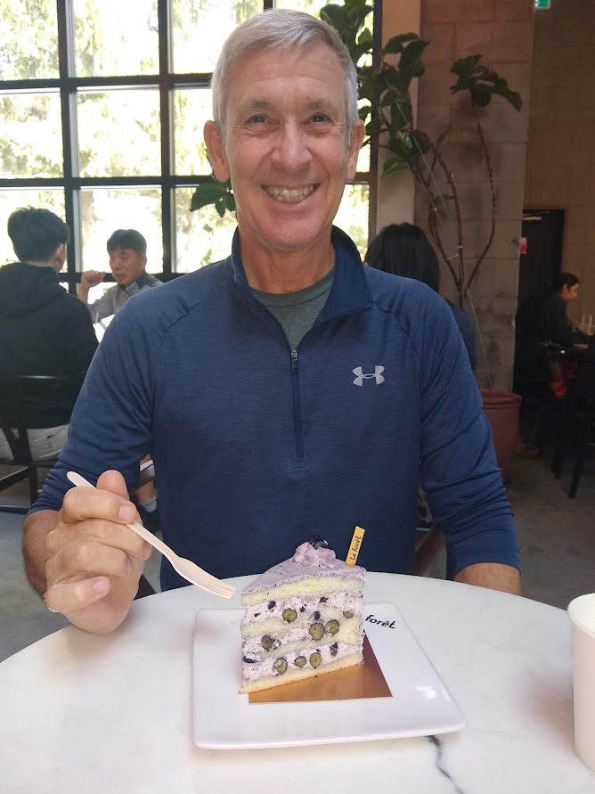

A delicious slice of blueberry cake

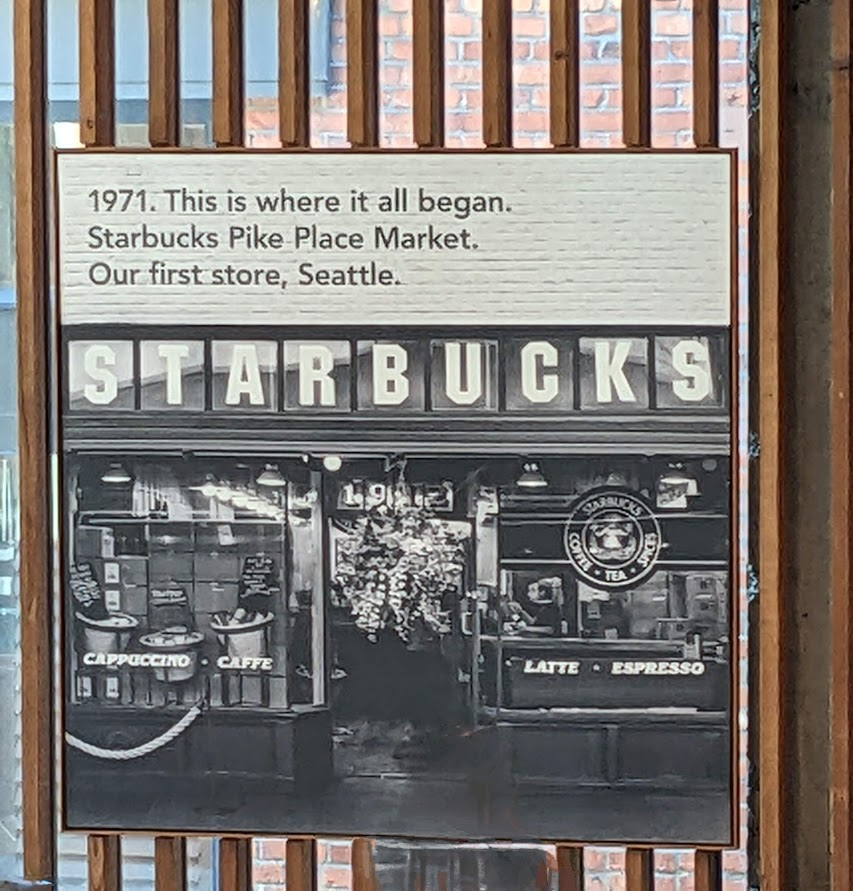

Back to the roots

**FUNNY**

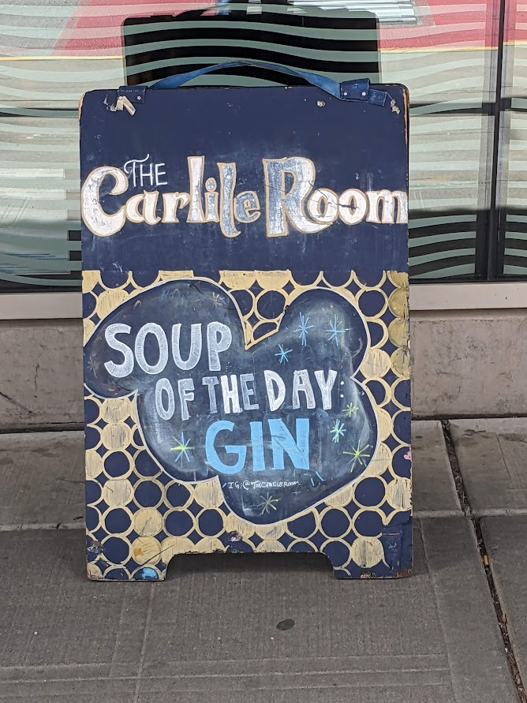

They wouldn't share the recipe. :(

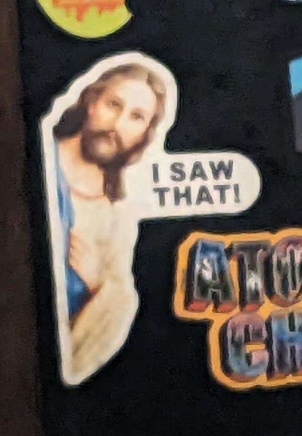

The pic is blurry 'cause we were in a bar.

He saw *that* too.

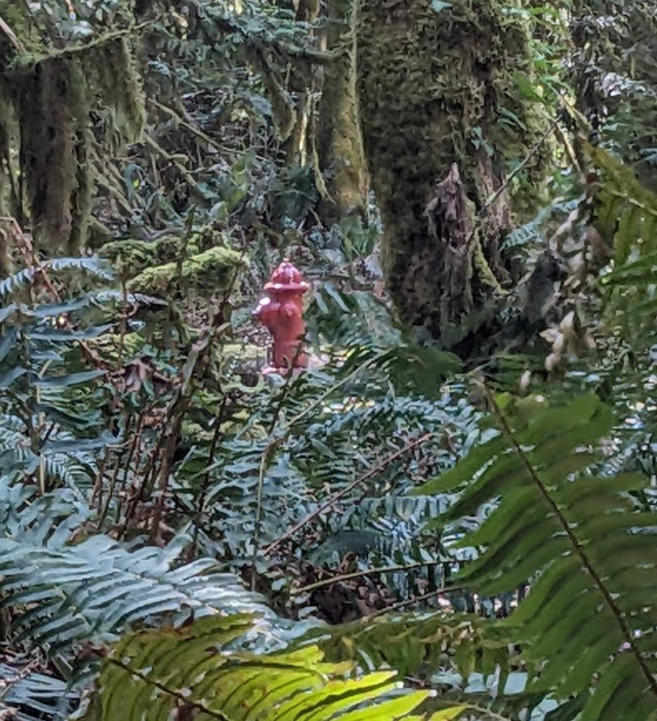

One of these things doesn't belong here

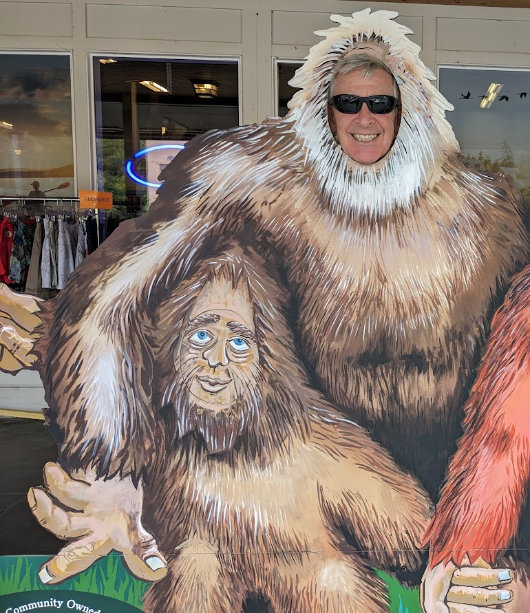

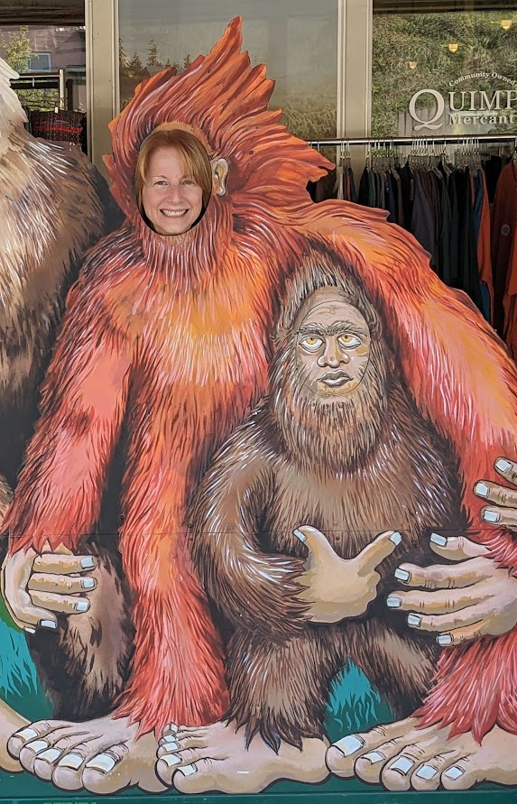

Finally, a Sasquatch sighting, actually two!