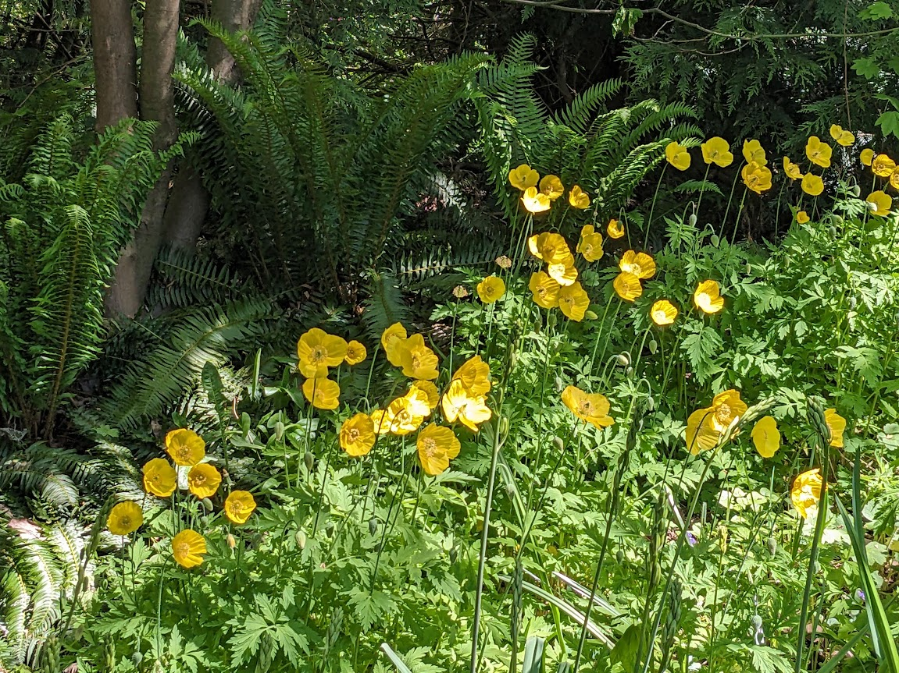
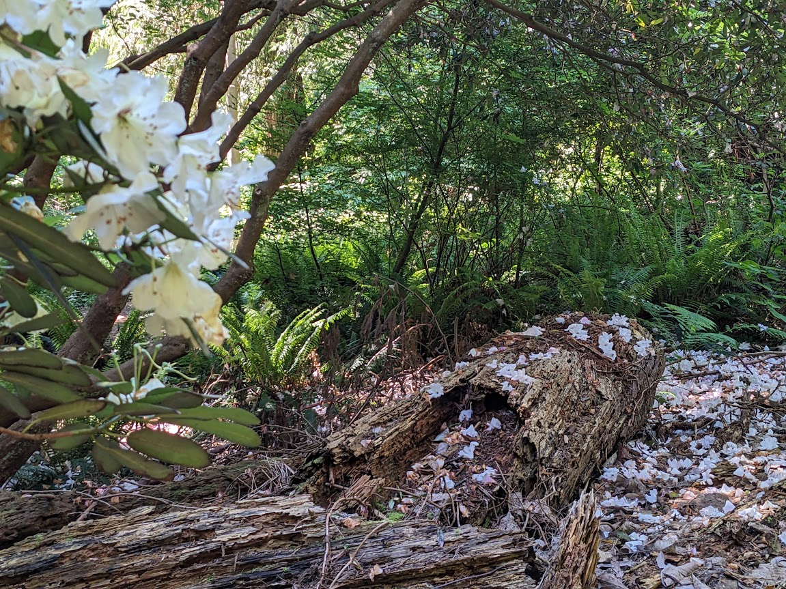
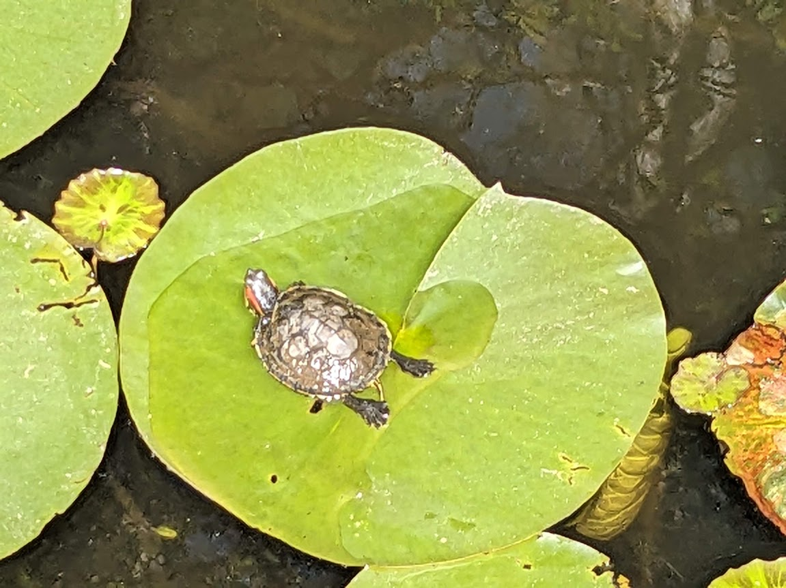
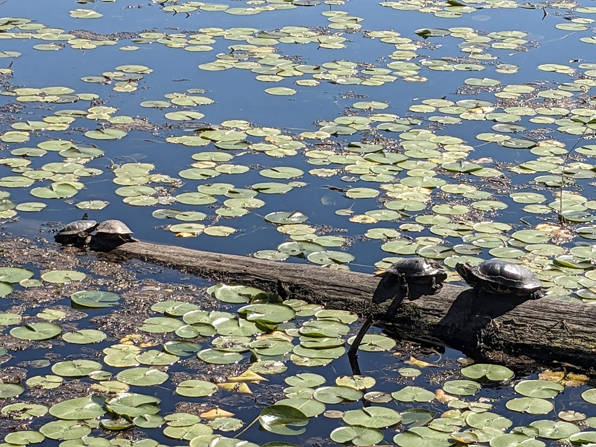
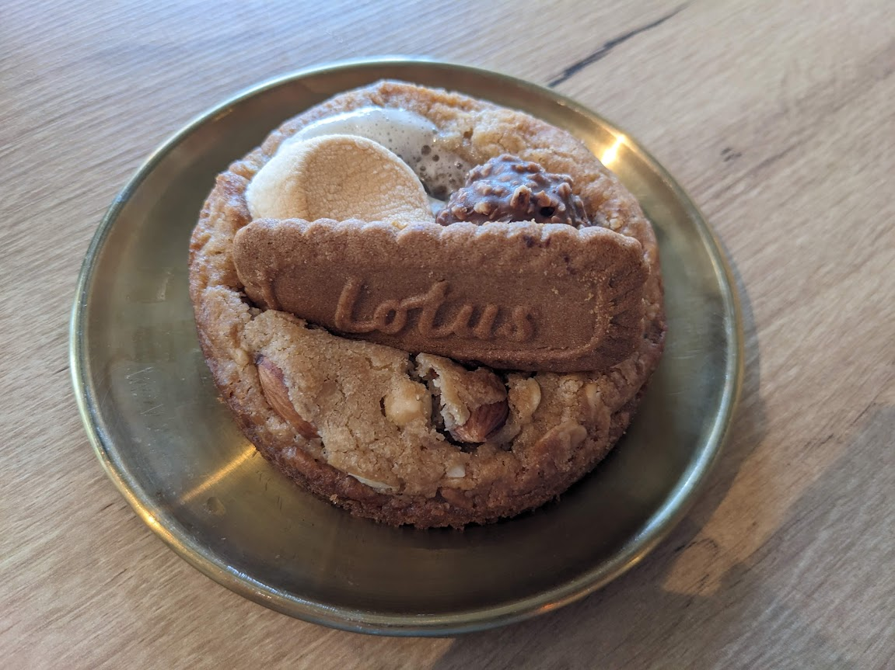
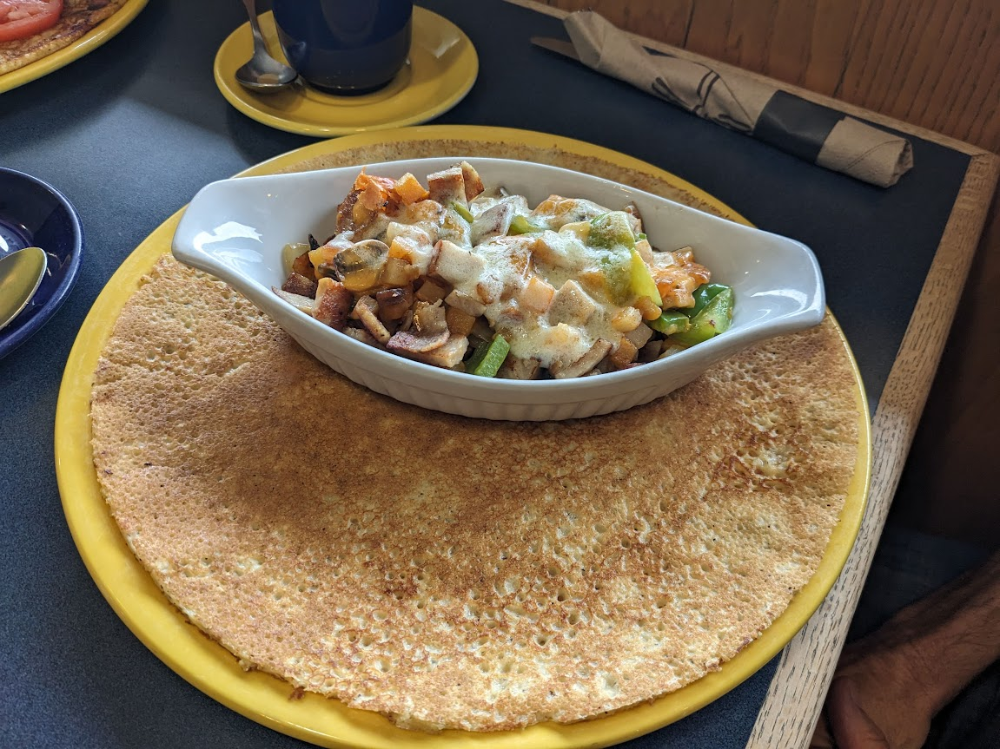
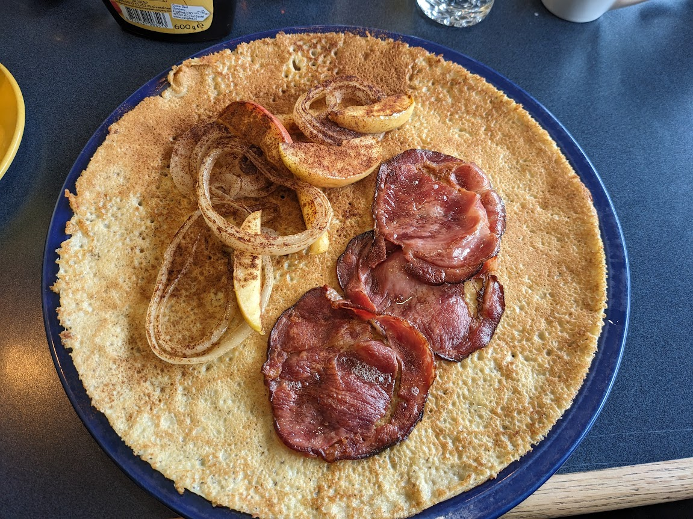
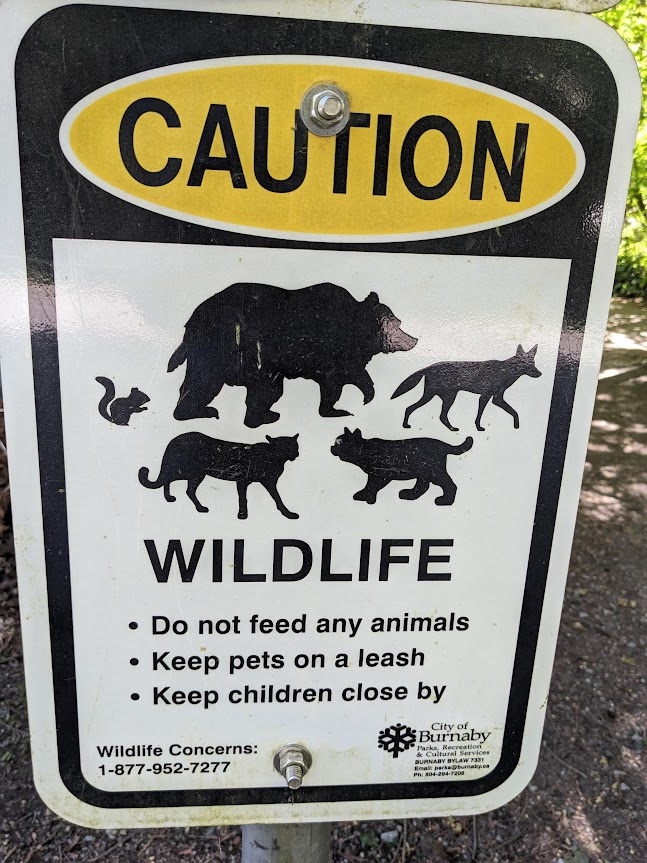
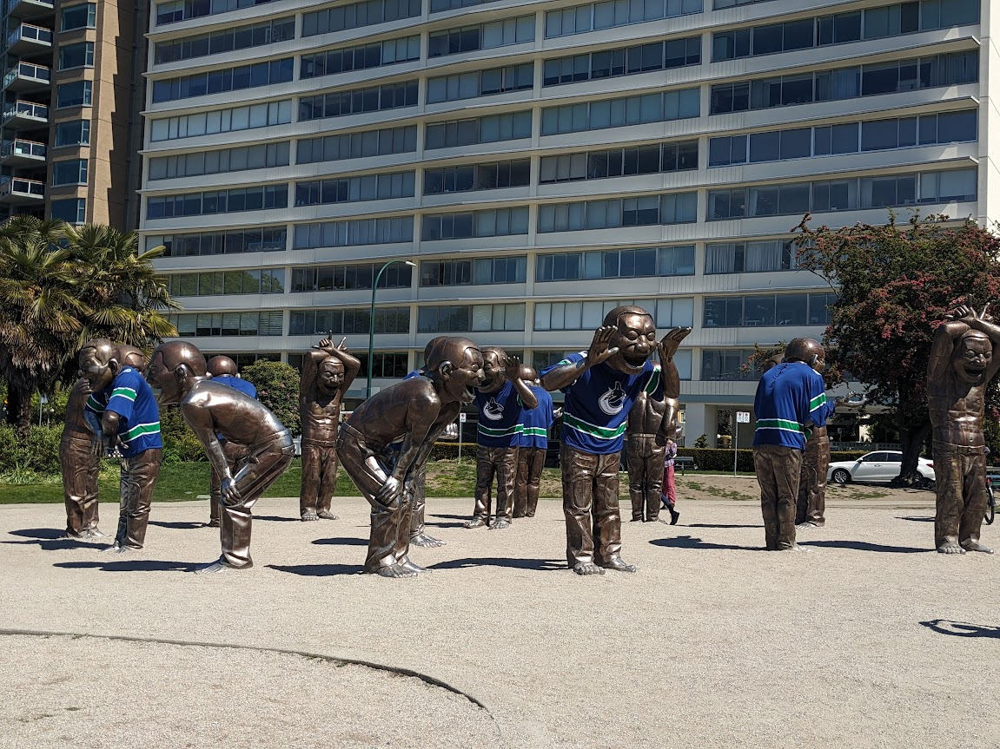

# Flora, Fauna, Food and Funny VII

* cyrsullivan
* Jun 29, 2024
* 1 min read

**FLORA**

My high school art teacher told me blue flowers didn't exist. So there!

Yellow poppies

Blooms in the forest

**FAUNA**

Red-eared slider

Painted turtles in VanDusen botanical garden

**FOOD**

Best s'mores cookie!

Pannekoeken (Dutch pancakes) for brunch with my cousin and his son

**FUNNY**

Don't have to worry about snakes anymore. So many more possibilities

here...like chipmunks

Confirmation that we were on the right track!

A-maze-ing Laughter sculpture updated for the western conference playoff series. The funny part is that they thought they might win.