# Flora, Fauna, Food and Funny VIII

* cyrsullivan
* Jul 20, 2024
* 1 min read

**FLORA**

It was all about the wildflowers in Kamloops,

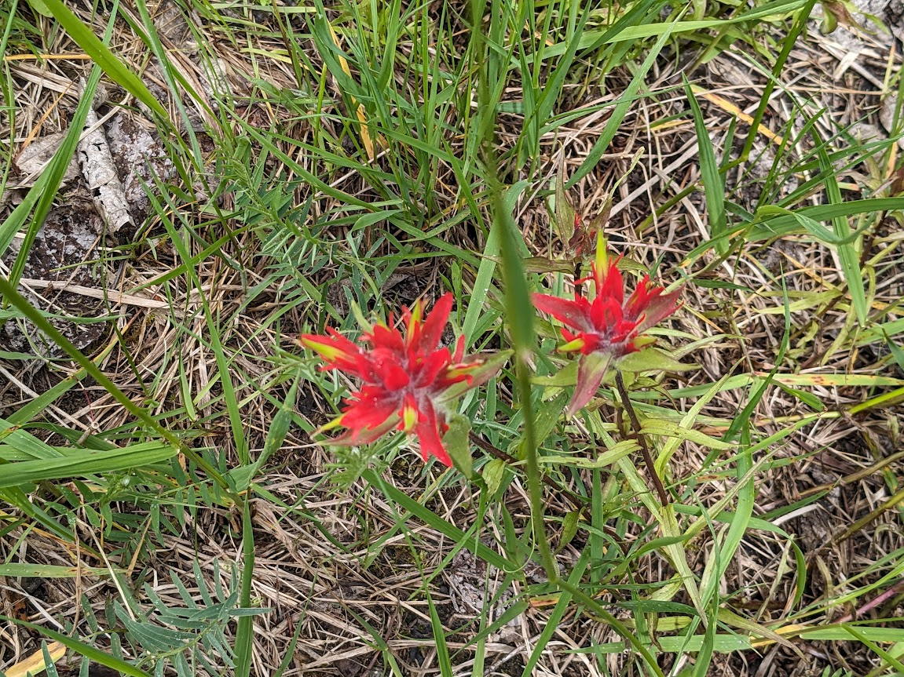

in Revelstoke,

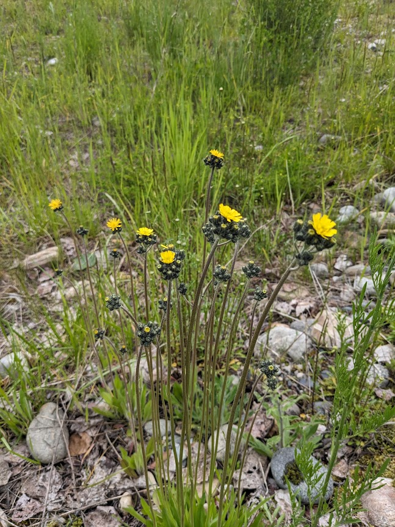

in Golden,

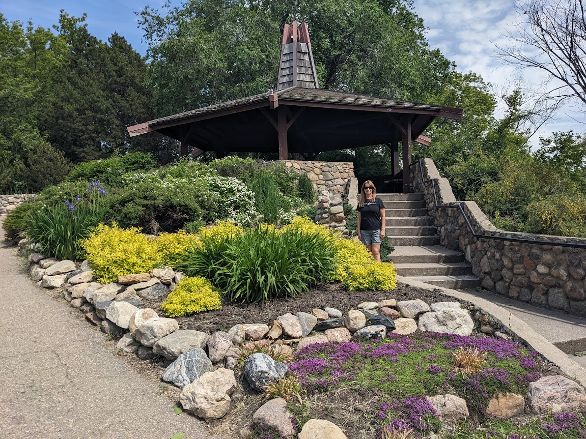

and in Saskatoon

FAUNA

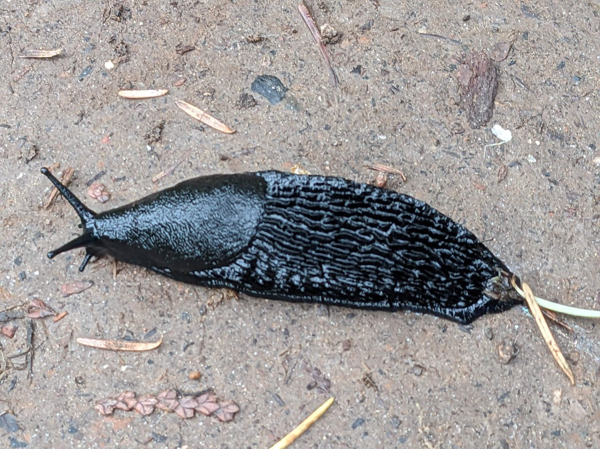

Appropriately called a Black Slug. The size of my thumb.

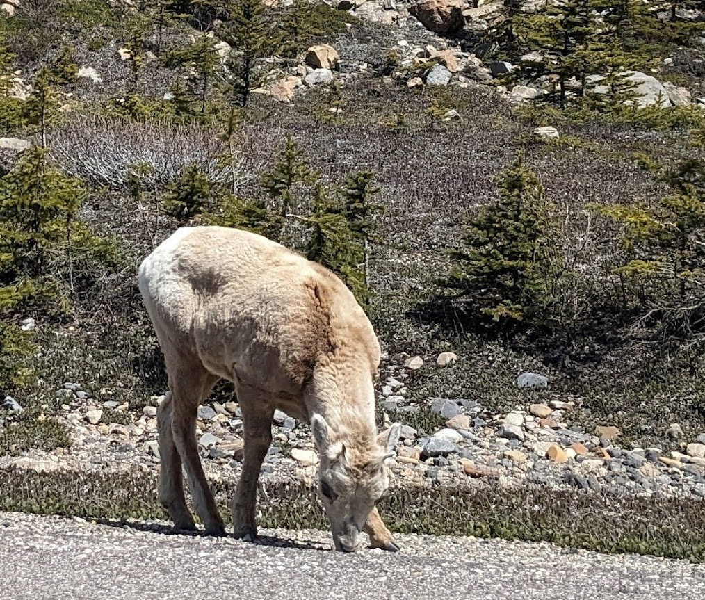

As I took this photo of a young mountain goat, the rest of the herd ran along the lower field

behind me. Sigh.

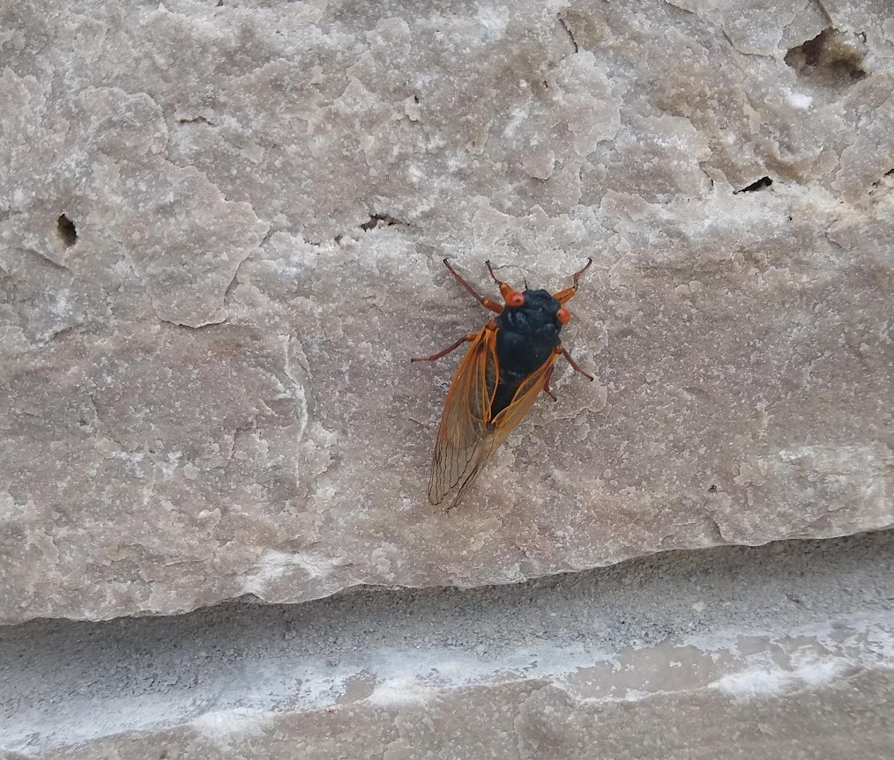

Came across the great cicada "double brood" event in Michigan. Another thumb size bug!

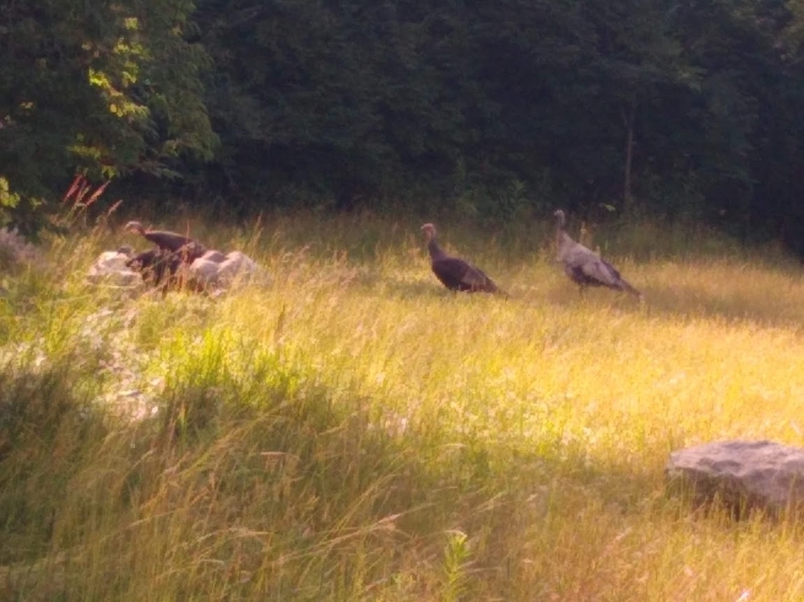

Turkeys in the golden hour along our hike in Dearborn, Michigan

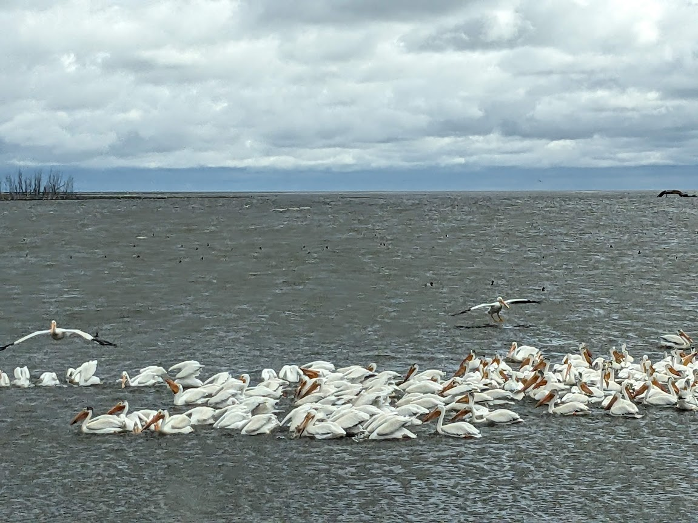

Hundreds of white pelicans migrate through Mountain Lake, Saskatchewan. Too many to get in one shot!

**FOOD**

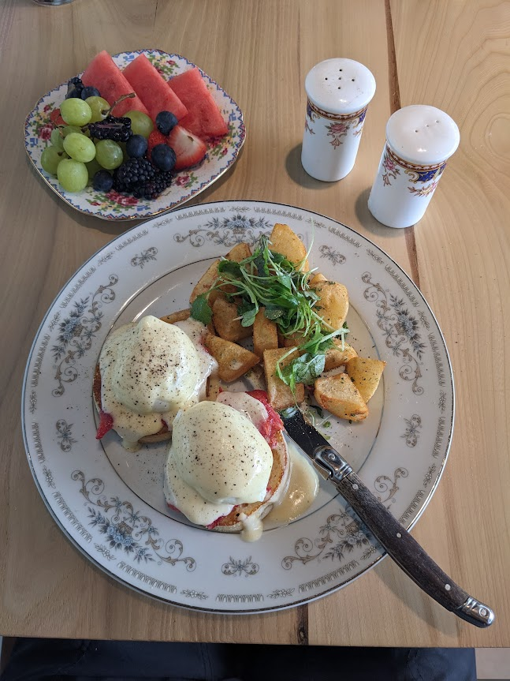

Terry continues his Eggs Benedict research. Benny with cured trout at the Remi Museum.

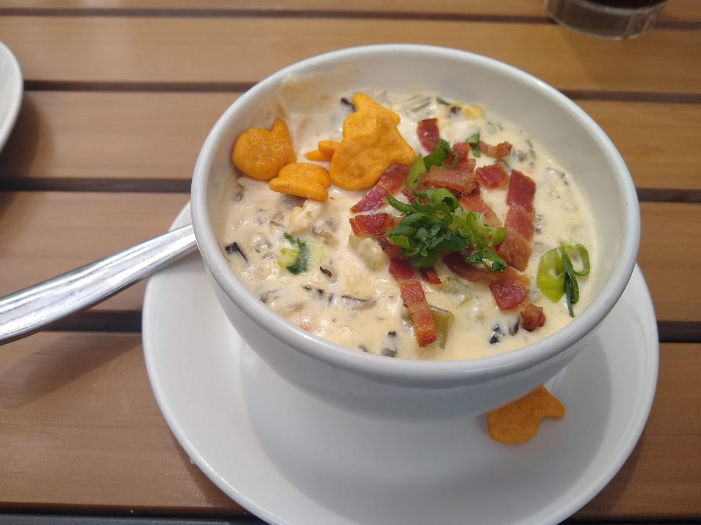

Bacon, chicken and rice soup...with gold fish.

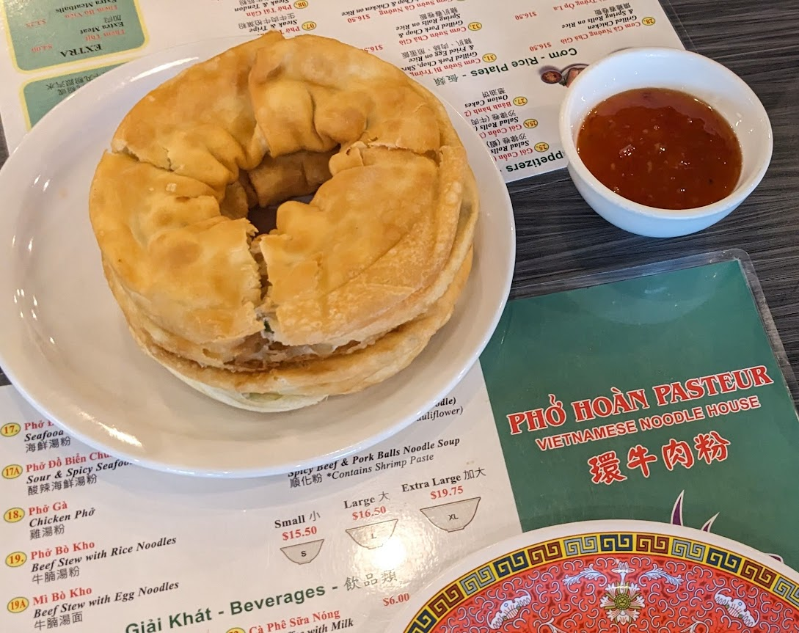

A Vietnamese classic (in Edmonton anyway), the Green Onion Cake. It was delicious.

**FUNNY**

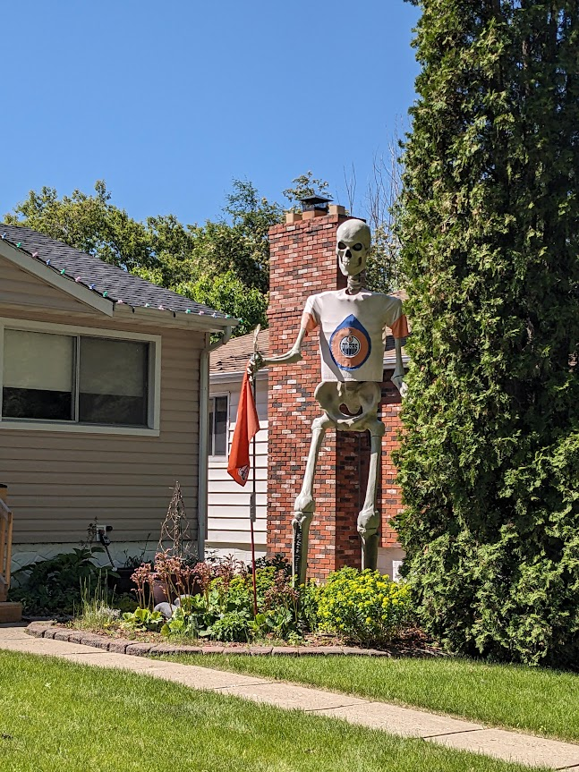

Edmonton Oiler fans had it bad. We enjoyed a playoff viewing party with Terry's sister and brother-in-law.

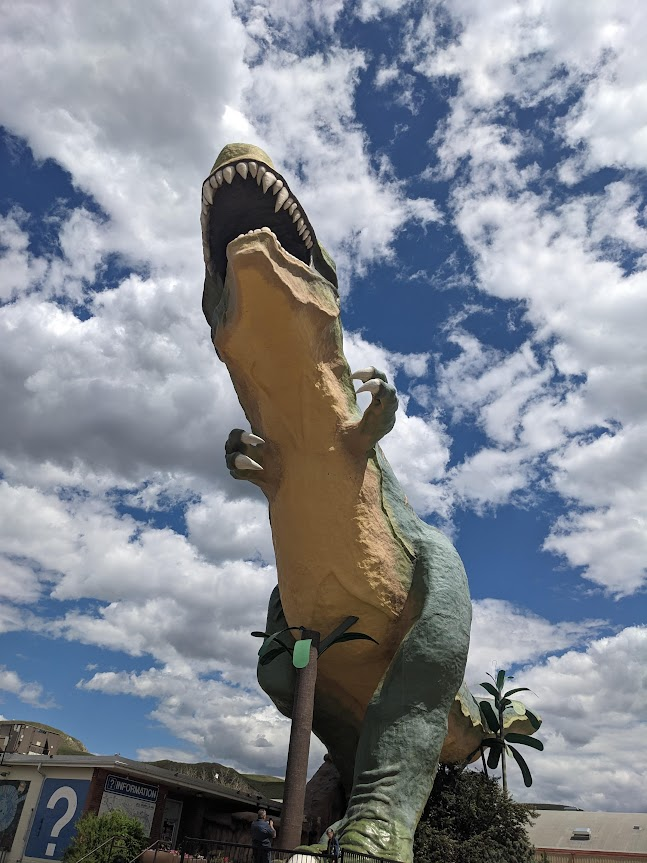

Another day in Drumheller, AB.

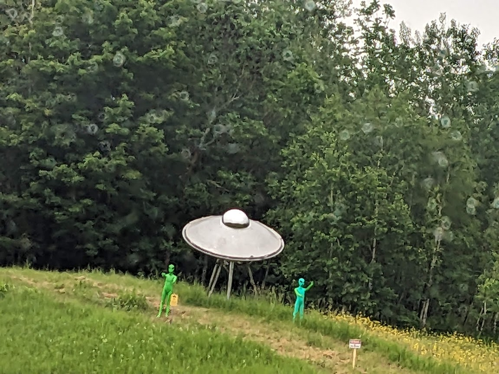

Commemorating a long ago sighting near Grand Lake, Minnesota.