# Flora, Fauna, Food and Funny - XIV (aka - Tasmania)

* cyrsullivan
* Apr 2, 2025
* 1 min read

Updated: Oct 2, 2025

## FLORA

Huon pine trees. They have sweet-scented timber, high in natural oil that resists rot and insects. Super valuable to boat builders.

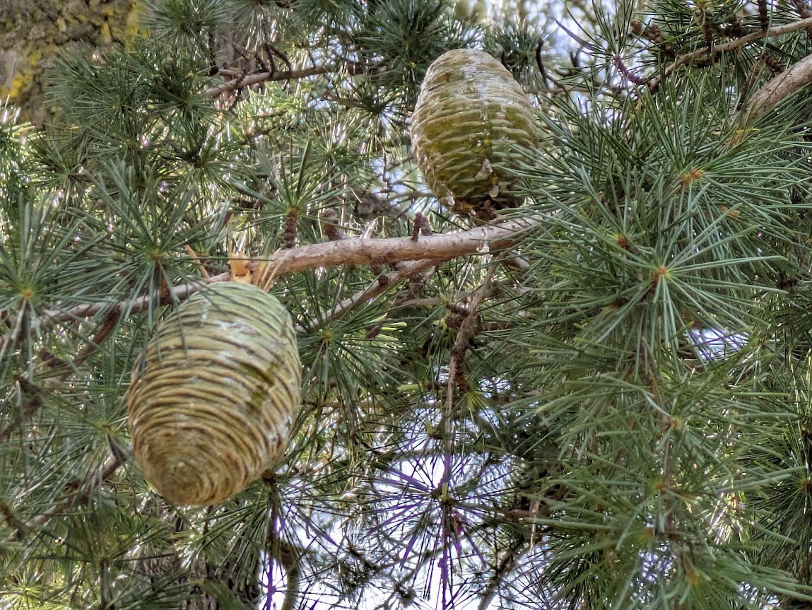

Deodar cedar with very cool cones!

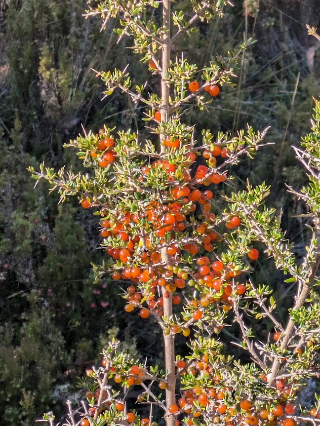

Bush rue shrub.

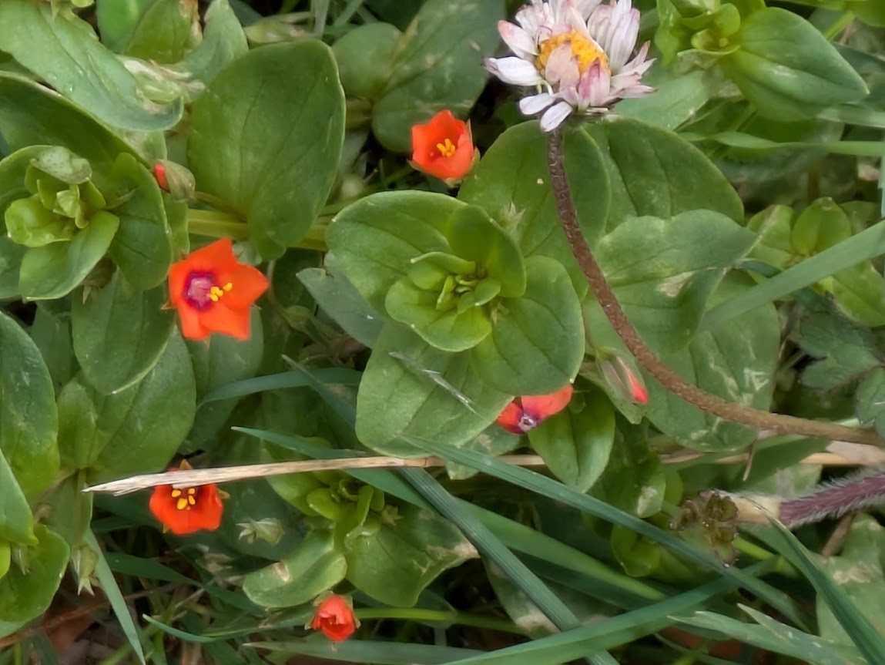

A scarlet pimpernel!

## FAUNA

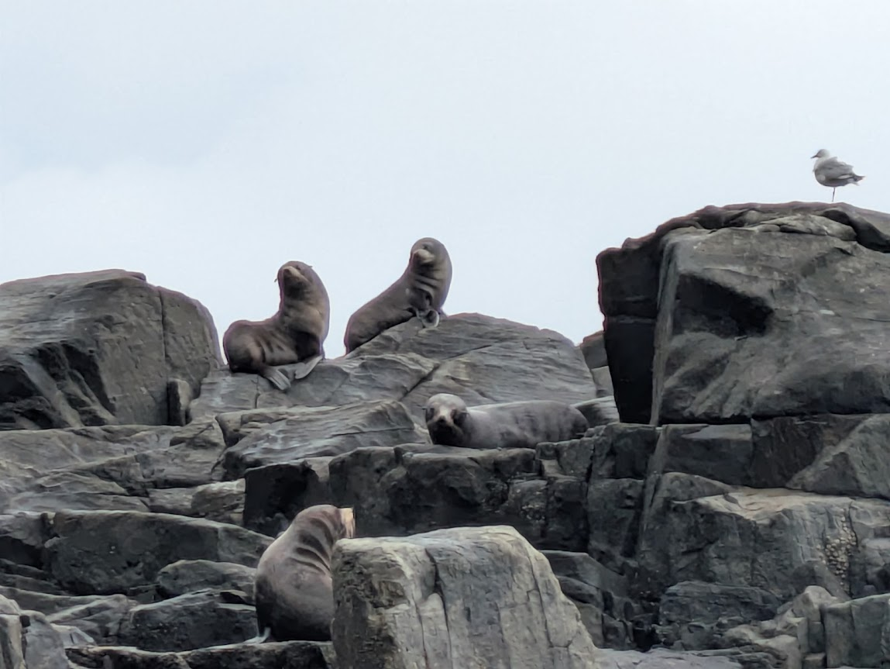

Cute fur seals

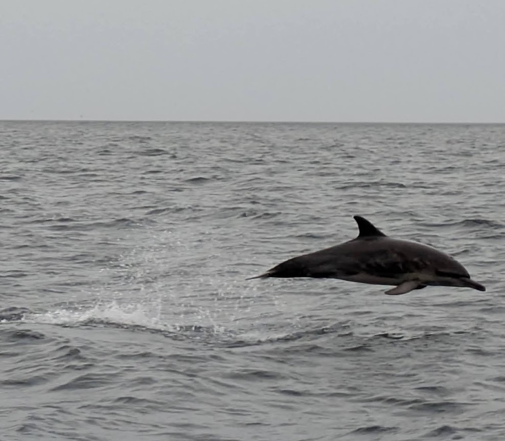

Playful dolphin

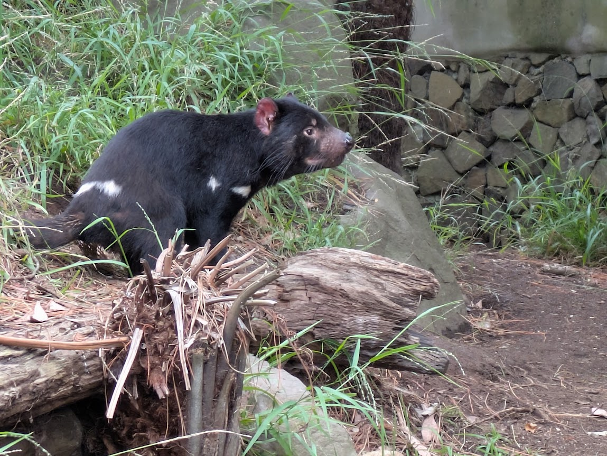

The feared Tasmanian Devil!

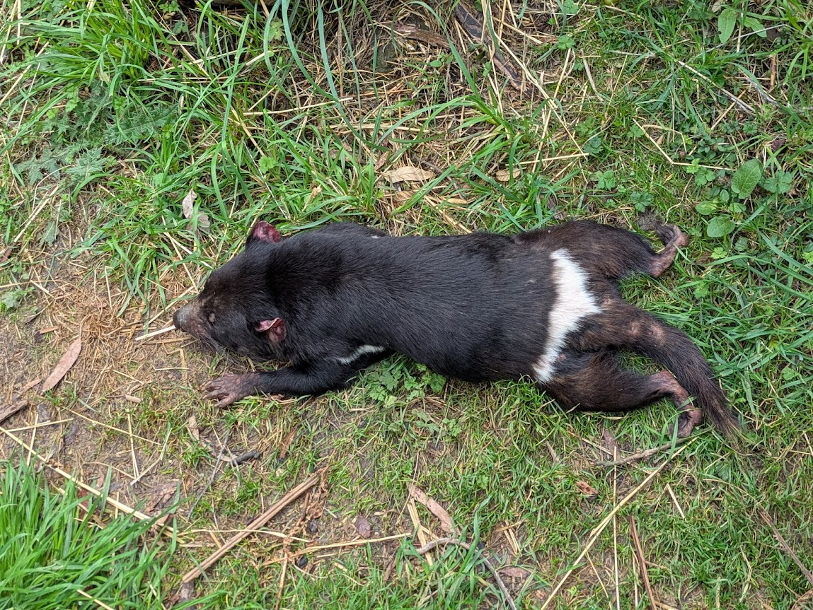

The feared lounging Tassie Devil!

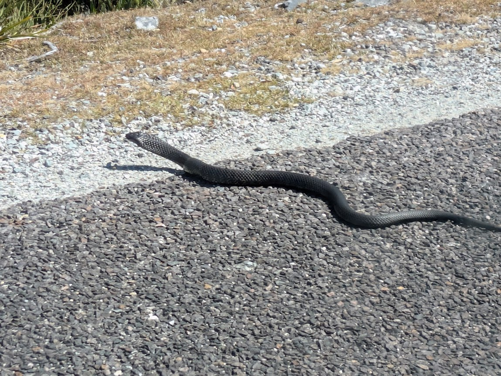

Lowland Copperhead, one of three super poisonous snakes in Tasmania. This one is about 4 feet long!

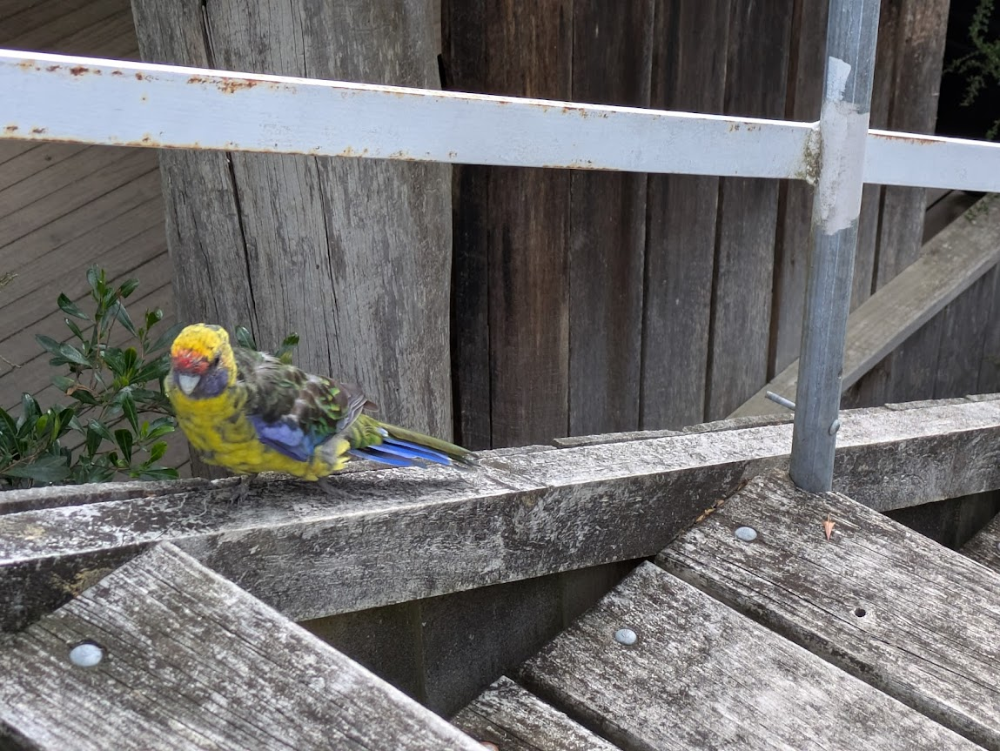

Tasmanian Rosella Parrot

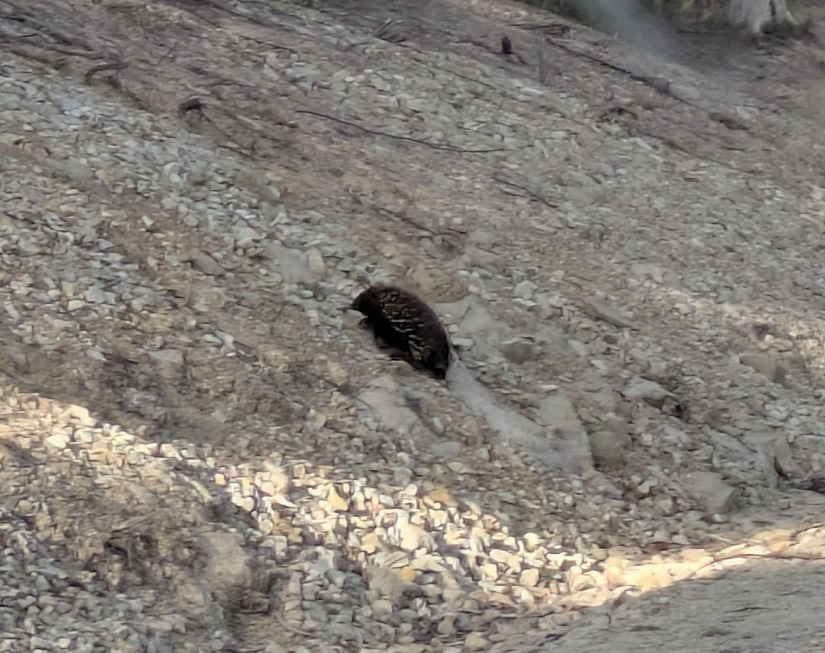

Long-nosed echidna

## FOOD

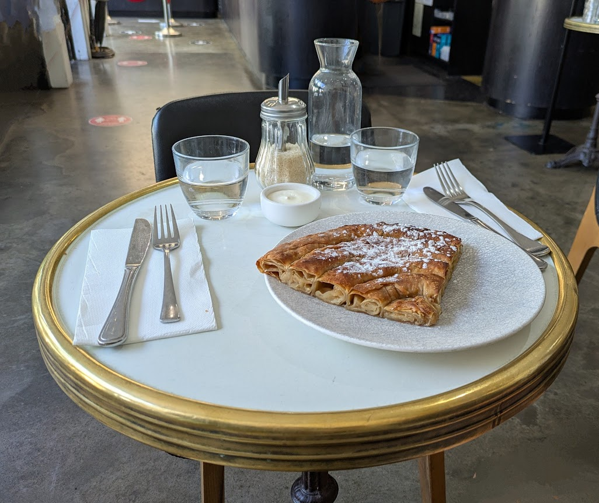

Delicious apple tart, with clotted cream, popular in Hobart.

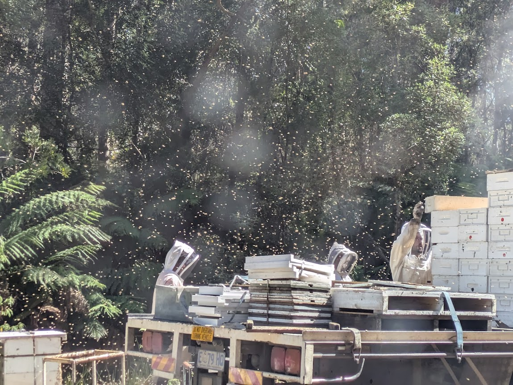

Bee keepers emptying roadside bee hives to remove honey, and prepare them for winter. Since they're collecting the honey, this is a "food" pic!

## FUNNY

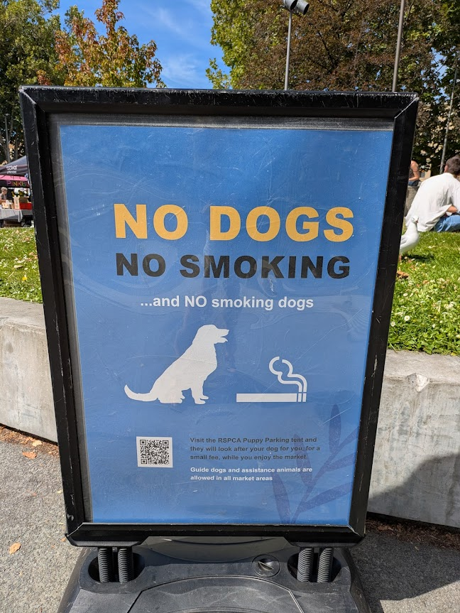

Seems like all of the dogs behaved because we didn't see any smoking pooches.

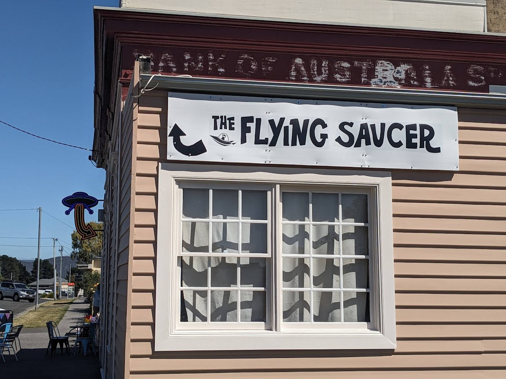

In the small town of Fingal, we enjoyed a flying saucer coffee since, well, what do they need a bank for anyway?