# Flora, Fauna, Food and Funny - XVI

* cyrsullivan
* May 20, 2025
* 1 min read

Updated: Oct 2, 2025

## FLORA

White shower tree in Bangkok

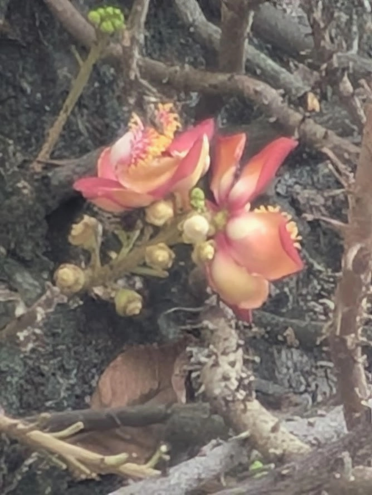

Flowing cannonball tree in Sihanouk, Cambodia

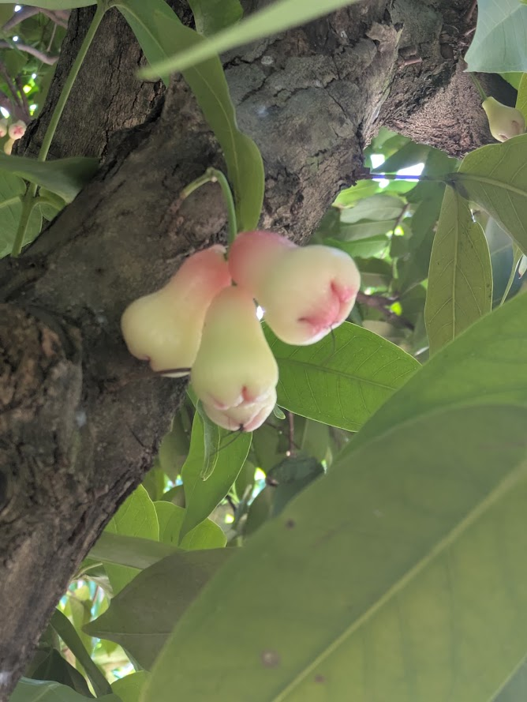

Java apple, Nha Trang, Vietnam

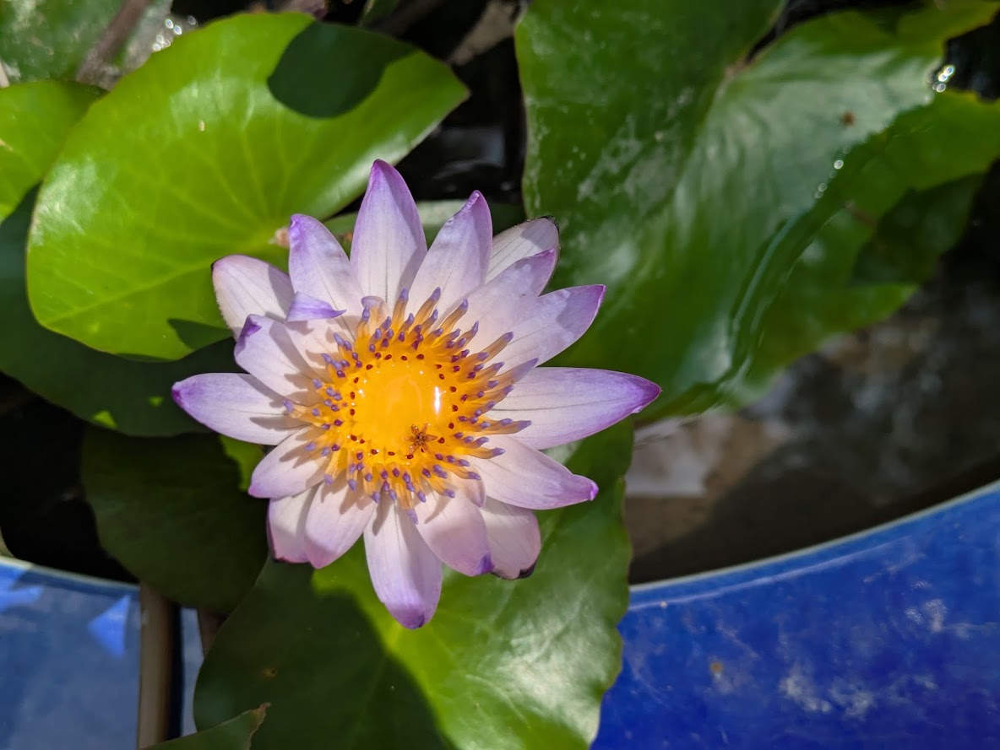

Blue Egyptian Lotus, Hong Kong

## FAUNA

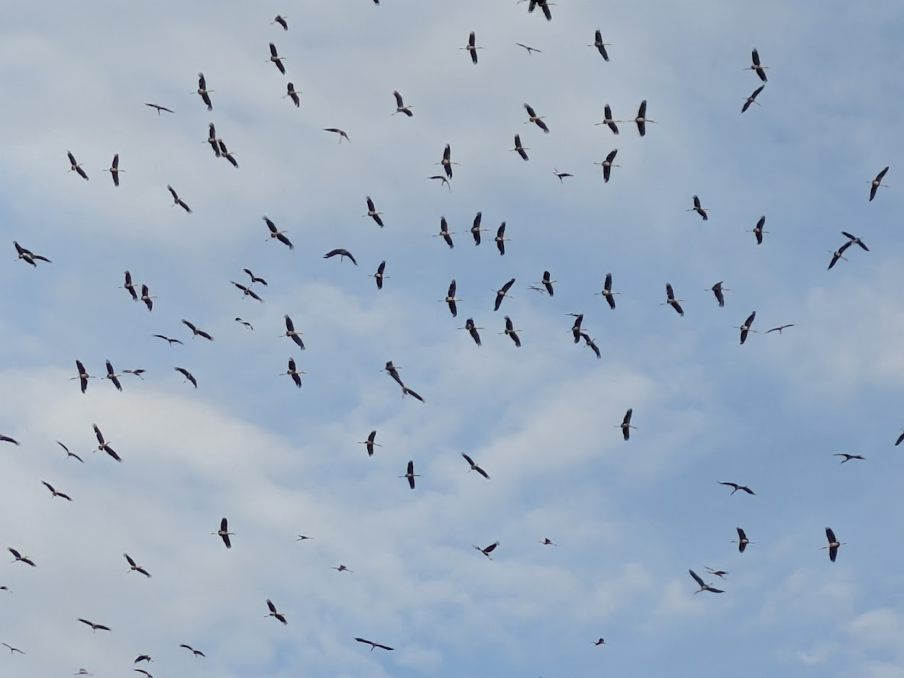

A muster of storks in Bang Pakong, Thailand

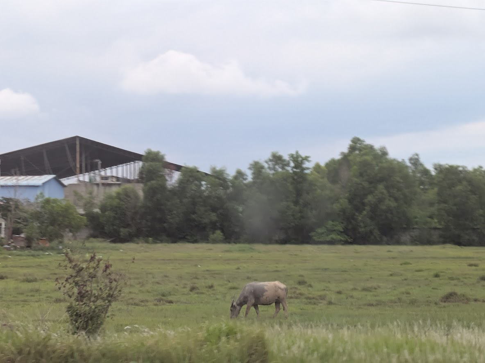

Water buffalo, Cambodia

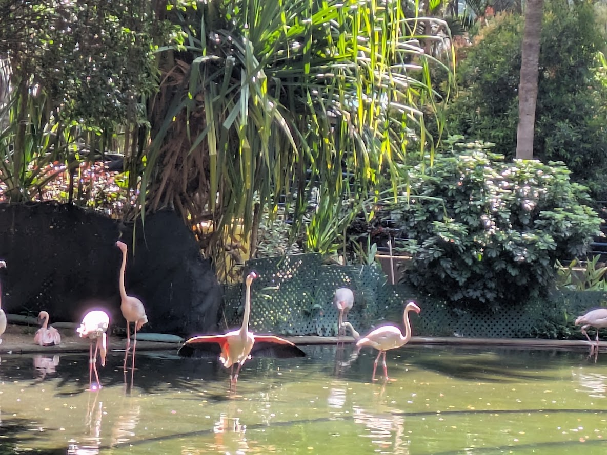

King of the World!! Well, Hong Kong anyway.

## FOOD

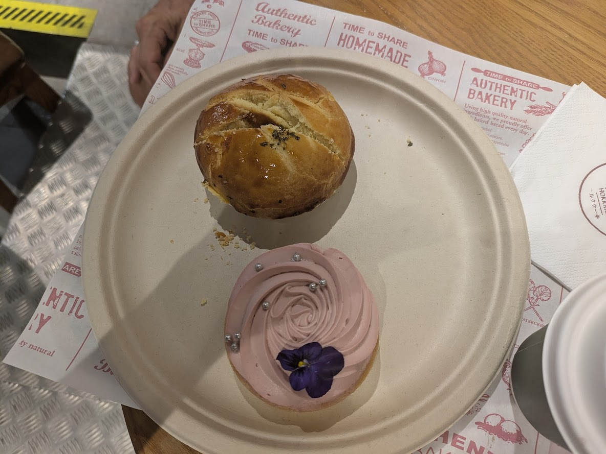

A fancy raspberry tart and a curry meat pie. Beauty and the beast.

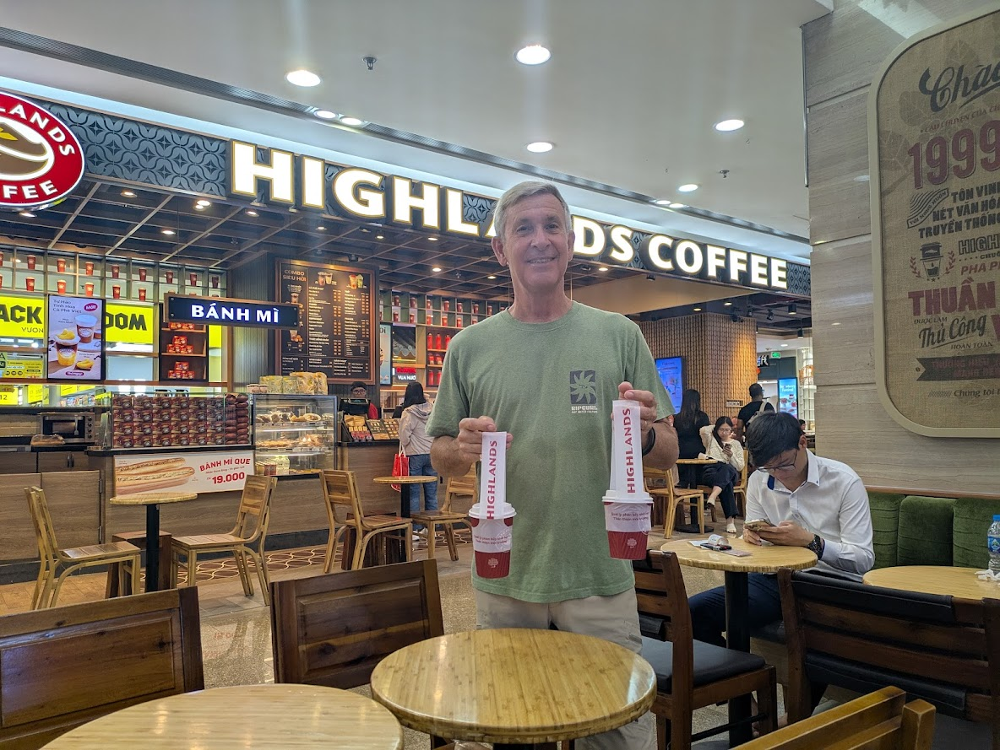

Three coffee carriers! The plastic holders are standard "to go" items in Vietnam so you can clip the coffees onto your scooter.

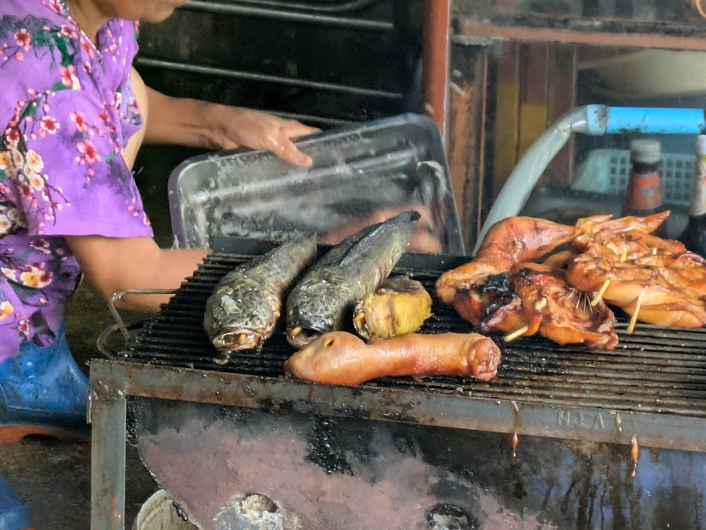

Street eats in Cambodia. Okay, so I didn't try any of these...but they sure looked good!

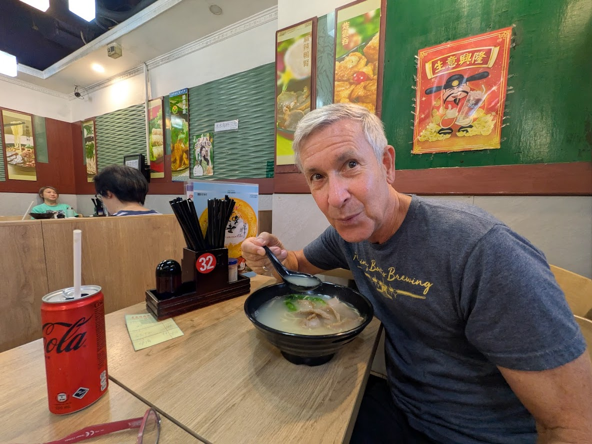

Ramen lunch at a local hole-in-the-wall in Hong Kong.

## FUNNY

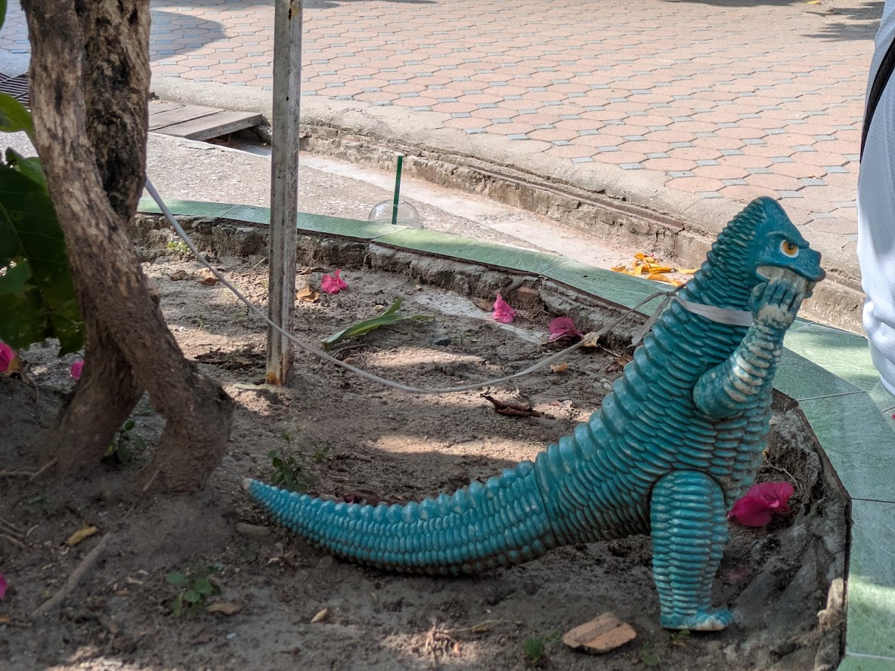

Fortunately this guy was on a tight leash!

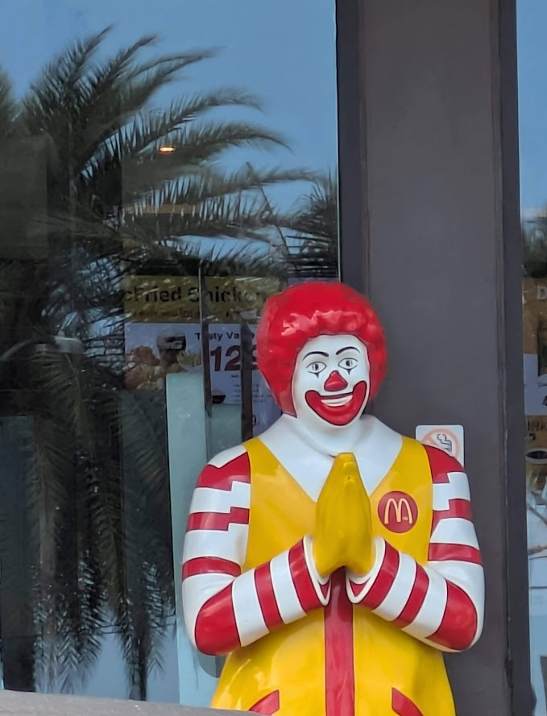

Namaste, Thai Ronald

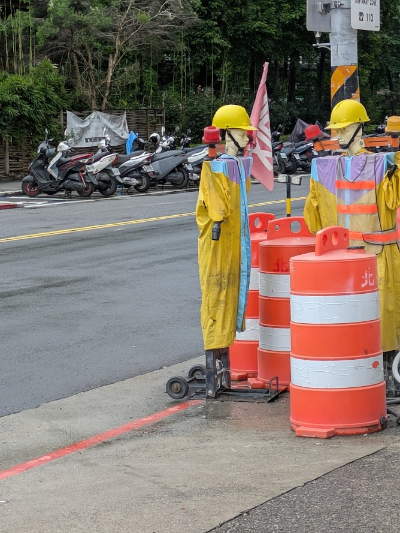

Robots are here to stay, or should I say construction scarecrows. Jobs are in danger.