# Flora, Fauna, Food and Funny - XVII

* cyrsullivan
* Jun 4, 2025
* 1 min read

Updated: Oct 2, 2025

## FLORA

The Paperflower, of the bougainvillea family.

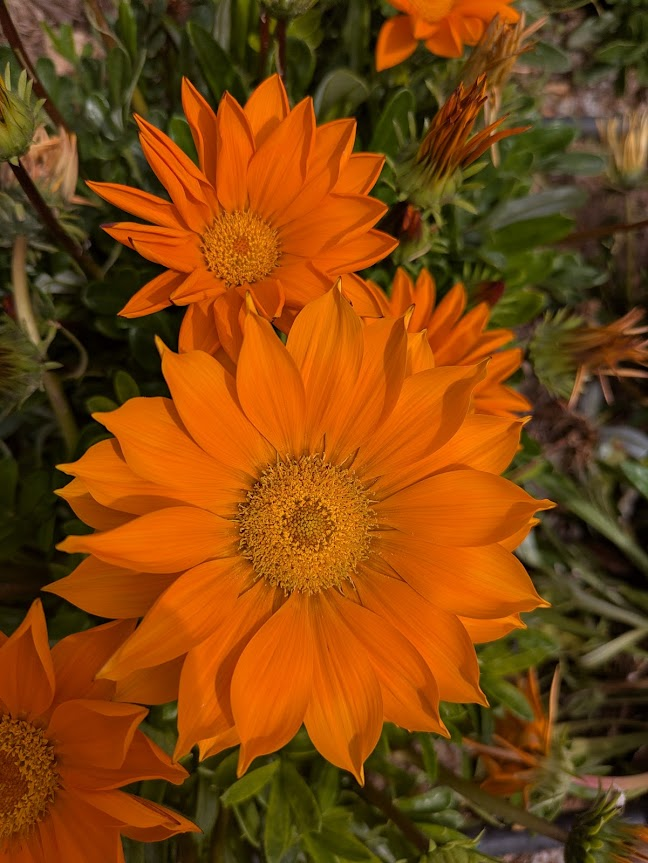

Treasure flower.

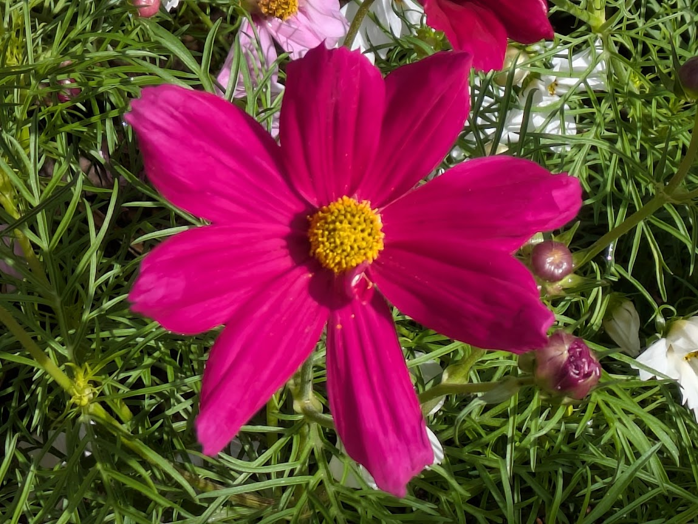

Cool Cosmo.

## FAUNA

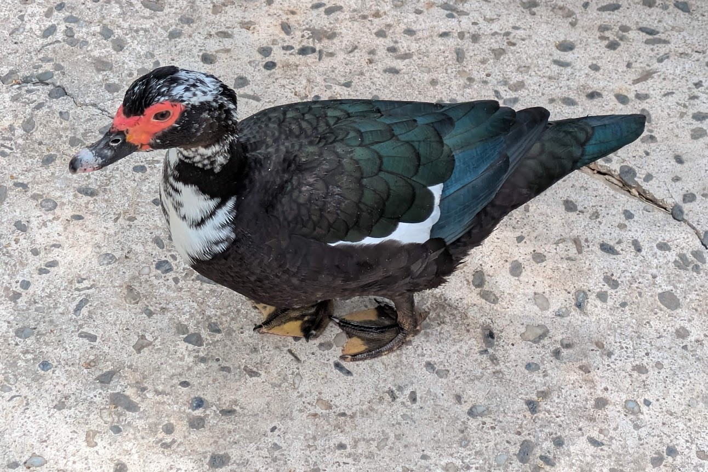

Muscovy duck taking a walk in the park.

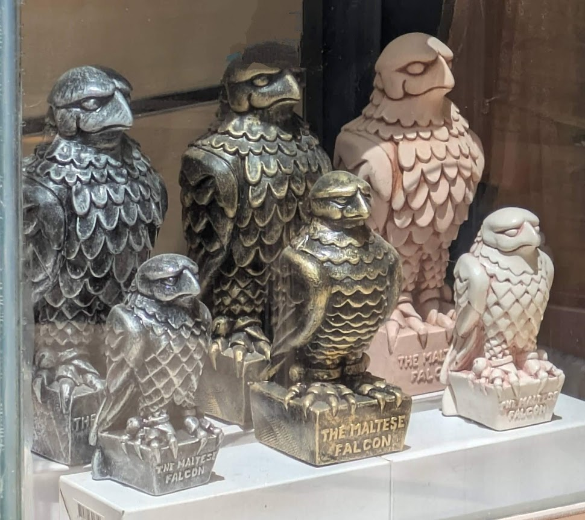

How much is that Maltese Falcon in the window?

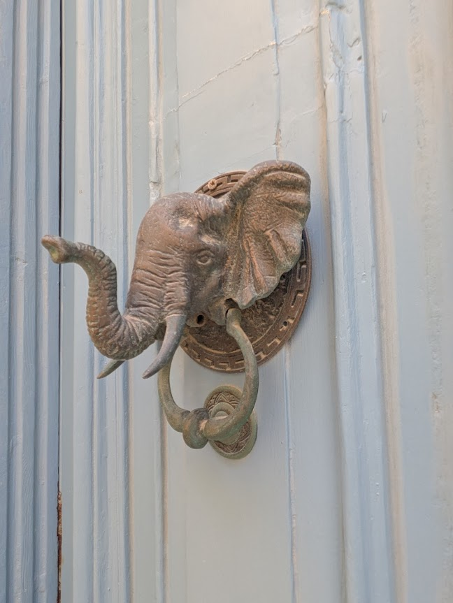

And of course we had to include this Maltese elephant head door knocker!

## FOOD

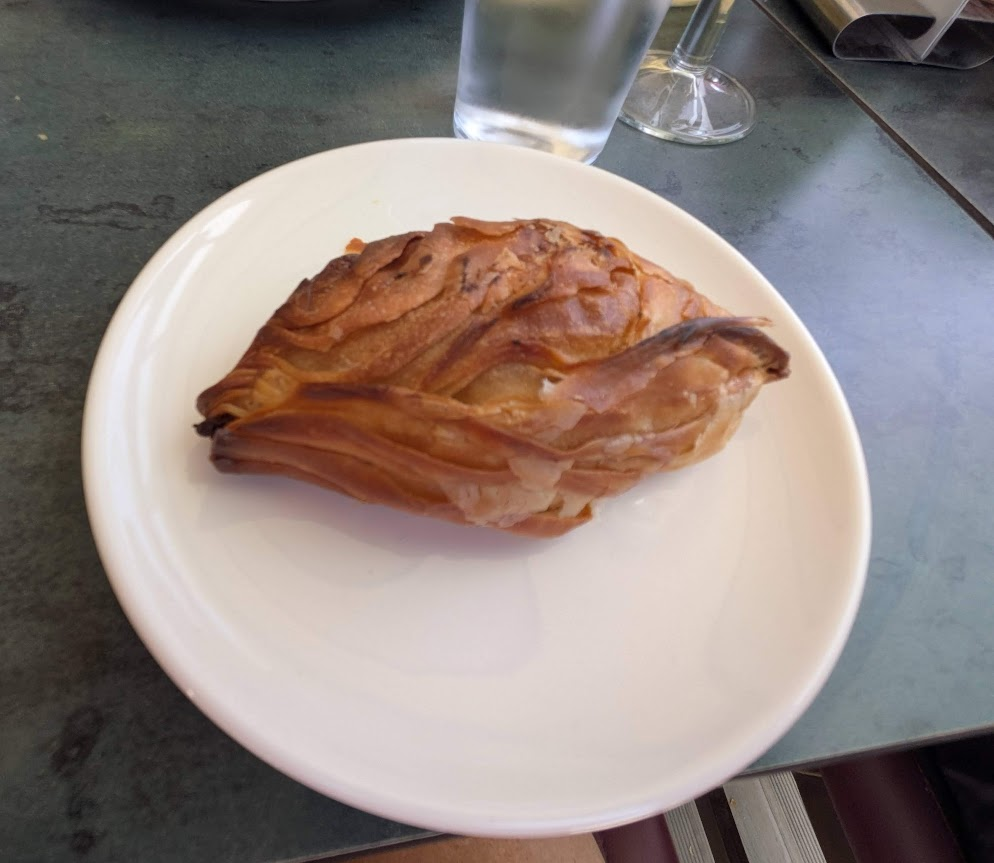

Local specialty, the savoury Maltese pastizzi. Meat and pastry together again. Delicious!

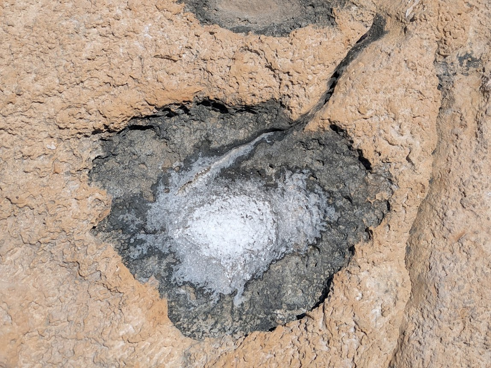

Rock Salt by the Sea Shore [It](http://Salt.It)'s a food group!

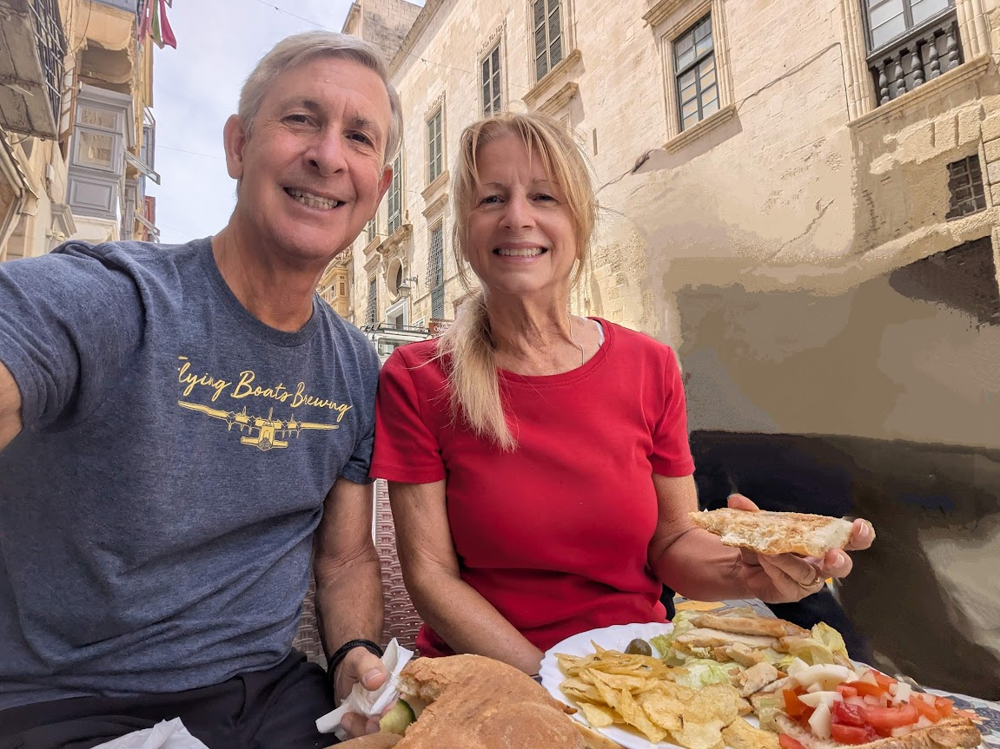

Maltese street food, giant sandwiches and chips. What a treat!

## FUNNY

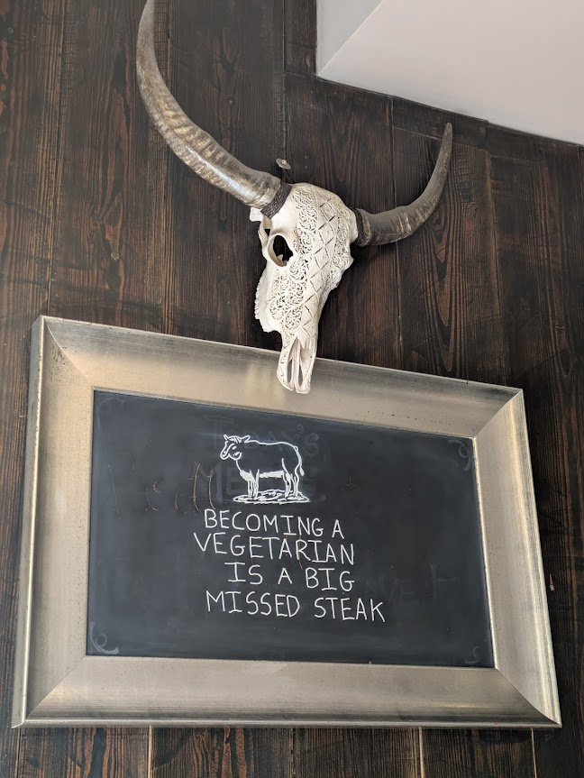

"Truer words were never spoken".

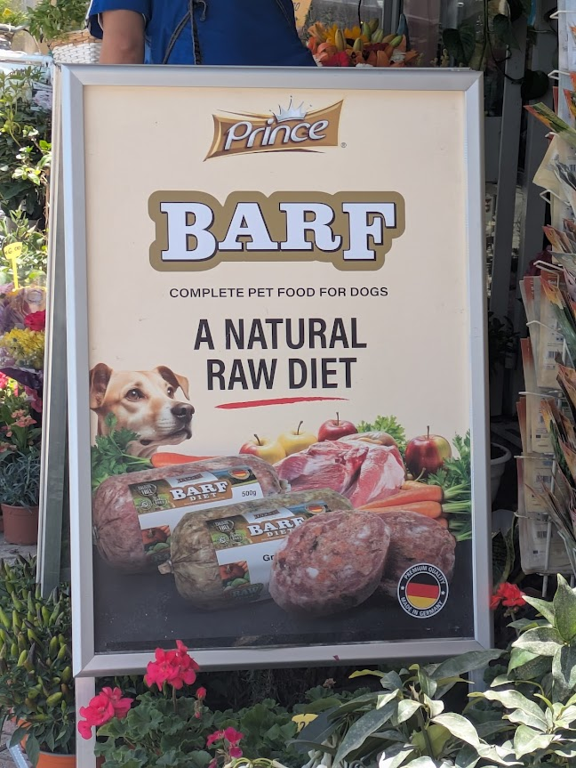

This diet HAS to work!

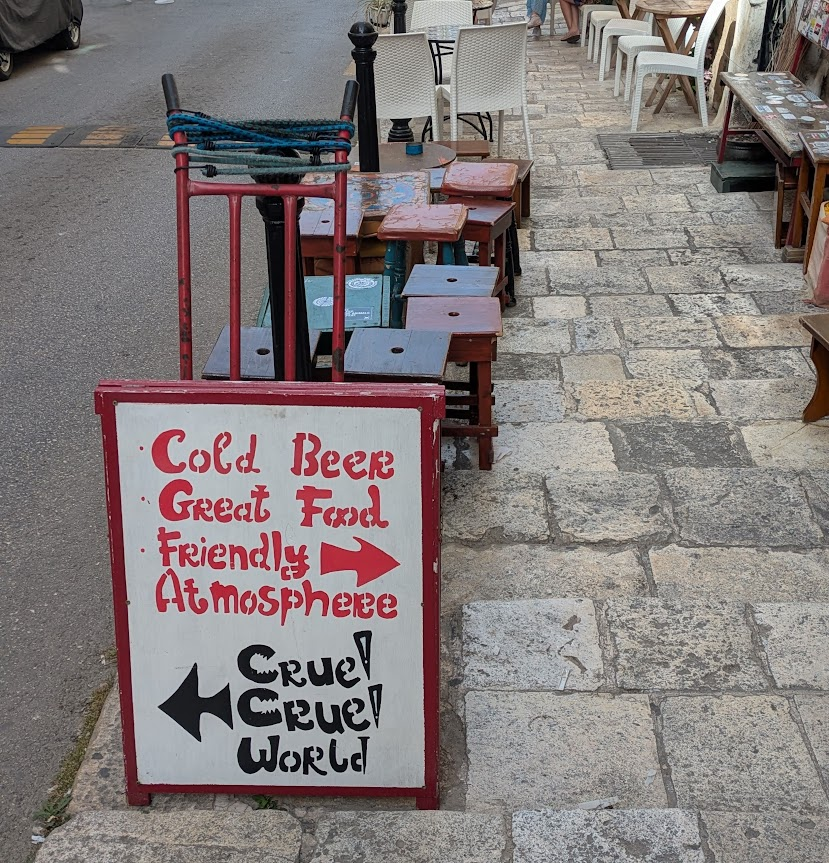

Or...cruel to the left and "Cruller" 🥯 to the right?!