# Flower, Fauna, Food and Fun - X

* cyrsullivan
* Feb 4, 2025
* 1 min read

Updated: Oct 2, 2025

## FLOWER

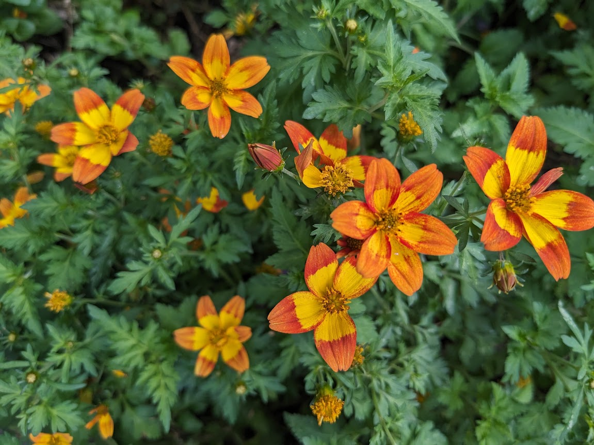

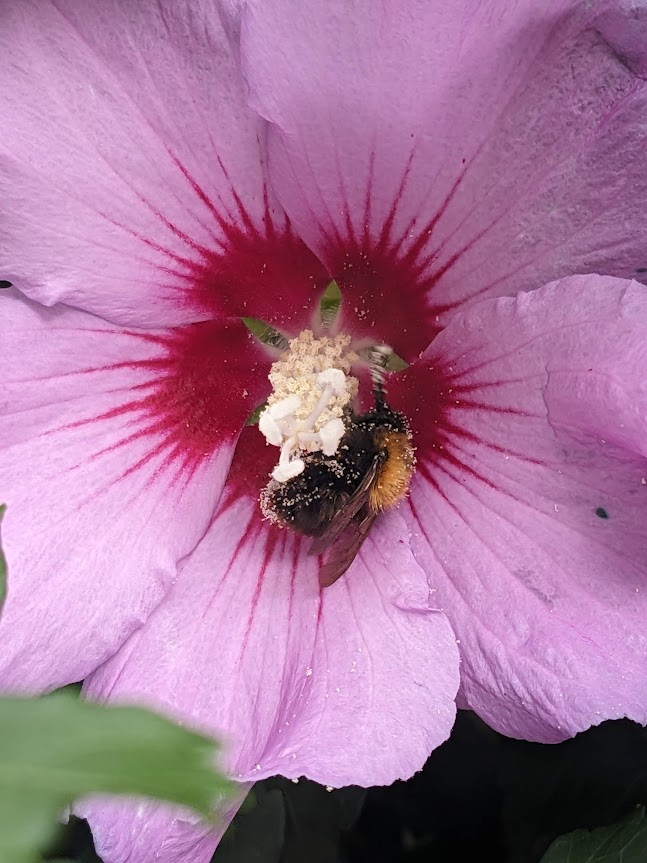

## FAUNA

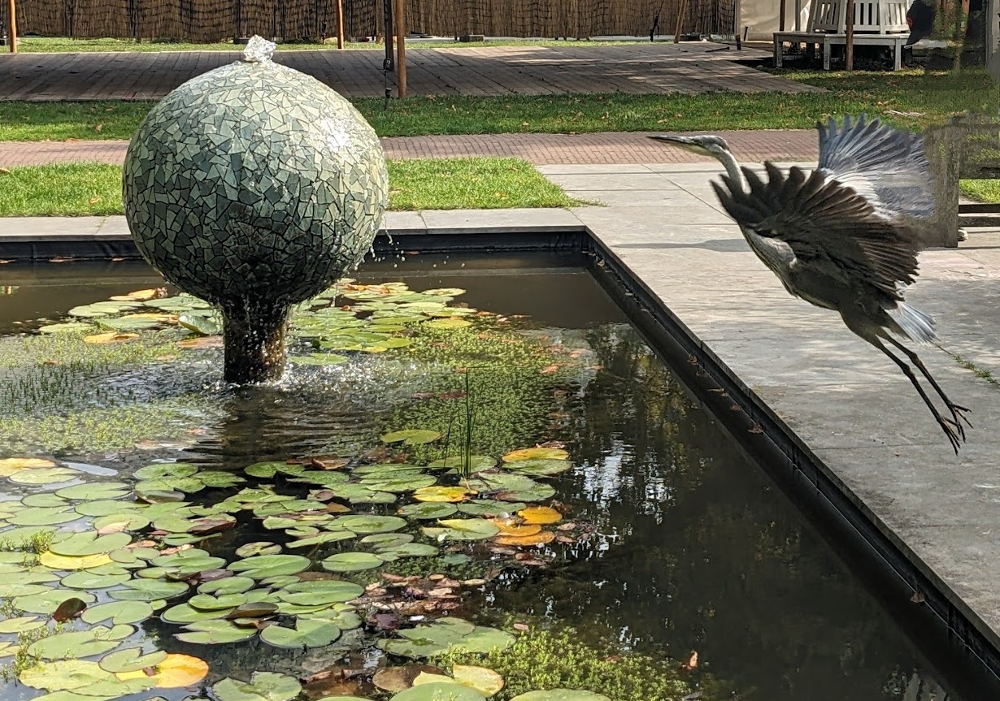

This crane has had enough of the pond.

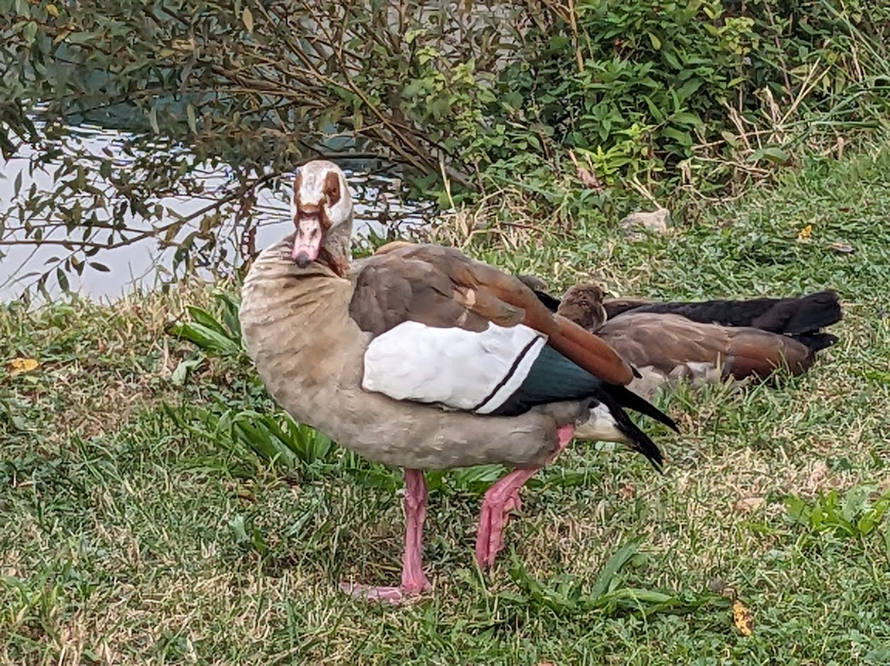

Egyptian goose...in Germany!

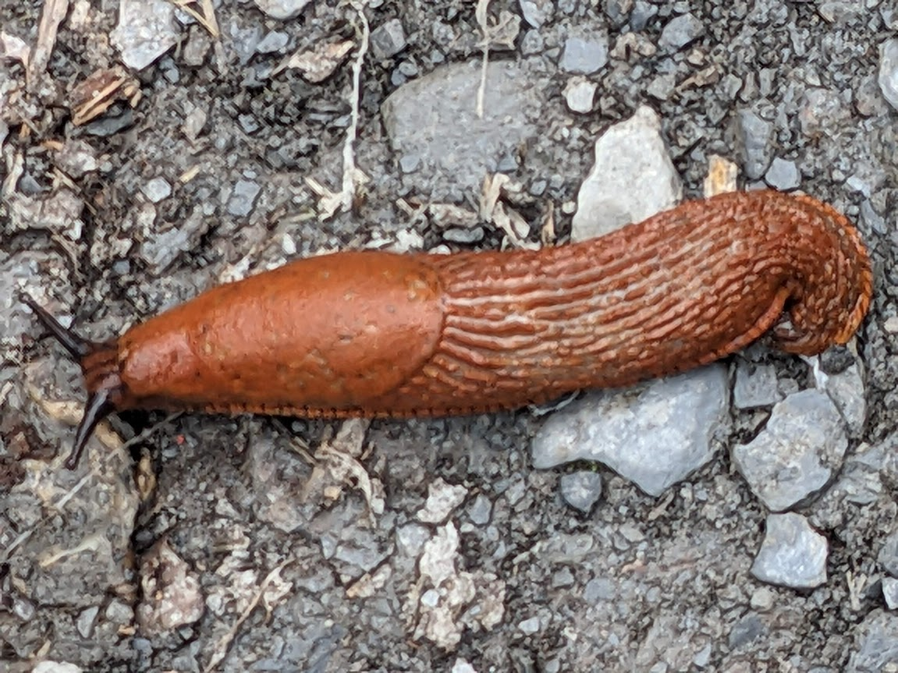

Slugs the size of my thumb were seen throughout our walk

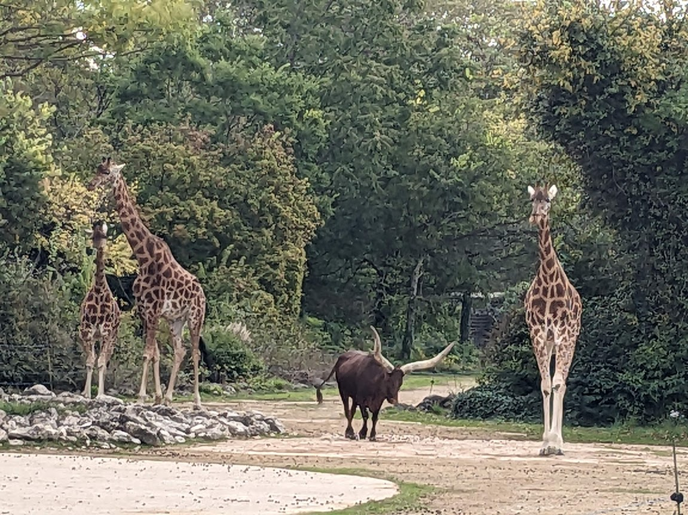

Surprize! Our walk took us past the small but spacious Lyon Z0o in the Lyon Botanical Gardens. Totally unexpected, who knew?!

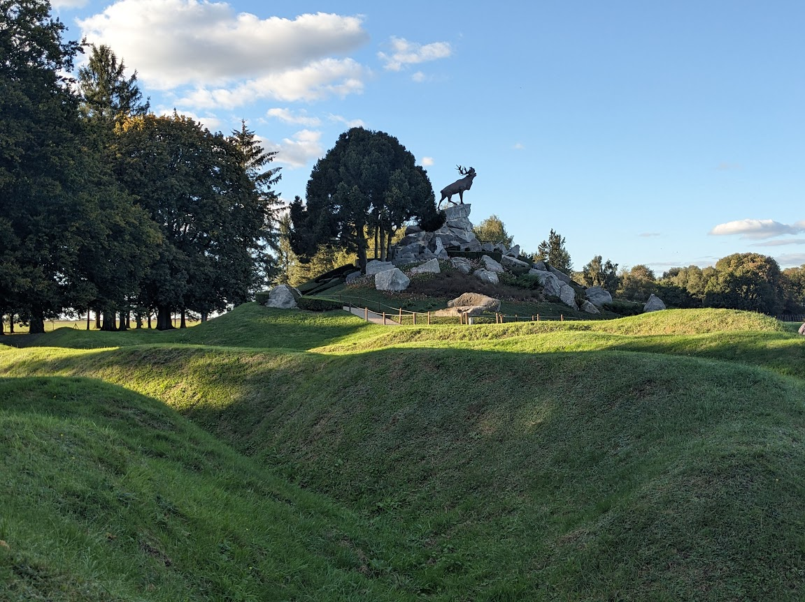

I would be remiss if I didn't include the caribou in Beaumont-Hamill, the symbol used to commemorate the Newfoundlanders who fought here and in locations around Europe.

## FOOD

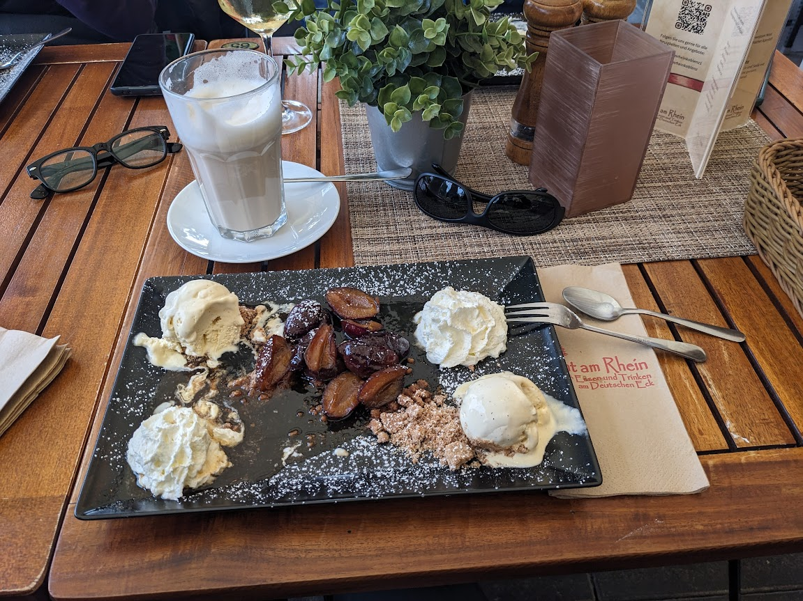

Baked figs with vanilla ice cream, crumble and cream.

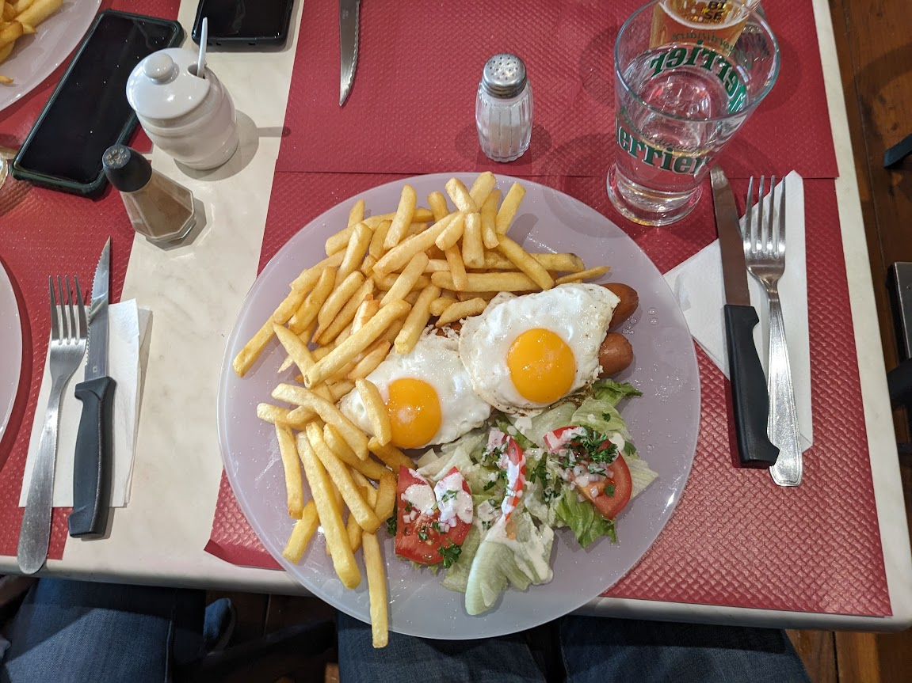

The hotdog and chips plate.

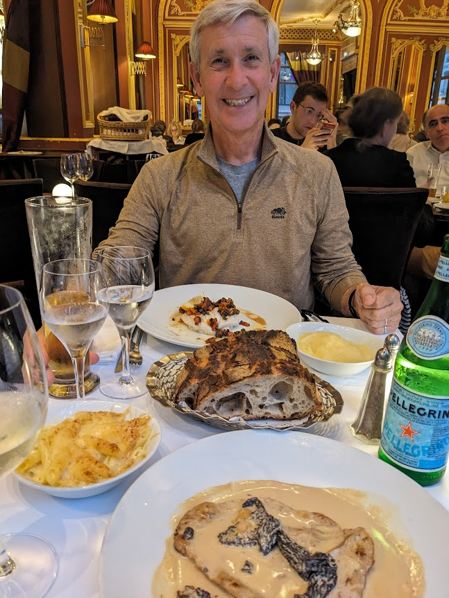

Schnitzel covered in a mushroom sauce with pasta & cheese and thick delicious bread on the side. Terry's poached fish was less impressive to me.

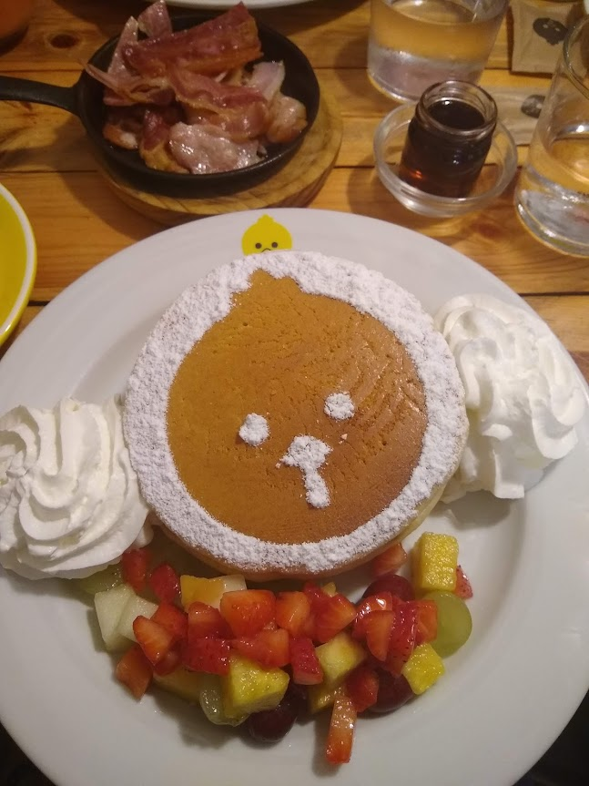

Pancakes with fruit at the Billy Brunch Cafe in Barcelona. Their logo is a chick, as is obvious from the icing decoration.

## FUNNY

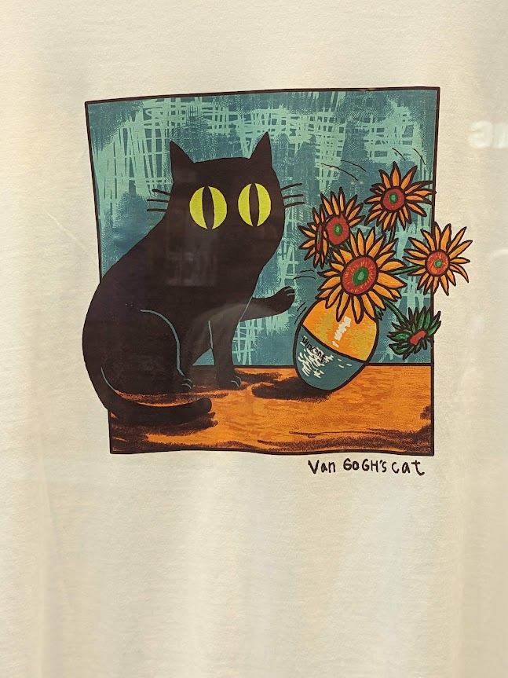

Come on. This is funny!

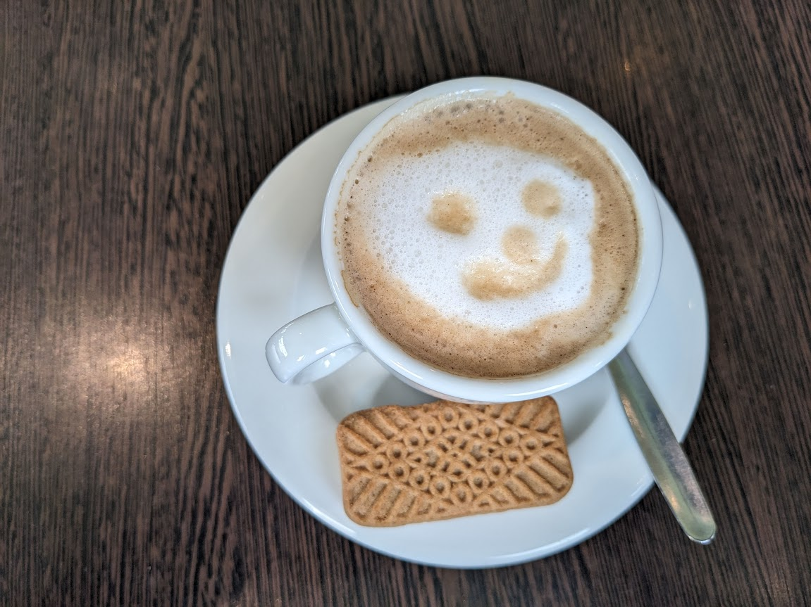

The new barista put in his best effort with this design.

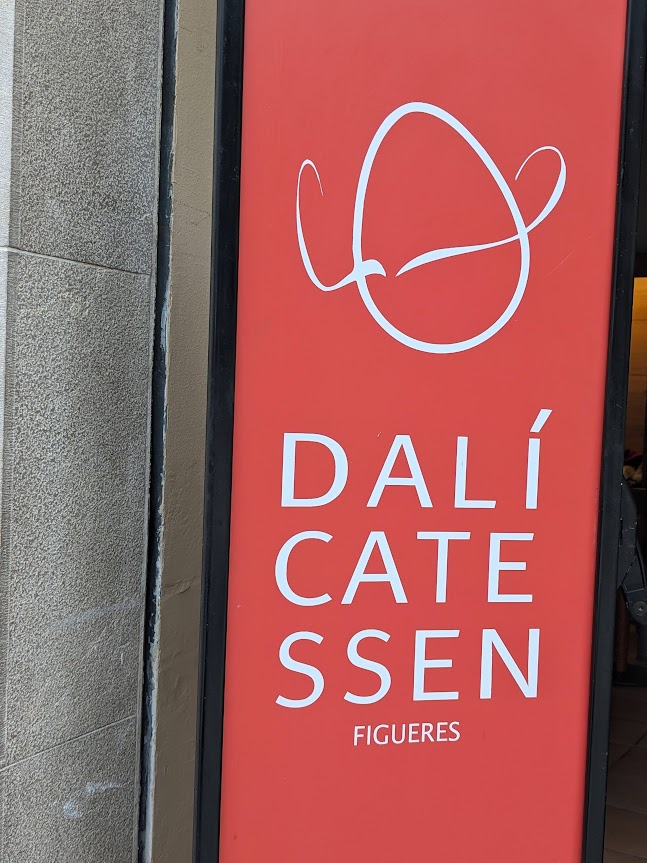

Everything in Figueres is Dali referenced. I found this one amusing.