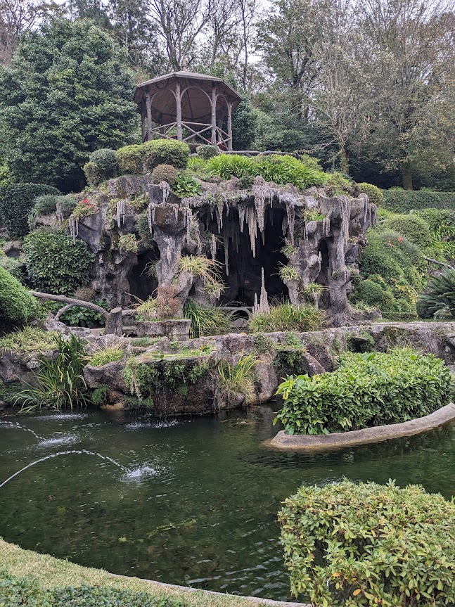
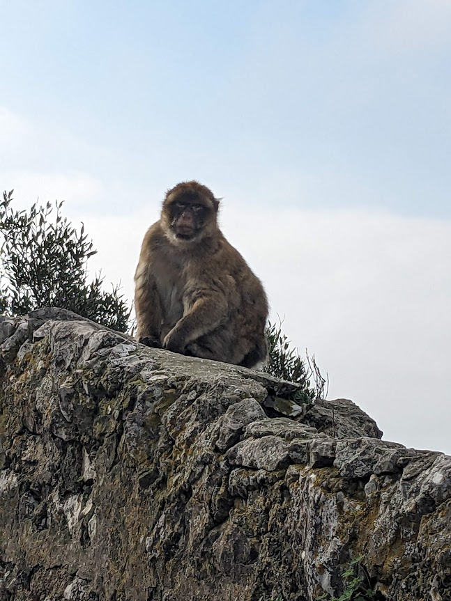
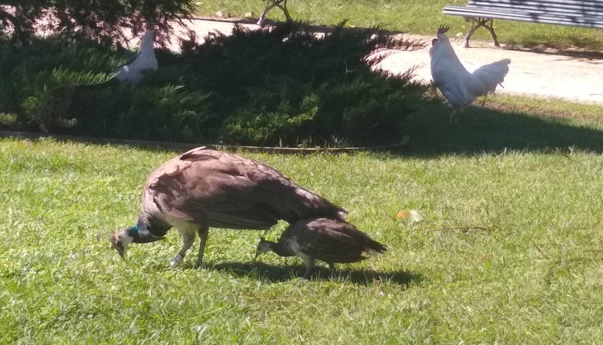
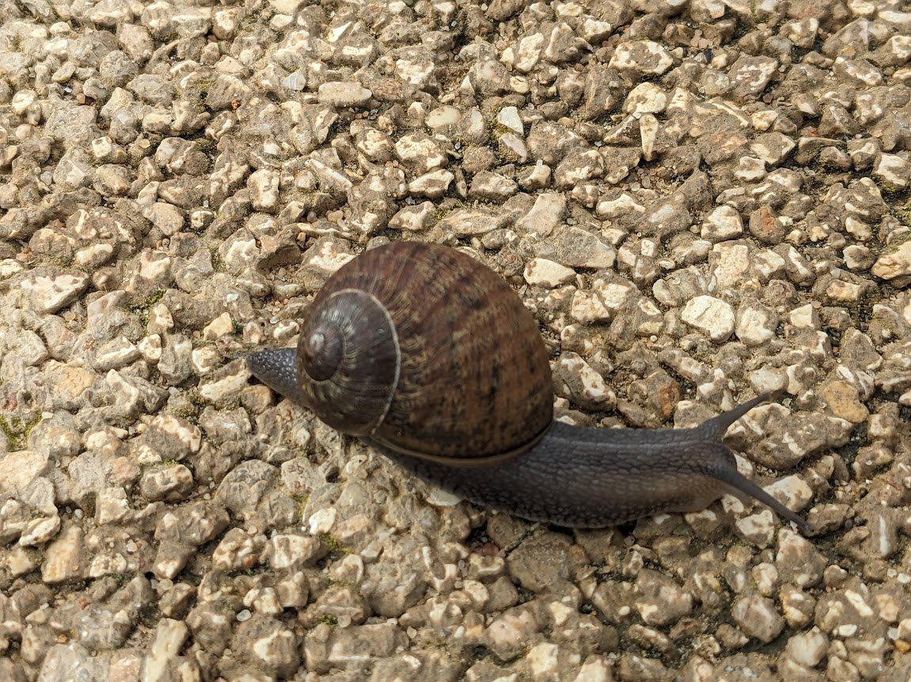
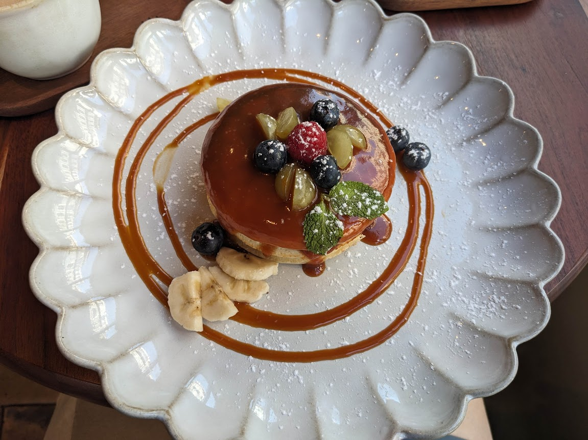
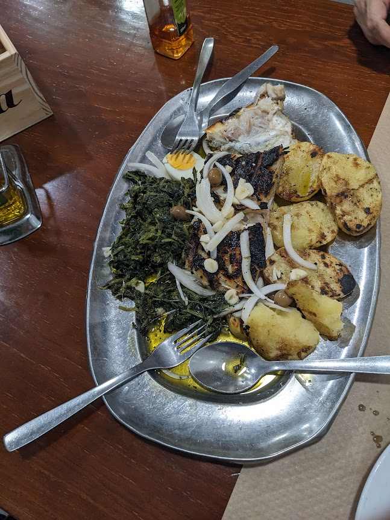
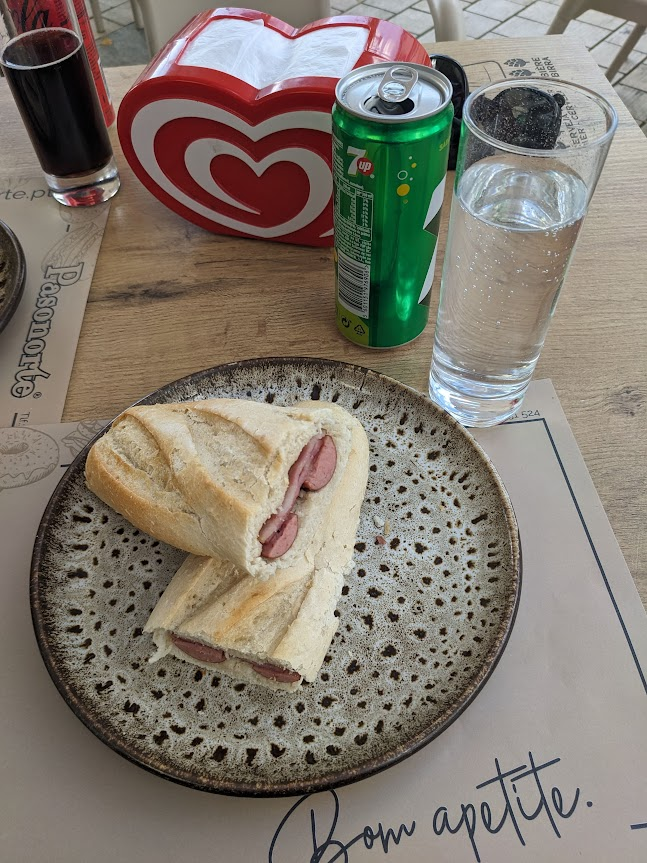
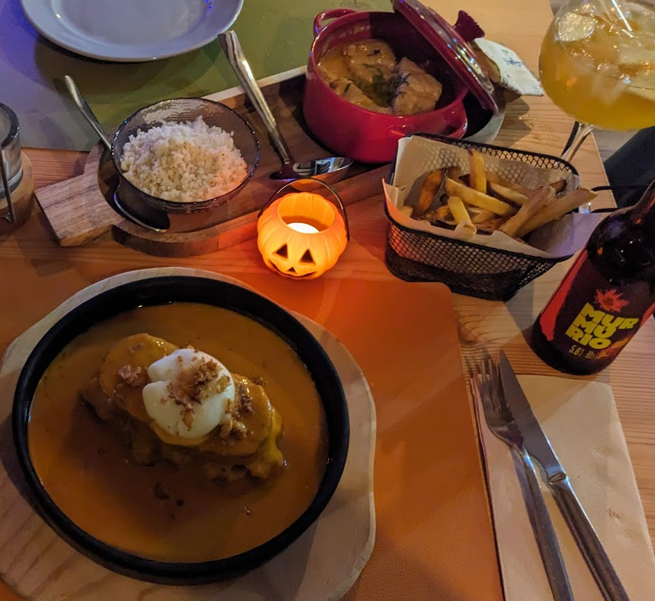
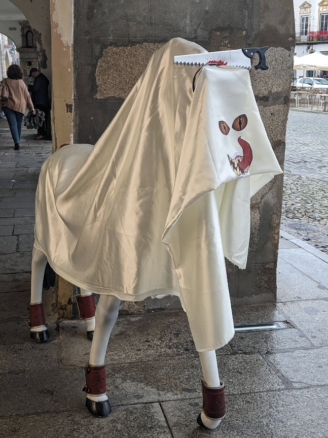

# Flower, Fauna, Food and Funny - XI

* cyrsullivan
* Feb 3, 2025
* 1 min read

Updated: Oct 2, 2025

## FLOWER

Dragon Tree in La Linea, Spain near Gibalter.

Rose petals...with a side of rice...and a wedding.

Garden in Bom Jesus do Monte near Braga, Portugal.

## FAUNA

Intimidating Barbary macaques monkey on the Rock of Gibraltar.

Porto park peahen and peachick (and chickens).

Escargot in Lagos, Portugal. It was big enough for the FOOD section but fortunately not on the menu.

## FOOD

Halloween lattes in Porto.

Pancakes with fruit and caramel sauce.

A full portion of cod fish and a bag of potatoes.

Hot dog with bacon on a bun, yum (says Terry).

Local Francesinha sandwich with poached egg and, the winner for the night, coconut curry snapper with coconut rice. Delicious!

## FUNNY

Scary Halloween steed in Evora, Portugal.

No snowfolks in Lisbon, but a rock Santa they got!