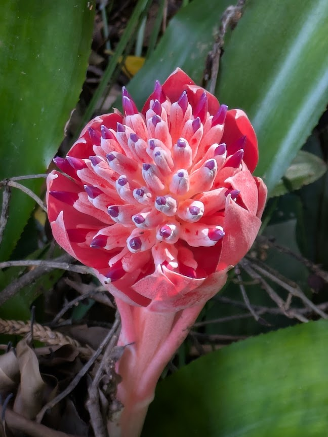
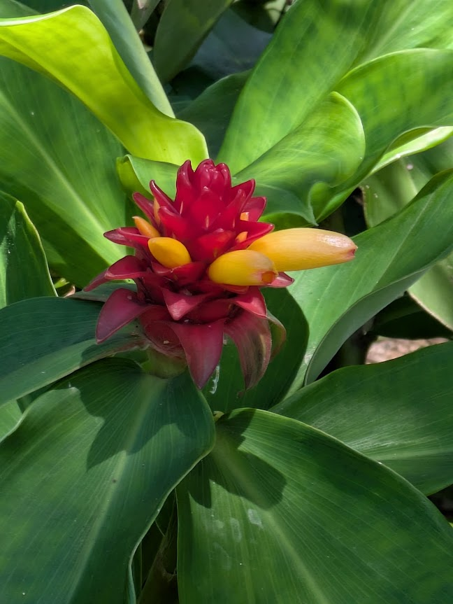
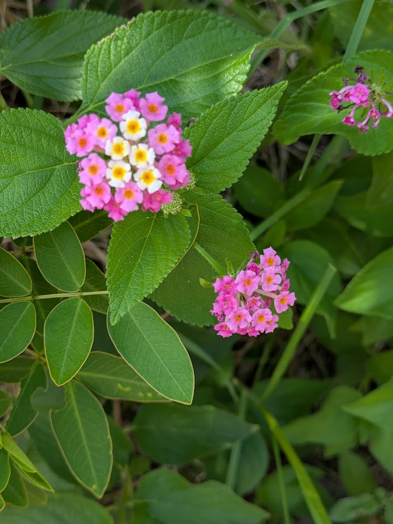
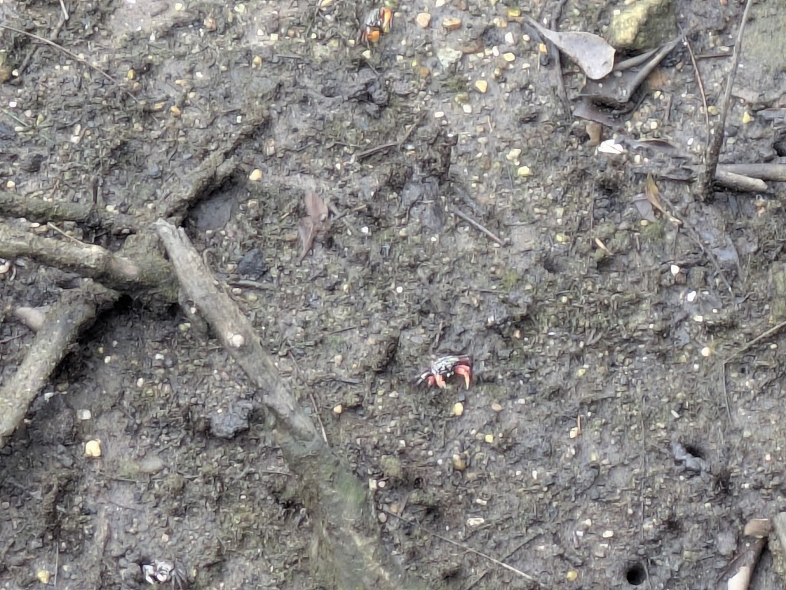
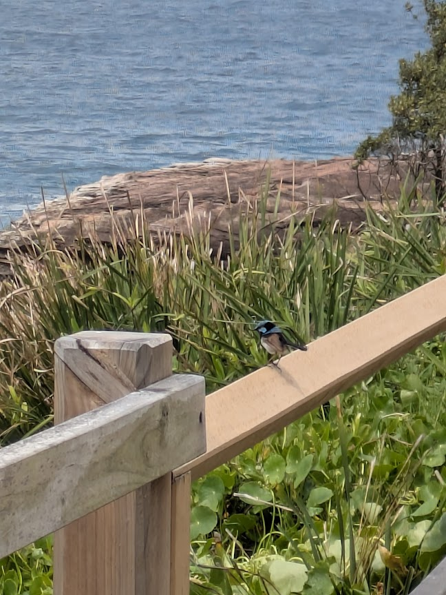
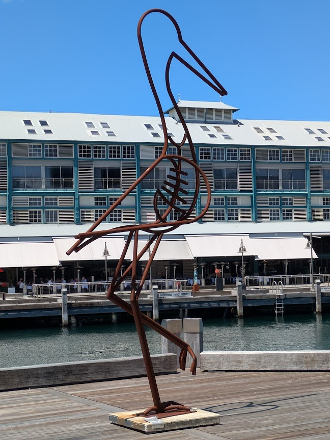
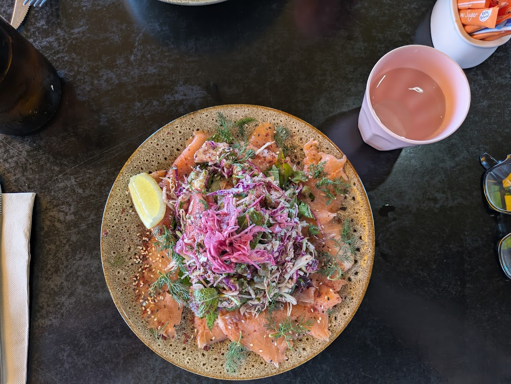
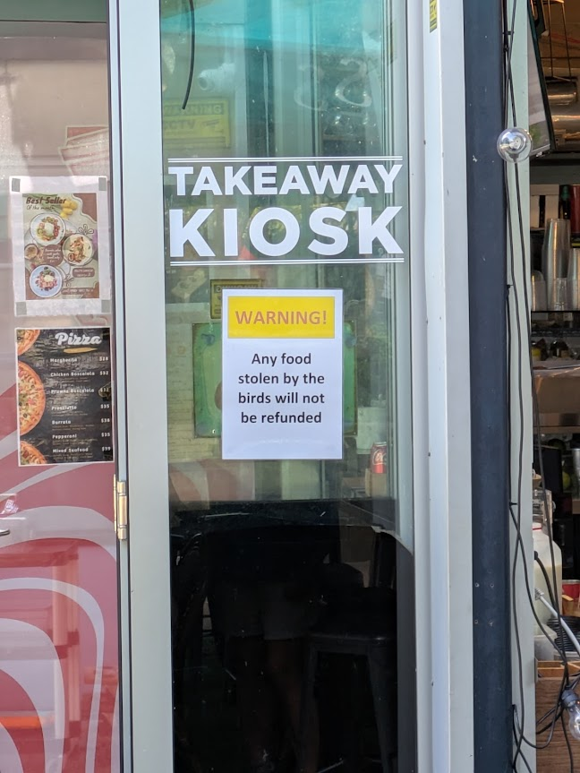
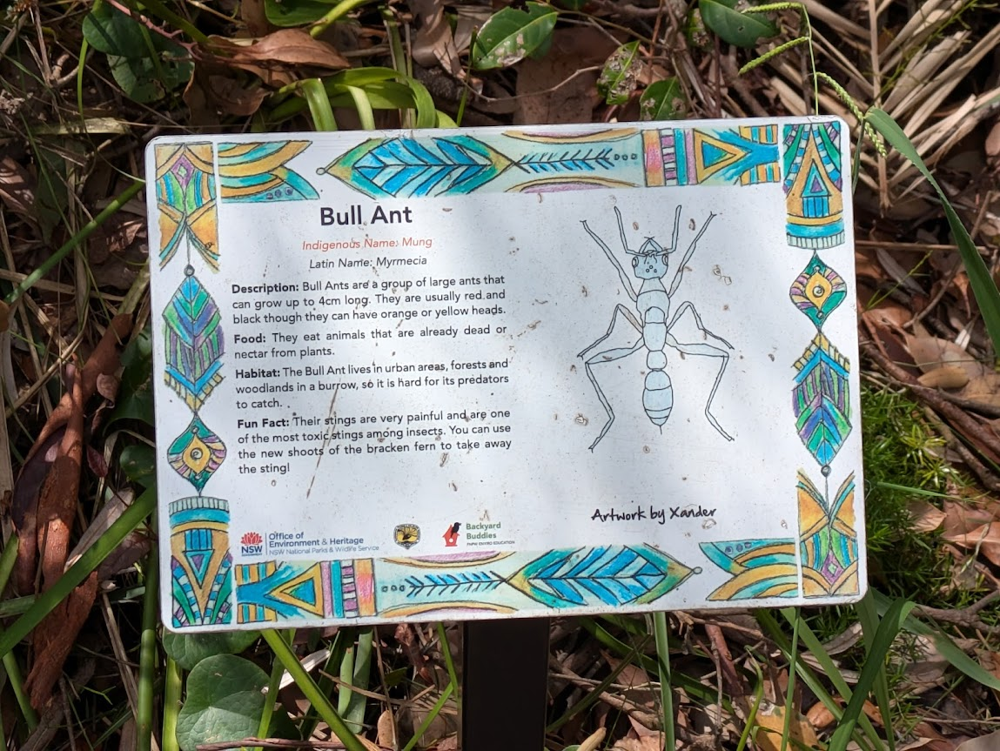
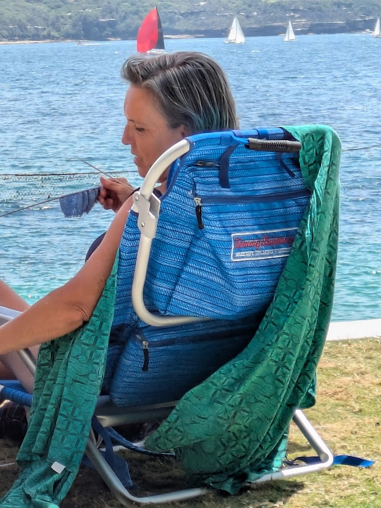

# Flower, Fauna, Food and Funny - XIII

* cyrsullivan
* Mar 11, 2025
* 1 min read

Updated: Oct 2, 2025

## FLOWER

Beauties at the Sydney Botanic!

## FAUNA

Tiny semaphore crabs skittered around in the muddy grounds in the mangrove area of the Lane Cove Mangrove Walkway

The superb fairy wren. I call it the bluebird of happiness.

The great metal gull. This one has a fish in its belly.

## FOOD

Loving the great Australian trio of a lunchtime ham toastie, a sausage roll and a toasted slice of banana bread.

My surprize chicken skewer meal.

Terry's tasty smoked salmon salad.

## FUNNY

Well, we've been told...and warned!

Fun fact indeed. What do bracken ferns look like?!! Similar informative signs were all along our walk around Bradleys Head Walking Track to help us enjoy the outing.

Some say funny, other might say productive. What else might one wisely do instead of going into the waters at Shark Bay? Note the shark net in the water.