# From Newcastle to Sydney - 12 March 2024

* cyrsullivan
* Apr 7, 2024
* 2 min read

Updated: Oct 2, 2025

With the Gold Coast in the rear view mirror, Sandy and I made our way to Newcastle, NSW. Newy, as it's known to the locals, is a lovely little coastal town that's packed with sandstone buildings and is home to the largest port on the East coast. Once a major coal mining town worked by convicts, it was known as a bit of a hellhole. Then in 2008, a Renew Newy program was initiated that completely revitalized the town. Now a hip and happening place with theatre, artisans, cafes, bars, a couple of great beaches and Fort Scratchley, it's definitely worth a visit.

We spent the week soaking up the atmosphere, enjoying some great breakfasts and dinner jazz. If we weren't snacking, we were strolling the downtown admiring the architecture or meandering along the coastal walks. A stand out treat was a three hour tour of Fort Scratchley. The fort was cool, but it was the animated guide that really brought life to the tour.

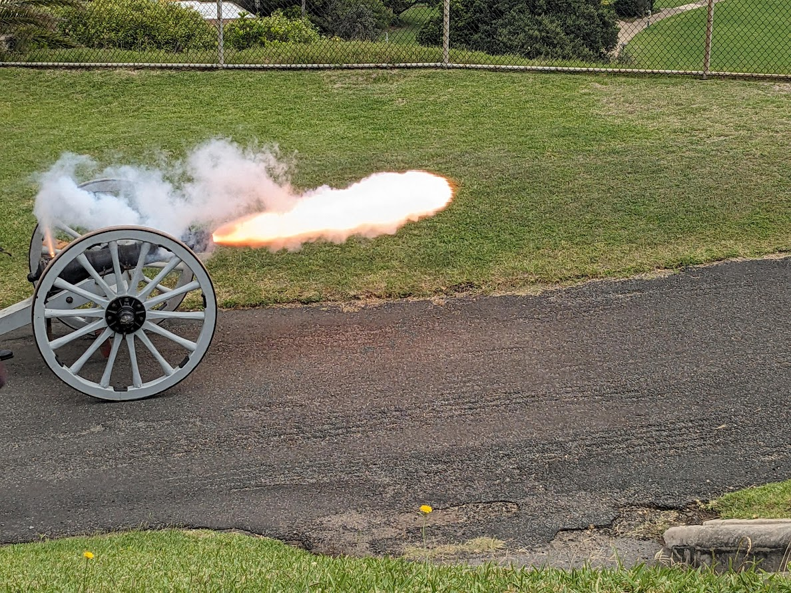

A thoroughly good time at Fort Scratchley

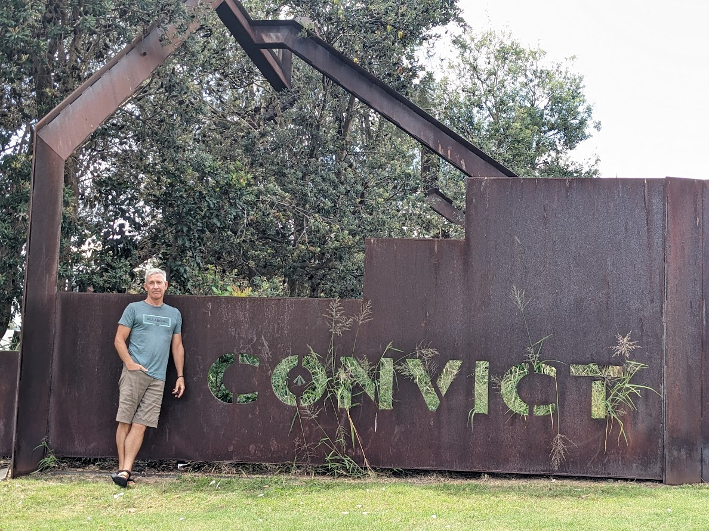

Newy is awash with memorials to the convicts that were once the engine of the community

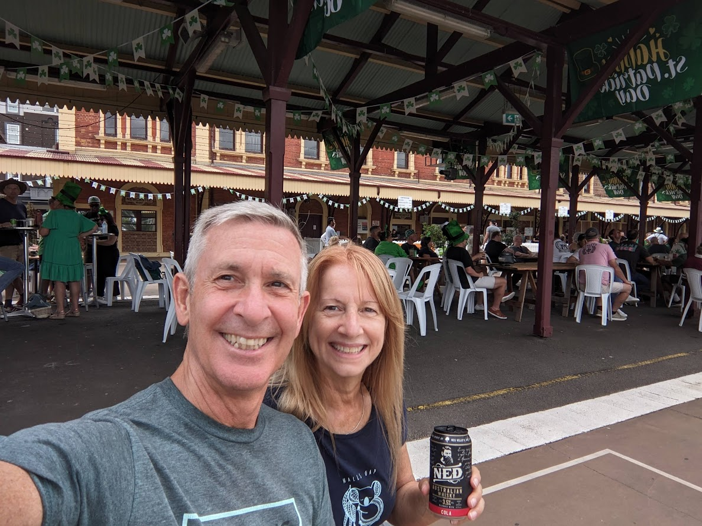

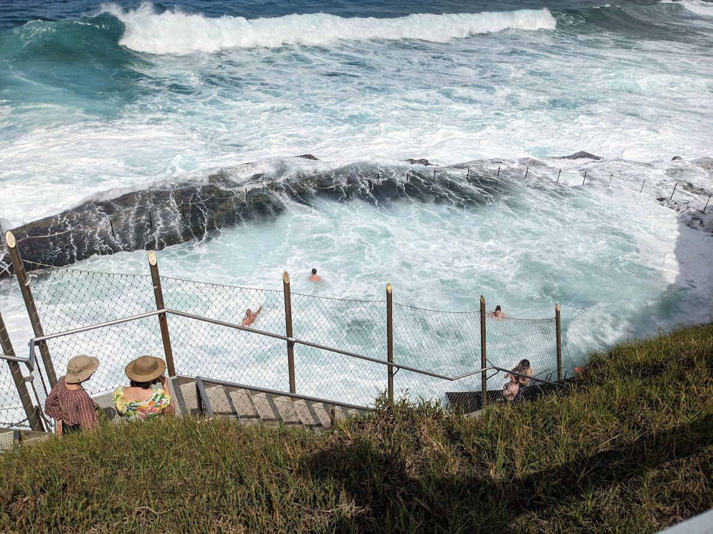

We raised a glass at the St. Patty's Day celebrations but passed on the opportunity for a dip in the rock pool

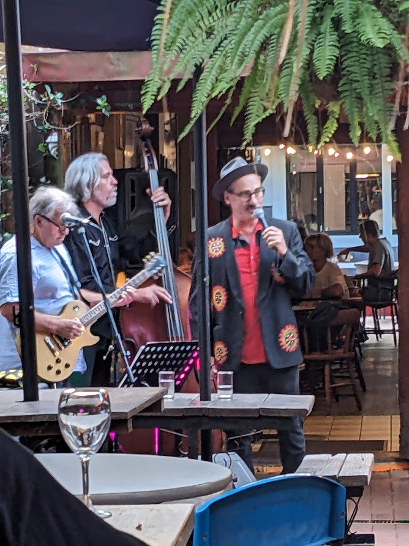

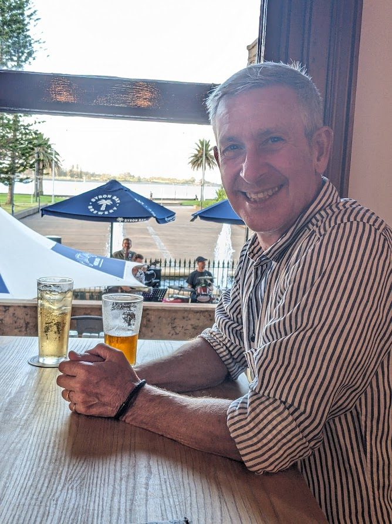

Enjoyed dinner and some super jazz at Goldbergs Coffee House and a rollicking 60's band at the Custom House

After a week of chill'n in Newy, we hopped the train back to Sydney where we spent the next two weeks revisiting many of the sites and sounds we highlighted in our earlier post. With Potts Point as our launch point, in a charming art deco AirBnB, our last two weeks evaporated into thin air and on April 1st we boarded our return flight to Vancouver. Welcome back to the northern hemisphere!

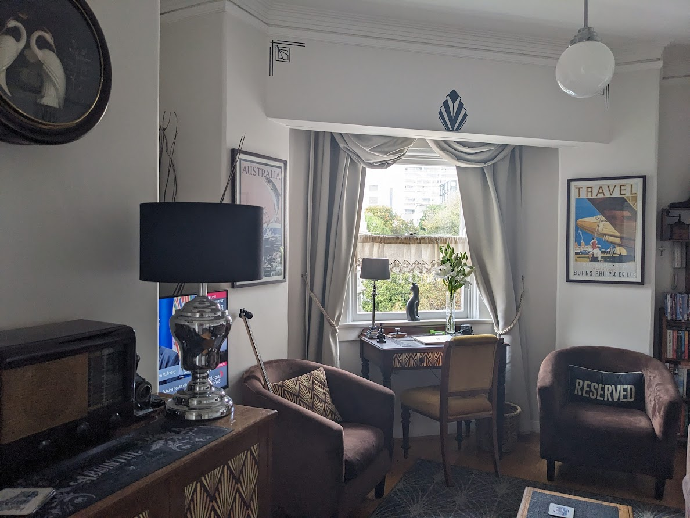

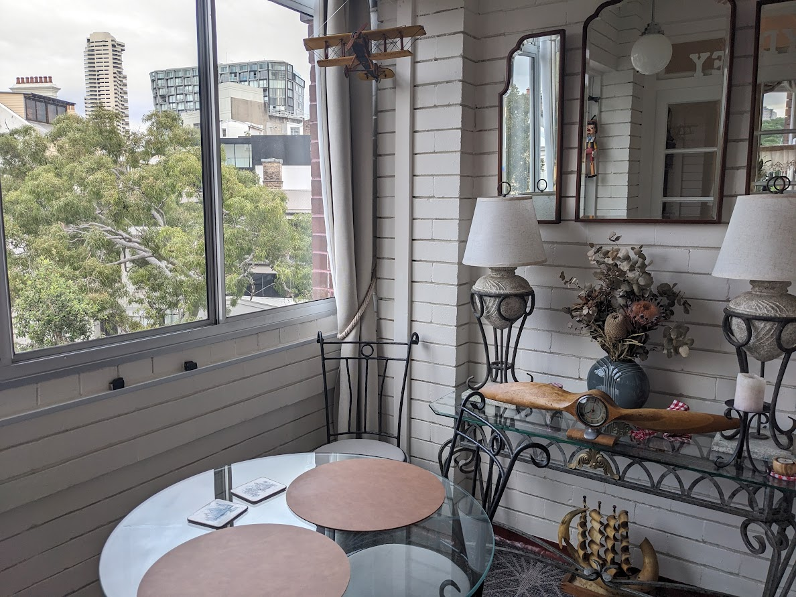

A couple of pics of our lovely little Airbnb in Potts Point

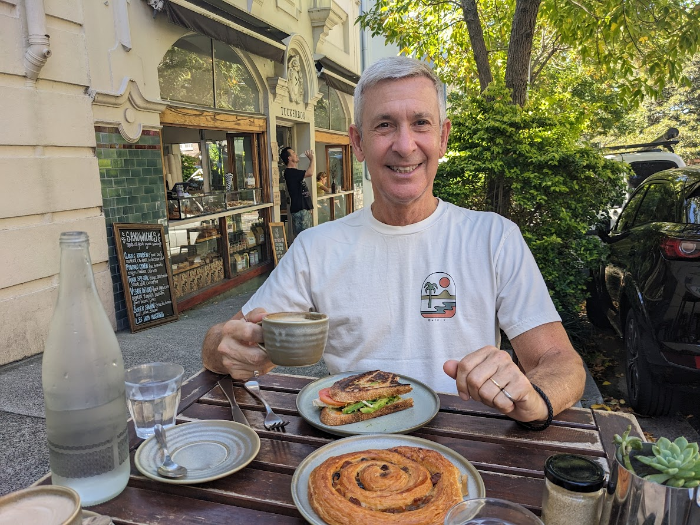

Enjoying the many patios in the Point. Delish!

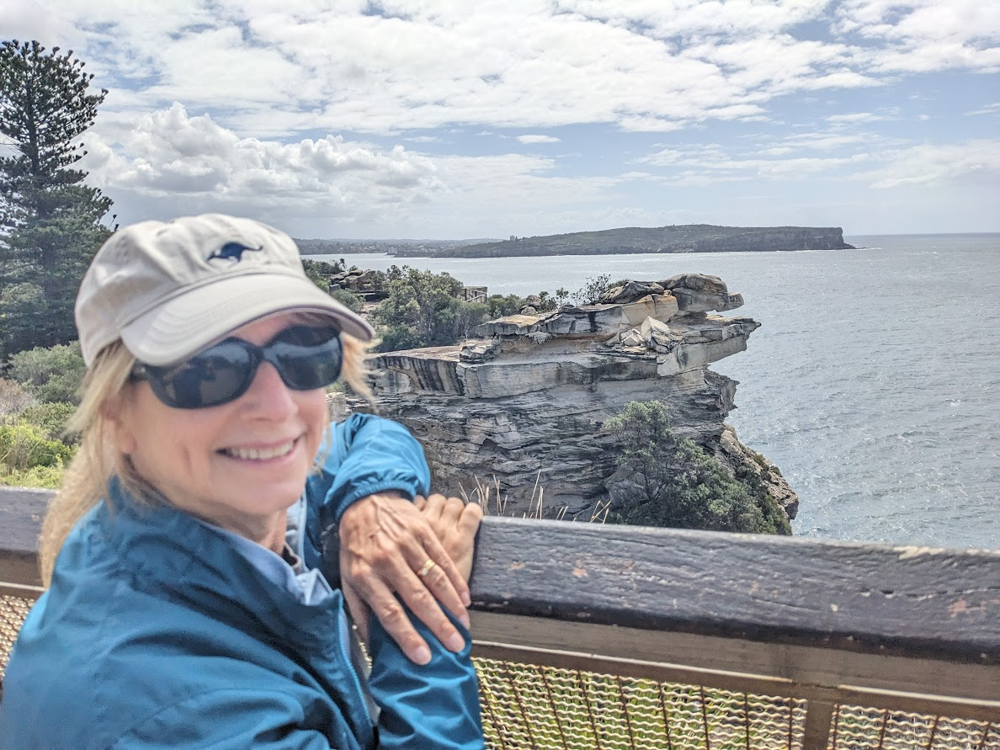

Looking out over the entrance to Sydney Harbour from The Gap Lookout National Park

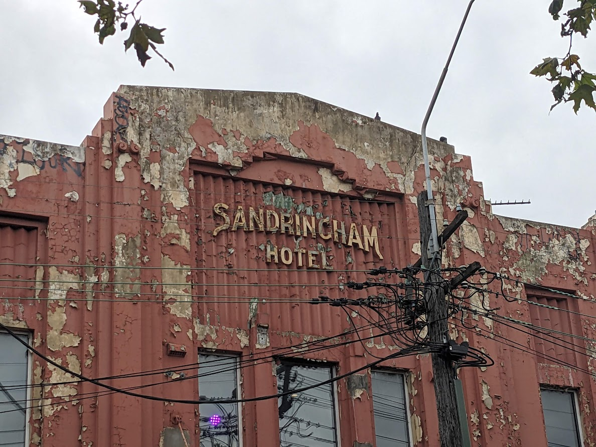

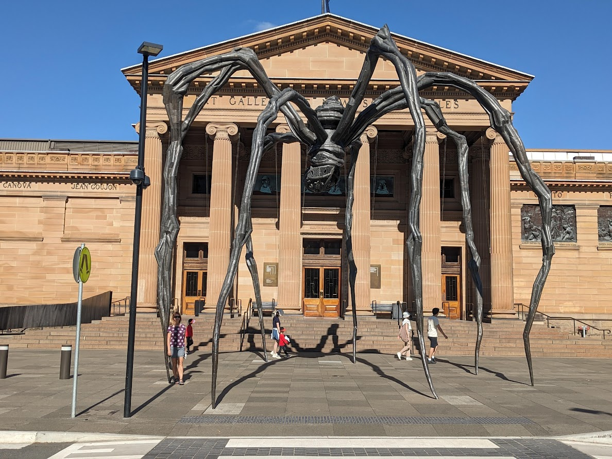

A great example of some of the aging architecture that is still used and appreciated. Also, another of the many spiders that dot the landscape.