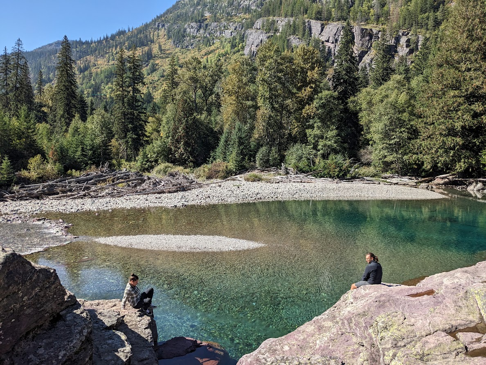
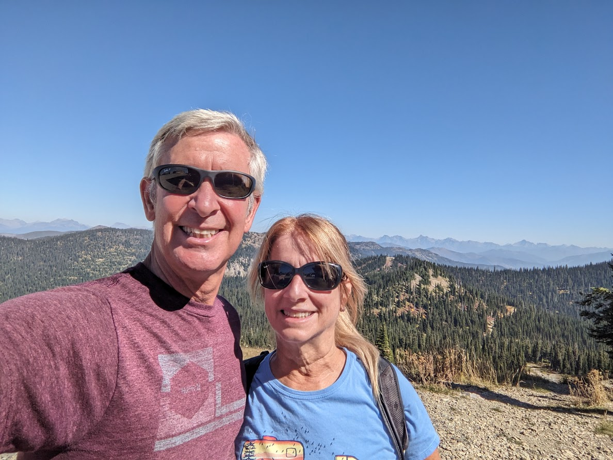

# Glacier National Park - 14/16 Sept

* cyrsullivan
* Sep 26, 2023
* 1 min read

Updated: Oct 2, 2025

With Yellowstone and Yogi Bear in the rear view mirror, we headed north to Glacier National Park. We decided to pitch up in Whitefish, Montana, a hip little ski town just outside the park near the Big White Ski Resort. A rather cool place to spend a few days.

We spent the first day driving the Going-to-the-Sun Road. This hair raising 80 km route, riddled with blind curves and super tight switchbacks, clings to the edge of the mountain like a mountain goat. It climbs to a height of 2,026 m as it cross-crosses the mountain. Be warned if you suffer from acrophobia.

We traversed the route in both directions stopping along the way to hike, enjoy a lunch stream side and generally catch our breath.

On Saturday we decided to hike the Danny On trail up Big White. A full day hike, the trail through the woods was extremely peaceful and the views from the top spectacular.

As we made our way up, we came across a two-point buck leisurely eating among the trees along the slope. While we were stopped, two young ladies slowed down to ask us if we were okay. When we told them we were just watching the deer, they looked over at it briefly then continued on their way while congratulating us (old folks) for being on the hike and moved off up the trail. The cheek!