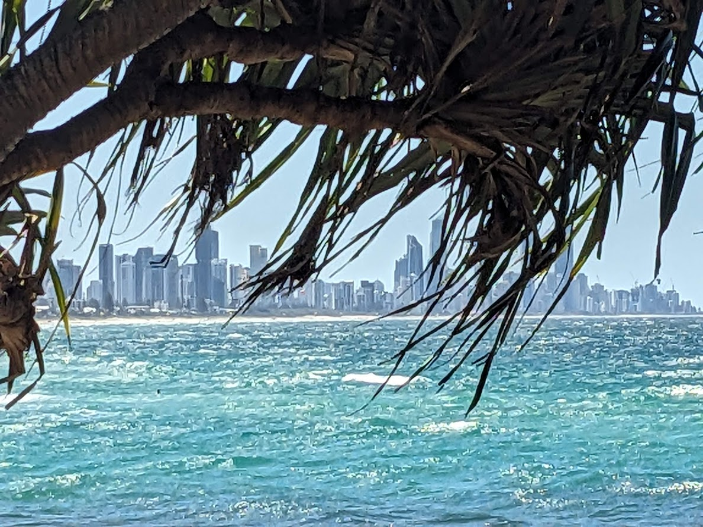
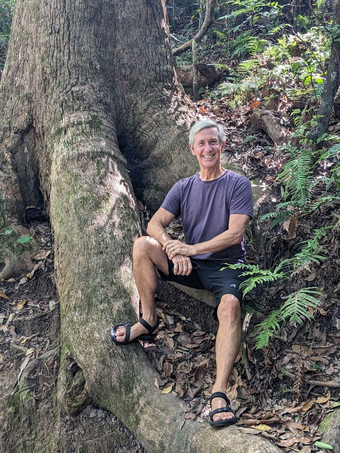
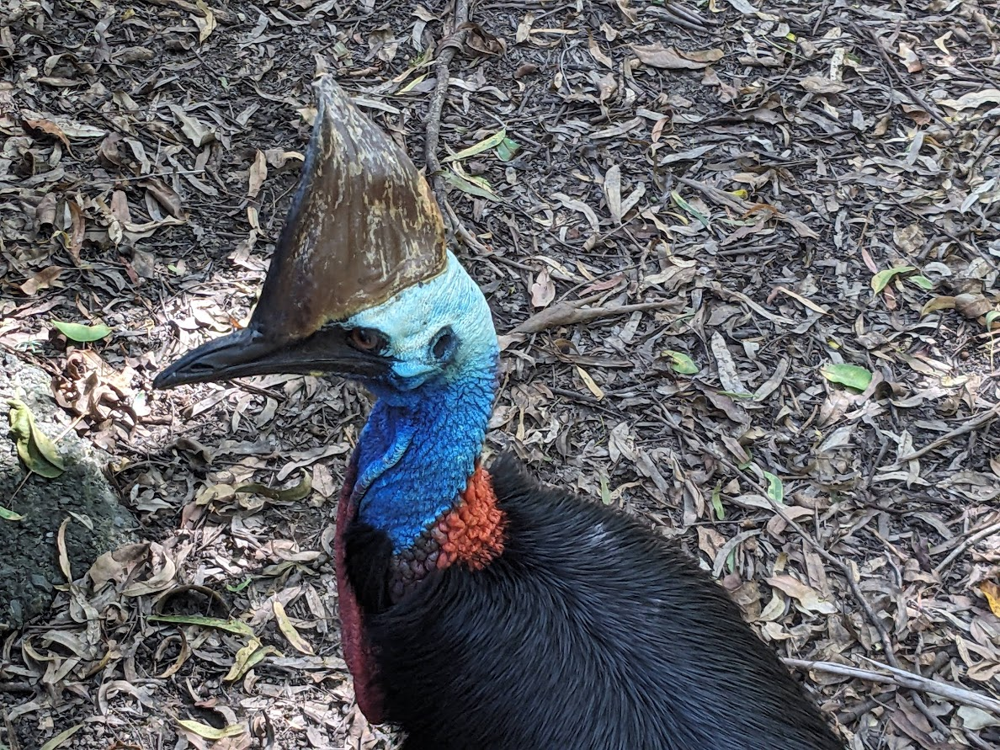
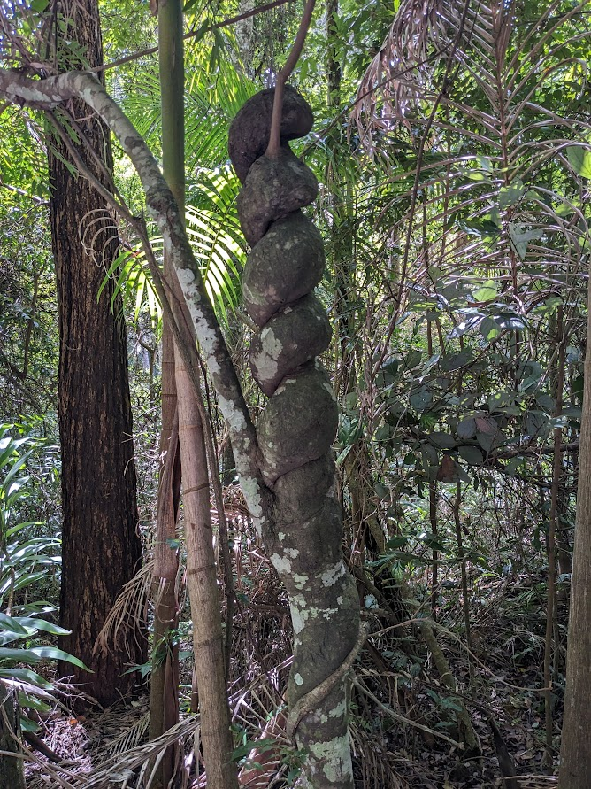
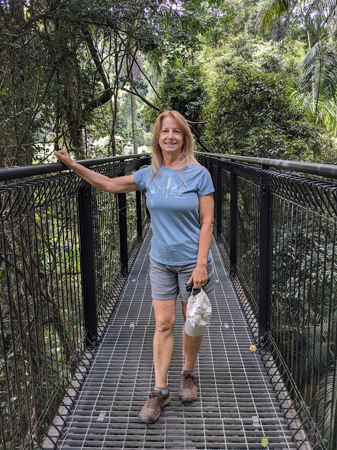
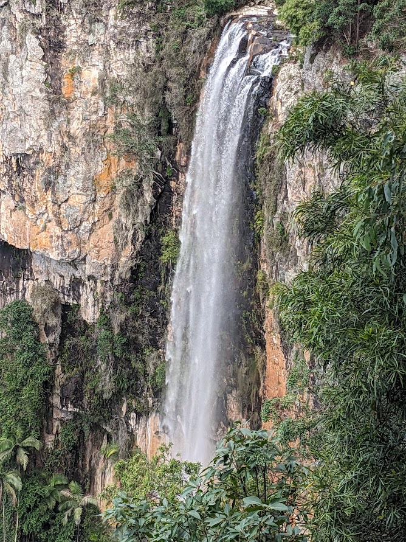
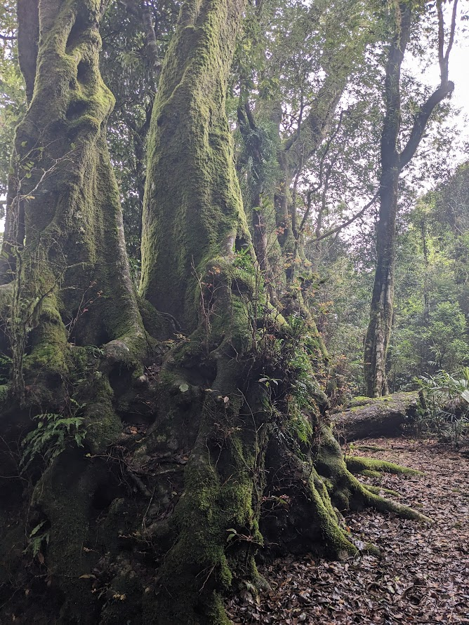
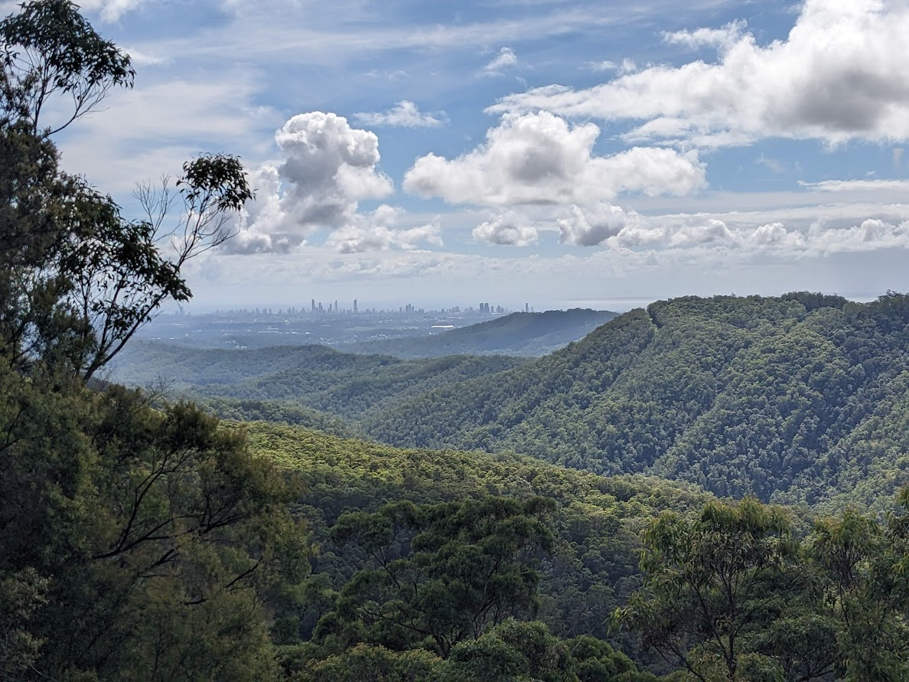

# Gold Coast - 27 March 2024

* cyrsullivan
* Mar 28, 2024
* 1 min read

Updated: Oct 2, 2025

After a super Great Ocean Road/Gold Mine Country tour, we flew up to Australia's Miami, the Gold Coast. With over 50km of pristine beach, it's a mecca for surfers with has a laid back atmosphere. We pitched up in a cozy one-bedroom apartment for our two week visit. Just off the beach, the apartment provided a sweeping view of the nearby Springbrook mountains and a glancing view of the ocean. We spent our time strolling the beach, exploring the bike paths and checking out the many cafes and restaurants.

Time passed quickly, but a few of the memorable moments included hiking in Burleigh Head National Park, conversing with the wildlife at David Fleay Wildlife Park (<https://parks.des.qld.gov.au/parks/david-fleay/about>), and day tours chasing the waterfalls of both the Springbrook and Tamborine National Parks (<https://scenicdaytourgroup.com.au/tour/best-of-tamborine-mountain-tour/>[)](https://scenicdaytourgroup.com.au/tour/best-of-tamborine-mountain-tour/) / (<https://scenicdaytourgroup.com.au/tour/springbrook-natural-arch-numinbah-valley/>).

A view of the Gold Coast from Burleigh Head National Park

Getting cozy with nature in Burleigh Head National Park

David Fleay Wildlife Park focuses on wildlife rehabilitation and protection of endangered species. Here's a lovely pic of an Australian Cassowary. A flightless and rare animal, they are a keystone species because they east tropical fruit and distribute their seeds throughout the forest (through their poo!). They resemble an emu but sport a [casque](https://en.wikipedia.org/wiki/Casque_(anatomy)) on their heads whose purpose still alludes wildlife biologists today.

We spent two days touring the rainforests, gorges, waterfalls and scenic overlooks of Springbrook and Tamborine National Parks. The parks are remnants of the huge, ancient Tweed Volcano, which give them their interesting landscape and vegetation.