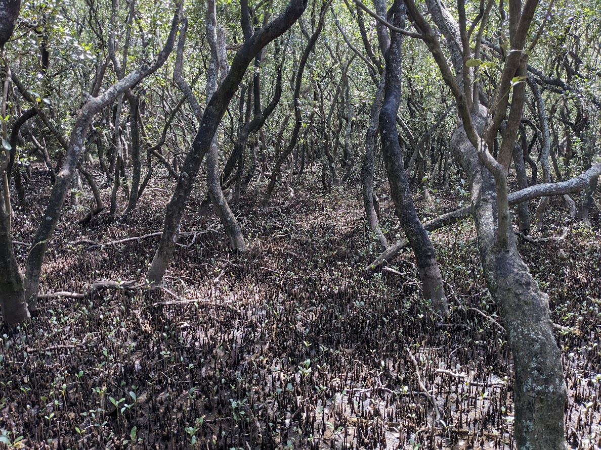
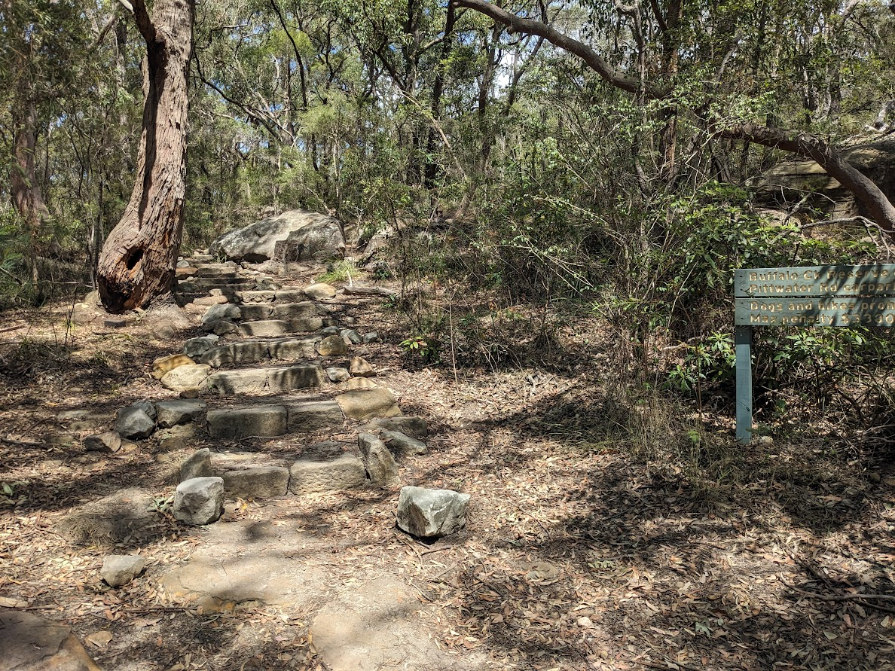
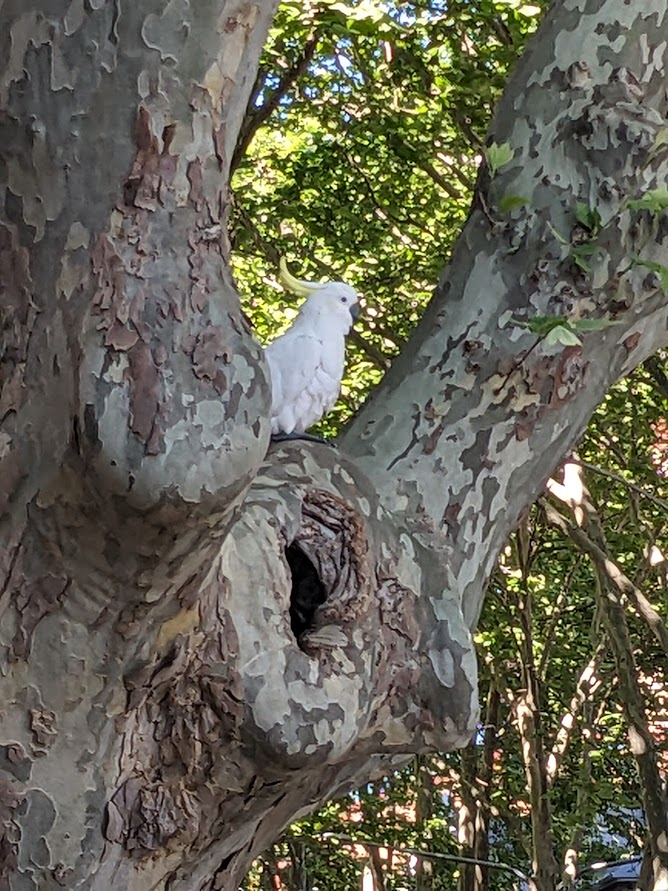
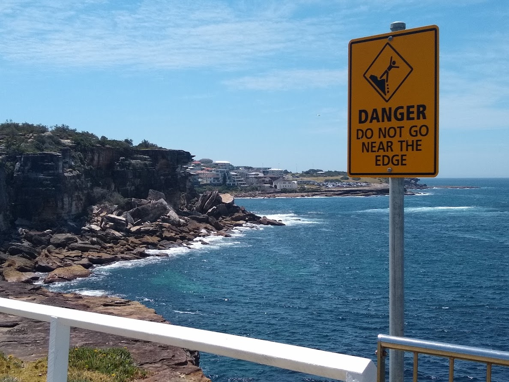
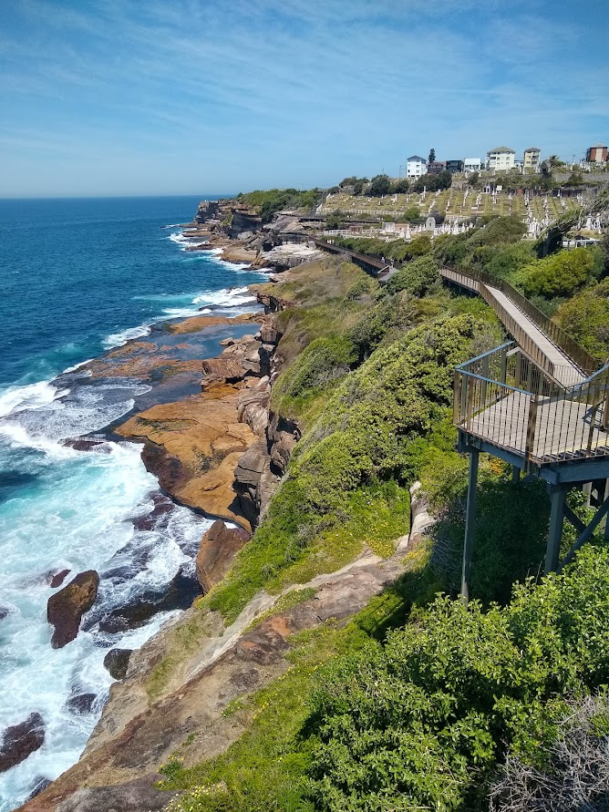
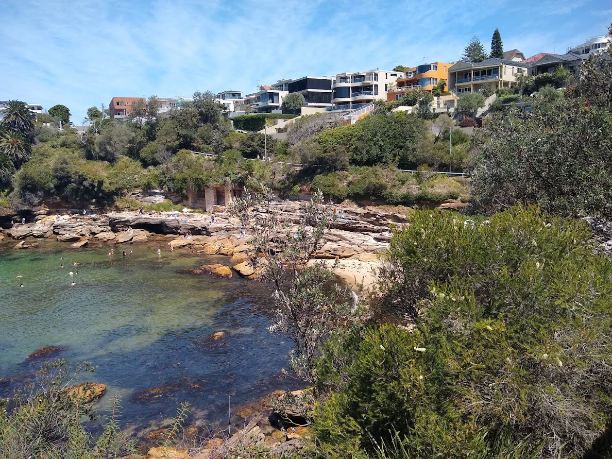

# Great North Walk/Coogee to Bondi Walks - 15 Oct 2023

* cyrsullivan
* Oct 14, 2023
* 1 min read

Updated: Oct 2, 2025

Another beautiful week here in Sydney as the sun continues to shine and Spring progresses. This week we managed to get outside and explore various Sydney neighbourhoods, but also to explore a couple classic walks.

Our first stroll was along a part of the Great North Walk, a stretch of trail that follows the Lane Cove River from its Sydney Harbour estuary northwards 250 km to Newcastle. We enjoyed a short 10 km section that meandered along the river through lush forest, eerie mangroves and passed through a lovely public park where we stopped for a picnic lunch. It's not uncommon to encounter wildlife along the way. Although pretty, cockatoos are rather noisy birds.

Later in the week we followed the heavily travelled Coogee to Bondi Walk. Another classic cliff edge walk, the trail affords spectacular views as it follows the ocean cliffs dipping three or four times to pass some beautiful sandy beaches.

We also found the time to visit A Man and His Monkey Cafe where we enjoyed a couple of cappuccinos and Scrumptious Crumpets.

