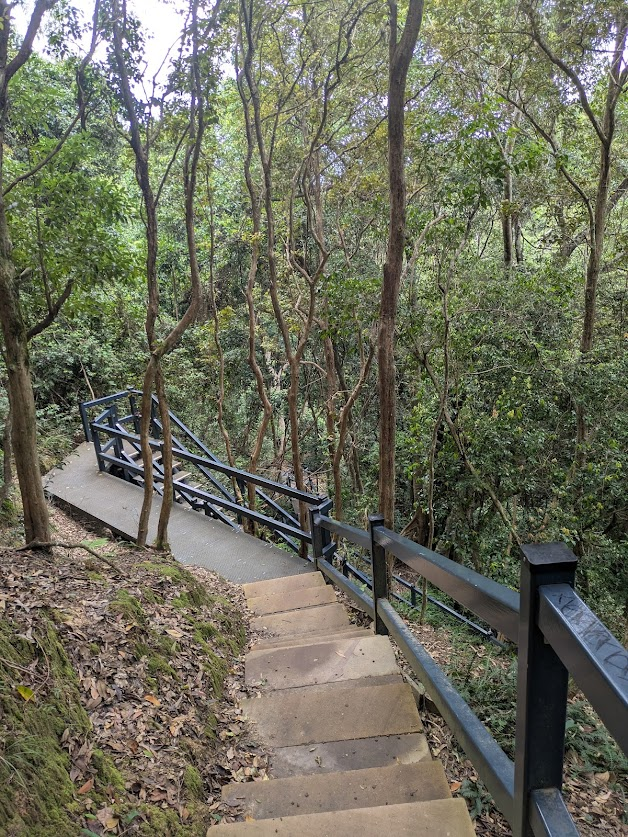
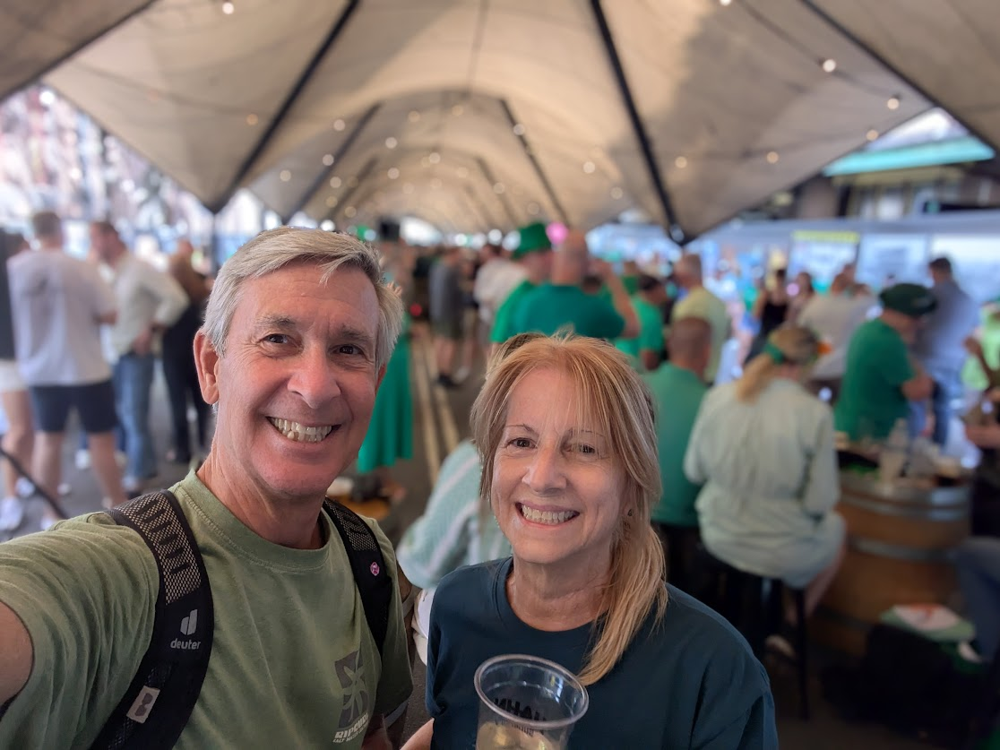
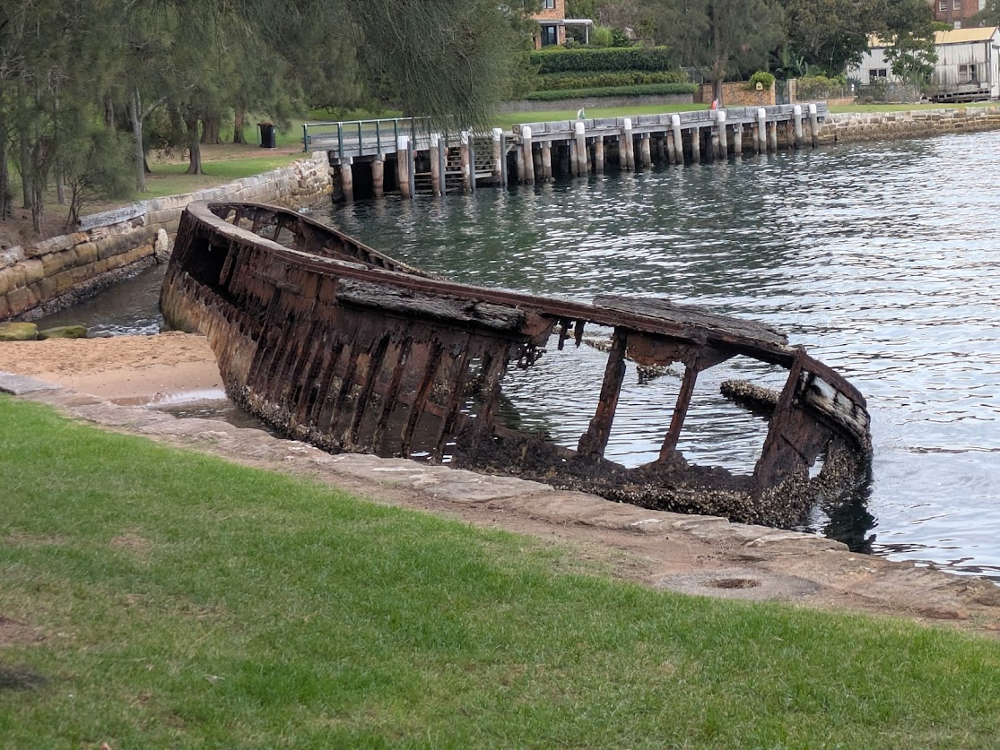
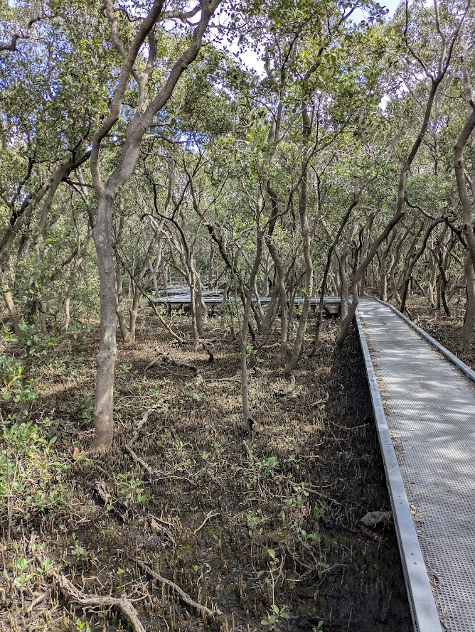
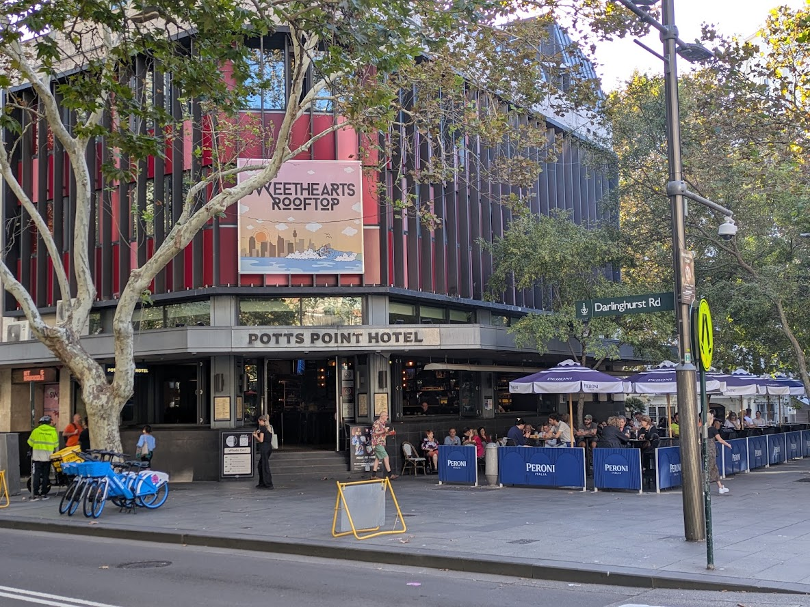

# Here Comes Spring - Sydney 2025

* cyrsullivan
* May 5, 2025
* 2 min read

Updated: Oct 2, 2025

Following an exciting tour of Tasmania, we found ourselves back in Newcastle, NSW for a week before returning to our old haunt, Potts Point, Sydney. This round in Sydney we settled into a snug studio apartment, just a spirited Stair-Master's climb down and up from the main drag, Darlinghurst Rd. In both cities we quickly fell into our old routine of hiking both familiar and new local trails and exploring the diverse neighbourhoods. Our regimen was pleasantly interrupted by a brief visit from our friends Barry and Ilektra from Ottawa, who were in Australia to see their daughter and tour the country.

As always, the weather was warm, even hot, and dry, providing plenty of chances to "go outside". Here are some of the memorable moments we'll treasure always.

We spent the day at Glenrock State Conservation Area, a vast reserve located just south of New Castle. It's filled with wonderful trails meandering beneath a leafy canopy and a secluded sandy beach.

Once again we had the pleasure of spending St Patrick's Day with our Australian cousins. There was no shortage of music, beer and revelry under the big top located in the Rocks, one of the Sydney's oldest neighbourhoods.

The wreck of a Maritime Services Board (MSB) hopper barge is located at Sawmillers Reserve in North Sydney. Close by, you'll find the Balls Head Coal Loader Site, a hidden treasure with a remarkable ambience. We began our walk at the Coal Loader Site, proceeded through Waverton Park and Sawmillers Reserve, and then headed to McMahons Point Wharf to catch a ferry back to Circular Quay.

The trails in Bicentennial Park and Badu Mangroves near the Olympic Site were a true discovery. Featuring paths and boardwalks that snake through mangroves, and pass by billabongs, a Waterbird Refuge, and stretches of expansive lawns with coffee shops and restaurants, it's a fantastic way to spend a hot day.

After a quick month, it was with heavy hearts that we said goodbye to Sydney, Potts Point, and our beloved hangout, the Potts Point Hotel Lounge. Sydney, once again proved itself to be a fantastic winter escape. As the Bard once said, "parting is such sweet sorrow'. Our next destination was Singapore, where we embarked on our 15-Day Gilded Eastern Kingdoms Cruise through Southeast Asia. Hello Buddha!