# In Search of the Tasmanian Devil - Febuary 2025

* cyrsullivan
* Apr 2, 2025
* 3 min read

Updated: Oct 4, 2025

After multiple visits to Australia, we felt it was time to explore Van Diemen's Land, the original name for Tasmania. Historically a penal colony for the most hardened of criminals, it's now a destination for outdoor enthusiast and motorcyclist alike. Down here, the Tasmanian Devil is just the Devil, like fries in France and waffles in Belgium. To organize our trip, we hired First Light Travels to create a self-drive tour around the island.

Our 11-day journey began in the capital, Hobart, a bustling, compact city nestled between the sea and nearby mountains. With plenty of pubs, restaurants, and live outdoor music venues, we found it easy to entertain ourselves during our two-day stay. The highlight was the sprawling Salamanca Outdoor Makers/Farmers Market. If you're visiting on a Saturday, it's a must-see, everyone will be there.

The bustling Salamanca Market. A great place for food and local crafts

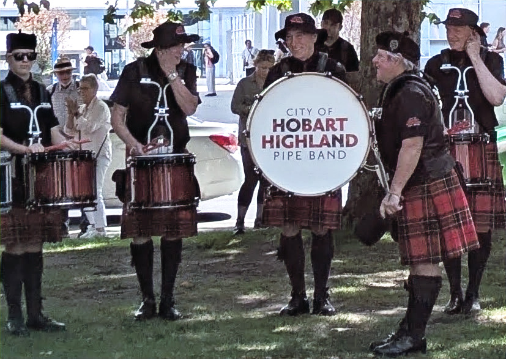

There was no shortage of street performers. Kilts optional

While in Hobart, we embarked on a bus tour of the nearby Tasman Peninsula. The trip included an exhilarating boat ride around Tasmania's southern tip. We sailed past impressive cliffs, observed a feeding frenzy of diving gannets and dolphins, and saw sea lions lounging on the rocky shores. In the afternoon, we visited the Tasmanian Devil Unzoo, where we had close encounters with the fierce devils and relaxed kangaroos. Unfortunately, a disease has infected the devil population, reducing it by 90%. A cure is believed to have been found, and hopefully, the population will recover.

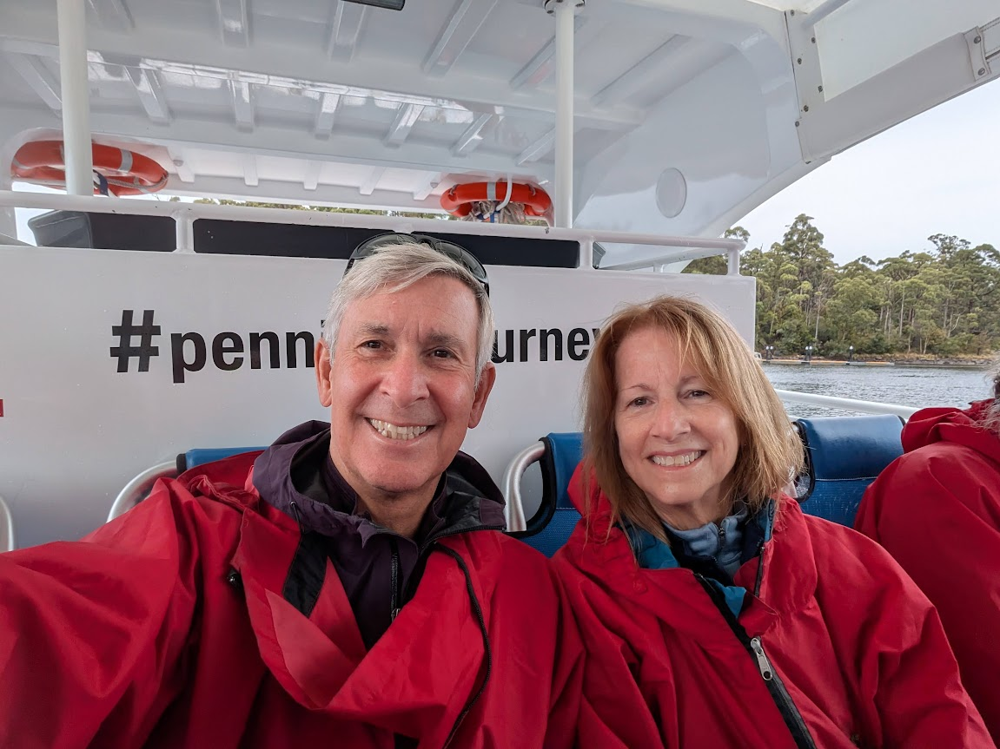

Fully equipped and ready for our rigid inflatable boat (RIB) ride

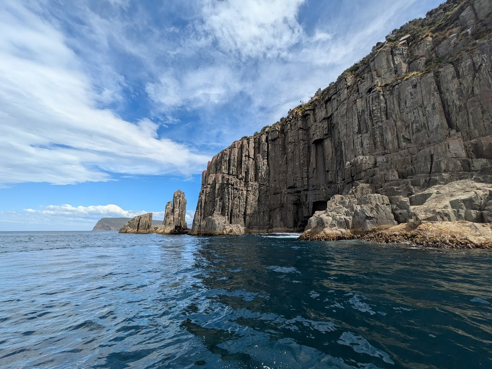

The southern coastline of Tassie was breathtaking

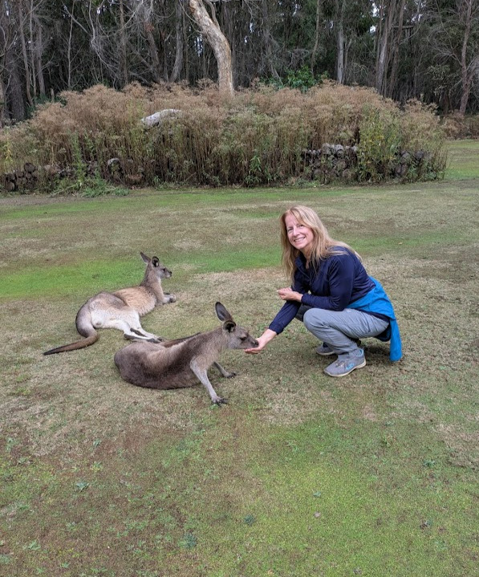

Chill'n with the roos

From Hobart, we travelled to Strahan Village, a quaint harbour-side settlement with a deep convict history. It is situated near the Tasmanian Wilderness World Heritage Area, a stunning tropical forest renowned for its past timber industry. We spent the day cruising the expansive Macquarie Harbour, listening to tales of the first convicts imprisoned on the remote Sarah Island, a "Hell on Earth" situated in the middle of the harbour. The cruise featured a guided tour of the island, a journey up the Gordon River in pursuit of Huon pine, highly prized by boat builders, and a brief walking tour through the magnificent forest.

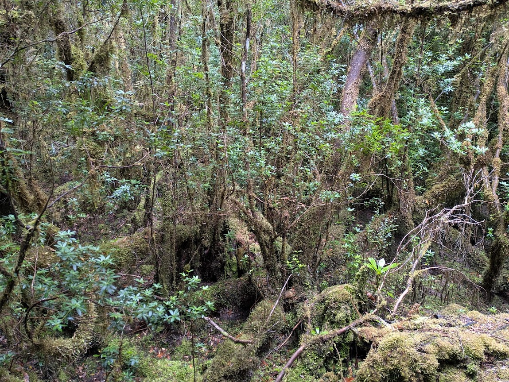

A typical scene from our cool temperate rainforest walk

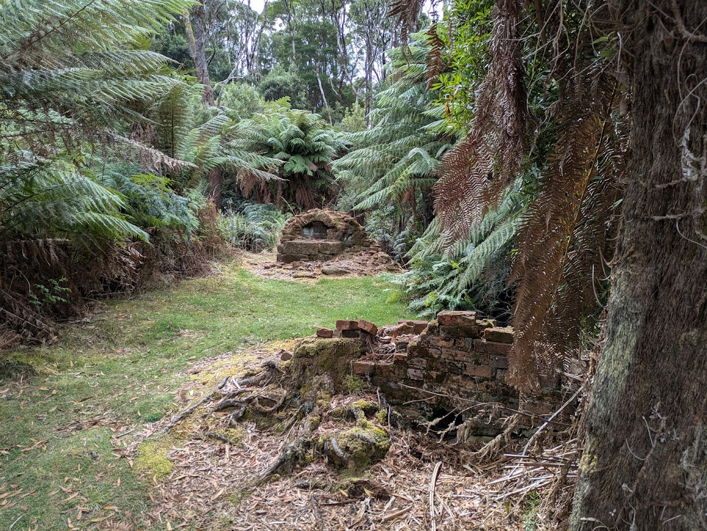

Few remnants are left of the Sarah Island penal colony. The walking tour featured chilling tales of this desolate island that would make anyone's hair stand on end

The subsequent stop was Cradle Mountain-Lake St Clair National Park, a unspoiled region within the Tasmanian Wilderness World Heritage Area. This park is known for its ancient pines, glacial lakes, and rugged mountains. Regrettably, our time there was too short, giving us just a day and a half of hiking. Nonetheless, the visit was incredibly rewarding and a must-see for hikers of any skill level.

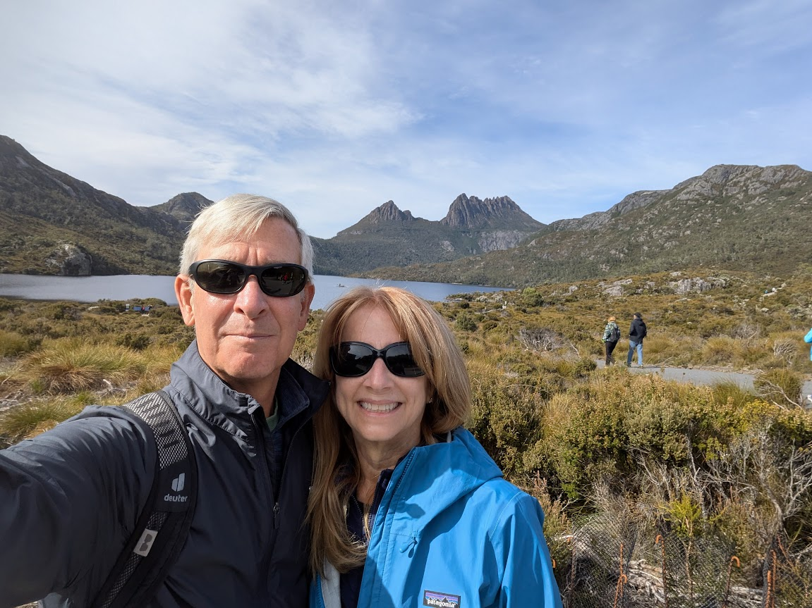

We were all smiles as we embarked on our amazing hike around Cradle Mountain. The Wombat Poo Trail lived up to its name. Indeed, there was poo everywhere!

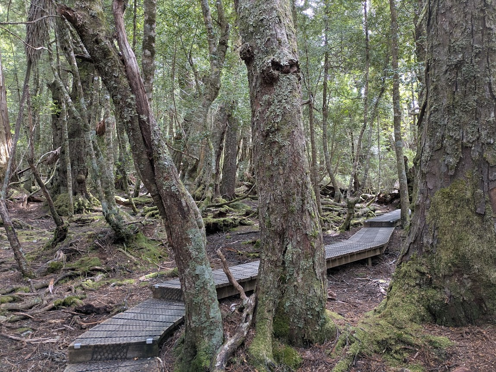

The boardwalk winding through the Ballroom Forest would make anyone feel like waltzing

As we journeyed further around the island, our next stop was Smithton, the entry point to the wild terrains of far northwest Tasmania. Here, we met our guide for a full-day Tarkine Forest 4WD Wilderness Tour. The day featured walks through the largest stretch of temperate rainforest in the Southern Hemisphere, short hikes along the rugged coastal heathlands, and an exhilarating 4WD ride across the vast sand dunes and beaches. Our guide was a treasure trove of local history.

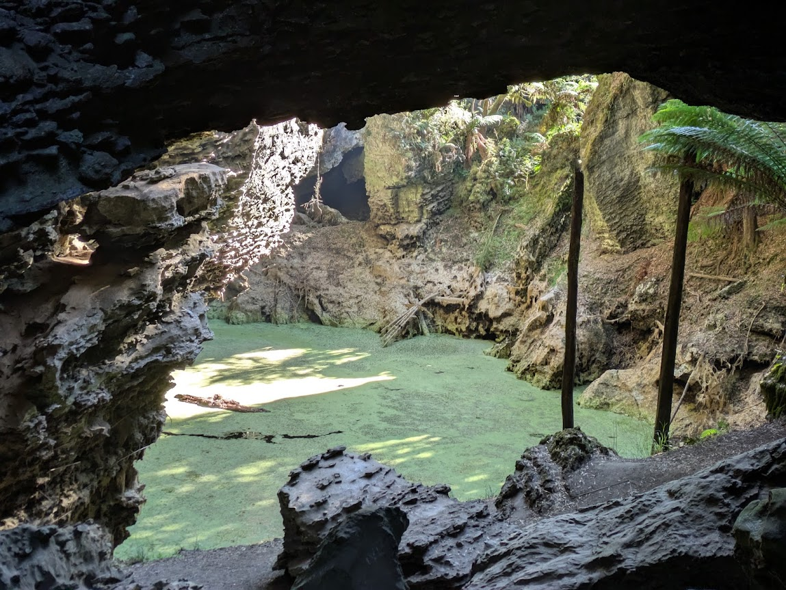

Trowutta Cave Reserve. A log-a-dile is clearly seen lurking in the swamp.

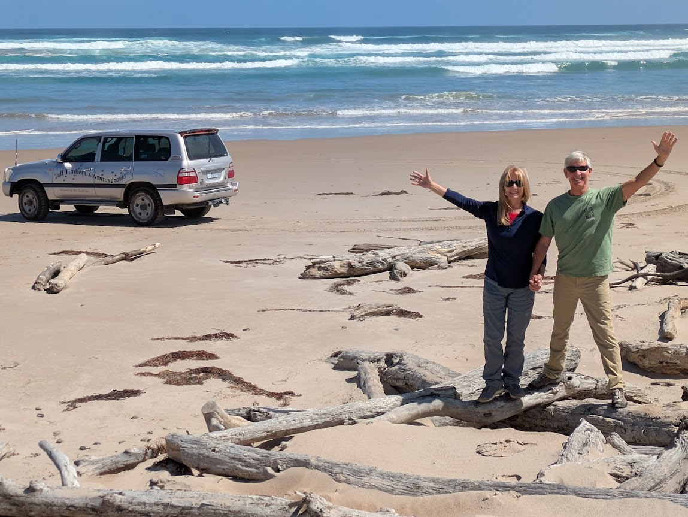

A quick stop along the beach for a romantic stroll and a pic for the blog

Our itinerary took us from Smithton to Launceston, Tassie's second largest city, for a short stay. From there, on to the Freycinet National Park. Situated on a secluded peninsula, the park features pink granite mountains and remote white sandy beaches. We dedicated one day to exploring the amazing hiking trails and another day to cruising around the peninsula to Wineglass Bay. The days were filled with countless sightings of marine and wildlife.

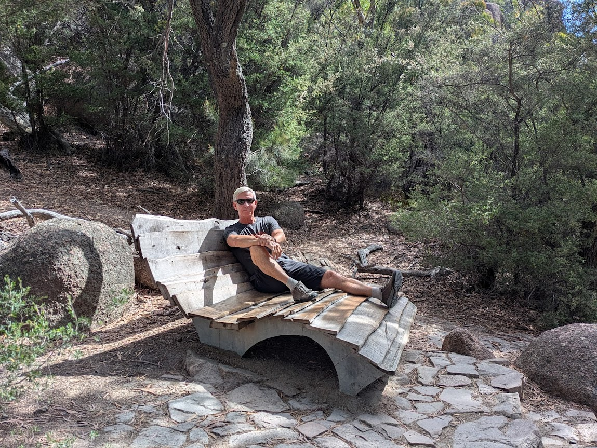

Our trek to the Wineglass Bay Lookout featured a wooden recliner for weary hikers

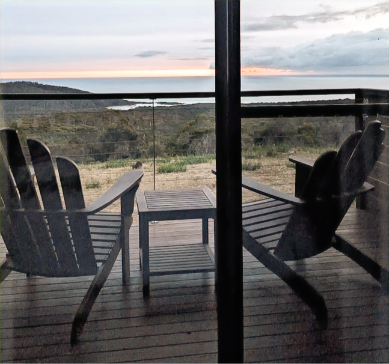

The view from our cabin at Freycinet Resort: secluded and solitary

Like all good things, our tour of Tasmania must come to an end. Leaving Freycinet National Park behind, we headed south towards Hobart. We spent the night at an airport hotel before flying north to Newcastle, NSW. Tasmania was an unforgettable adventure and comes highly recommended for anyone visiting Down Under.