# Malta - Spring 2024

* cyrsullivan
* Jun 3, 2025
* 3 min read

Updated: Oct 2, 2025

Ah, Europe! There's nothing quite like the old-world charm found here, and Malta exudes it. On the advice of several friends, we chose a charming Airbnb in a historic neighbourhood in Valletta. This heavily fortified city, located on a small island in the Mediterranean just south of Sicily, has been the centre of conflict for centuries.

Following a rather busy itinerary in South East Asia, our aim in Malta was to take things slower. With two weeks to explore the country, we had the opportunity to unwind, visit various attractions, and enjoy leisurely walks through back streets and with relaxed coffee breaks.

The highlights of our visit included wandering through the streets of Valletta, the nearby towns of Sliema and the incredibly charming Birgu, and the Valletta neighbourhood of Paola, known for its ancient prehistoric ruins and underground burial chamber. We also embarked on two excursions to the more rural island of Gozo and the village of Mdina, a fortified hilltop medieval city.

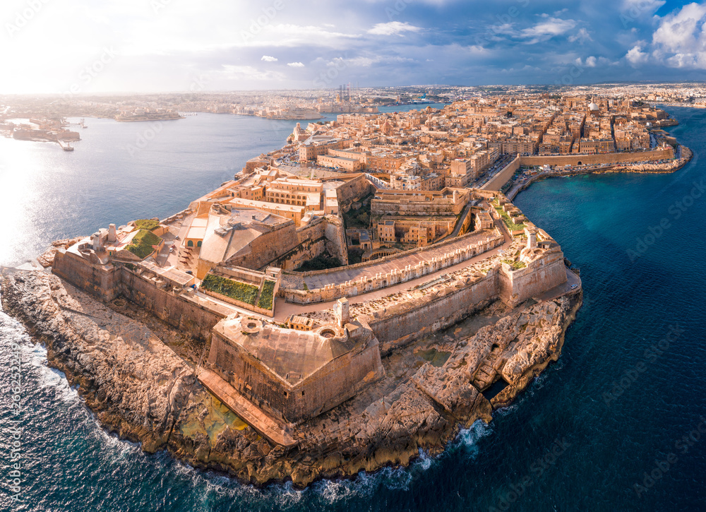

This stock image depicts the fortified peninsula of Valletta, with Birgu across the bay to the left in the background. Our apartment was situated just behind Fort St. Elmo visible in the foreground of the image.

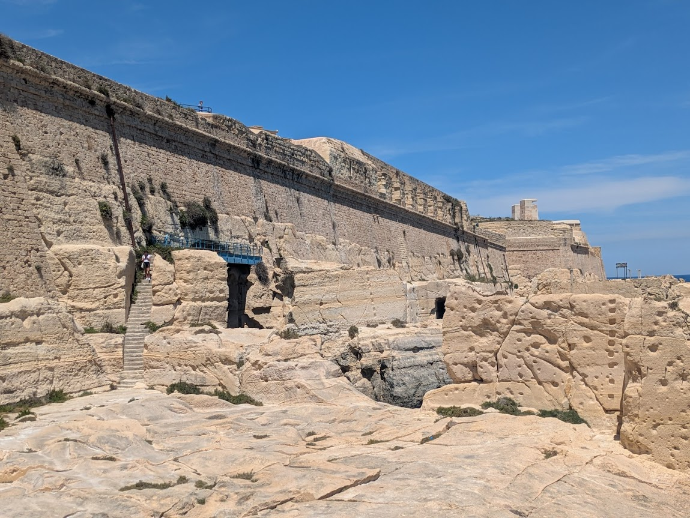

We embarked on an exciting hike around Fort St. Elmo. The precarious trail, carved from the foundational rock encircling the Fort. It offered expansive views of the nearby cities of Sliema and Birgu.

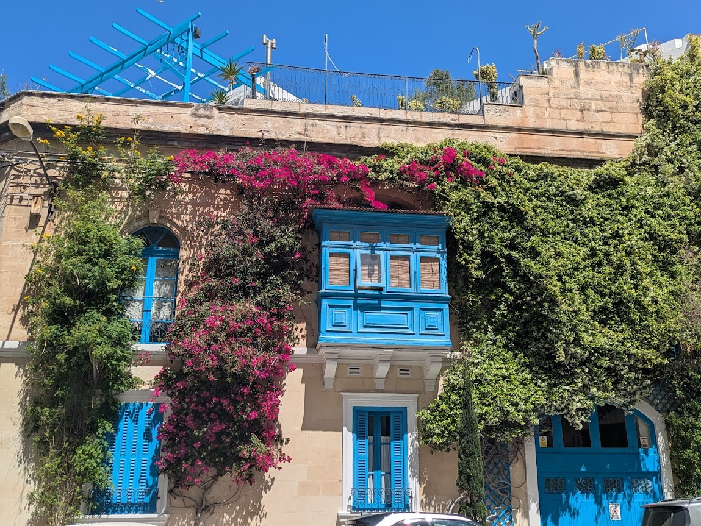

In Sliema, we took a pic of this classic apartment. It showcased a common feature of Maltese architecture known as a Gallarija. These enclosed balconies, or projecting windows, were traditionally used by women to observe the outside world without being seen. They also afford the apartment extra light and a cross breeze in the narrow streets of medieval towns.

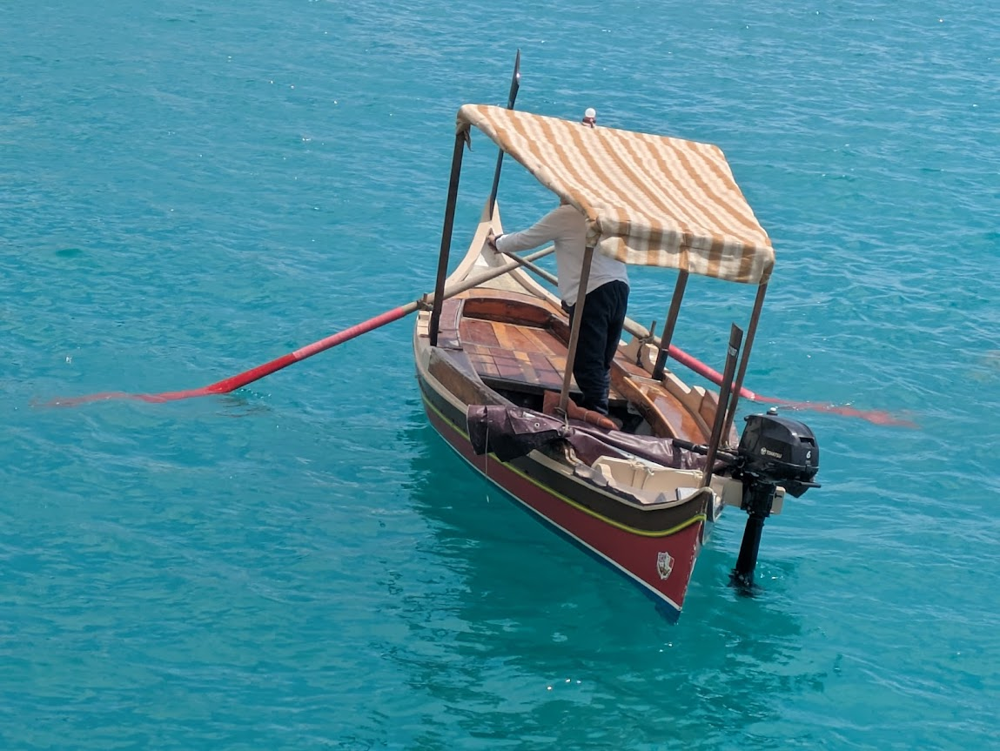

One of the many Dghajsa (water taxis) ferrying passengers between Valletta, Sliema and Birgu. However, this is a busy commercial harbour, crowded with large ships manoeuvring about. We chose to err on the side of safety and travelled on the larger city ferries instead.

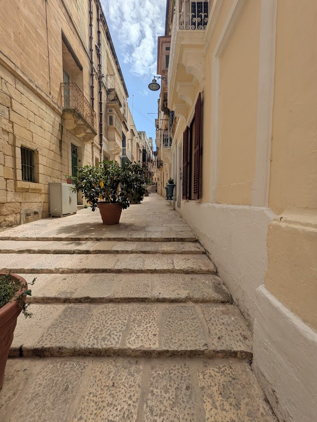

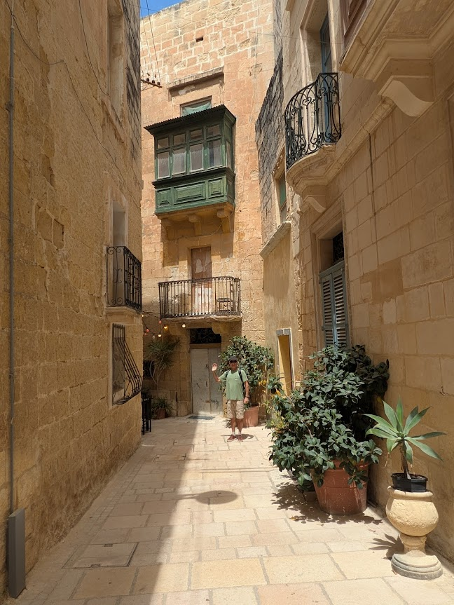

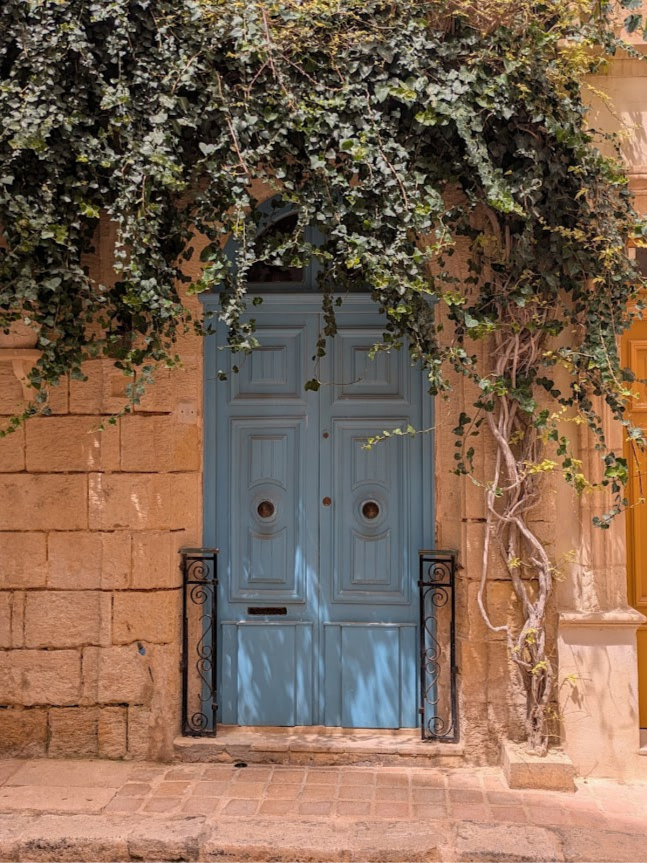

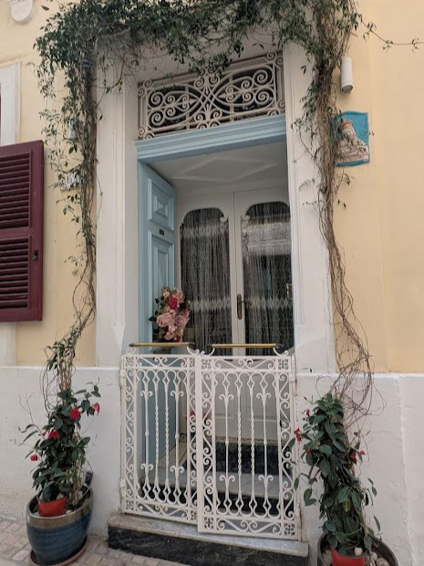

The intricate network of Birgu's backstreets was pristine and beautifully maintained. We were amazed by the dedication locals showed in decorating their homes and alleyways. Numerous streets were adorned with plants, adding a hint of greenery to the narrow lanes.

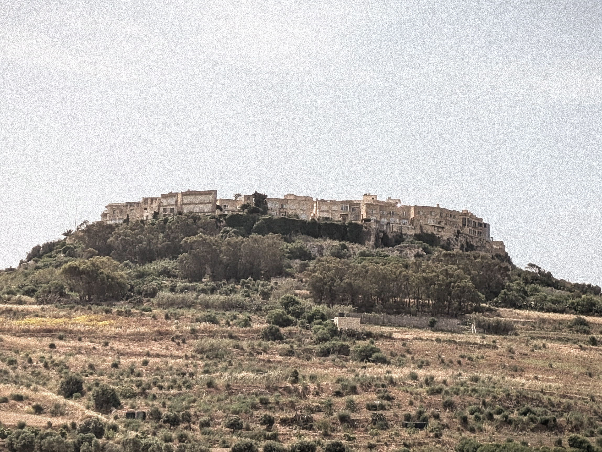

The island of Gozo is predominantly rural and scrubland, featuring a mix of coastal and hilltop towns. The culture is more relaxed, with locals enjoying a slower pace of life.

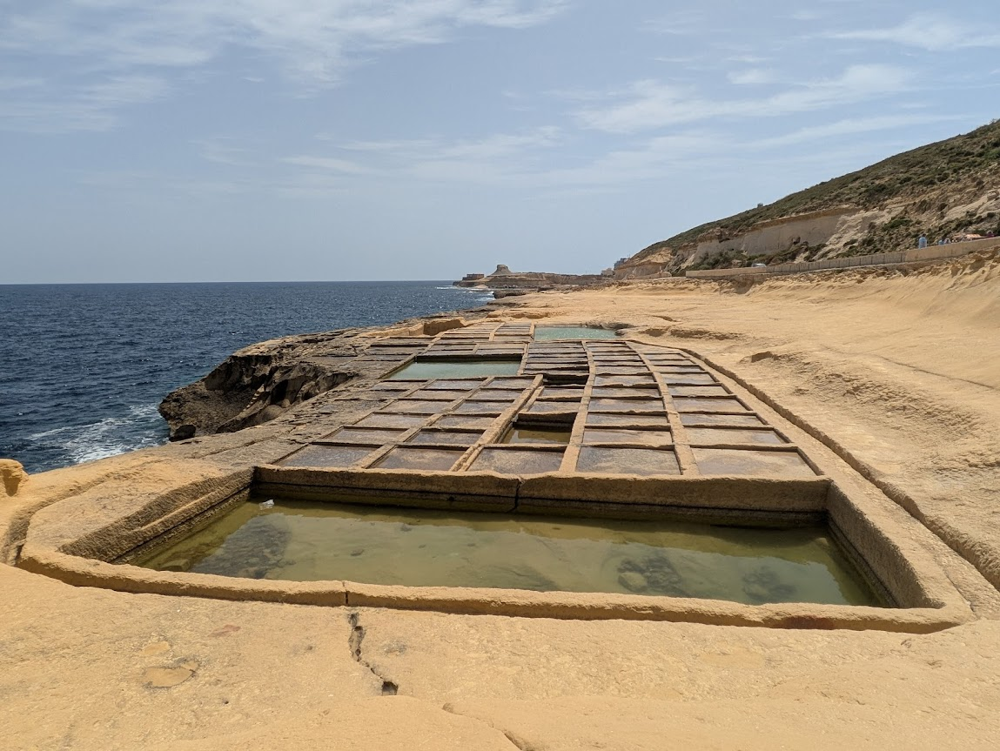

During our 4-wheeled tour of Gozo, we visited the salt pans located on the island's northern side. Salt was a precious commodity, essential for food preservation, seasoning, and even used as a form of currency (sal-ary) by the Romans. These salt pans, worked by slaves, played a vital role in the Roman economy.

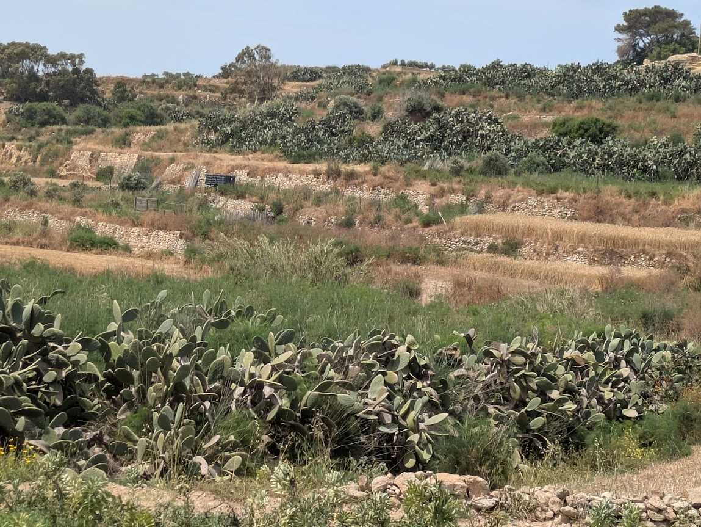

Gozo's farmland is characterized by dry stone walls that divide the fields, with cacti planted along these walls to deter intruders and contain livestock. However, challenges such as competition from imported goods, and the effects of climate change make it challenging for small farms to remain sustainable.

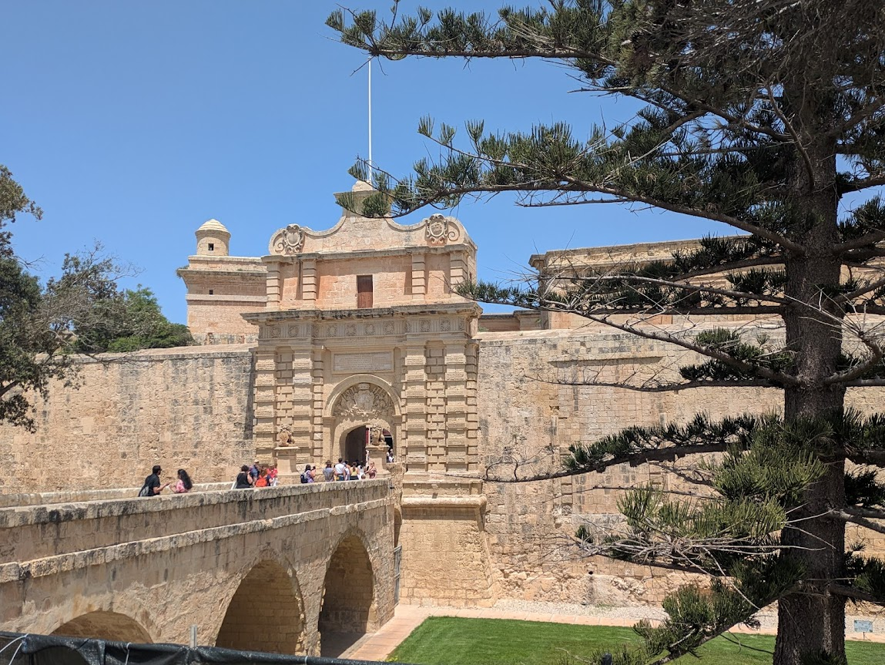

While on one of our excursions, we spent a few hours wandering through the narrow yet bustling streets of Mdina. A medieval walled hilltop city, it's an essential destination for anyone visiting Malta. Once the capital, before Valletta, Mdina is rich in historical significance and has been wonderfully preserved.

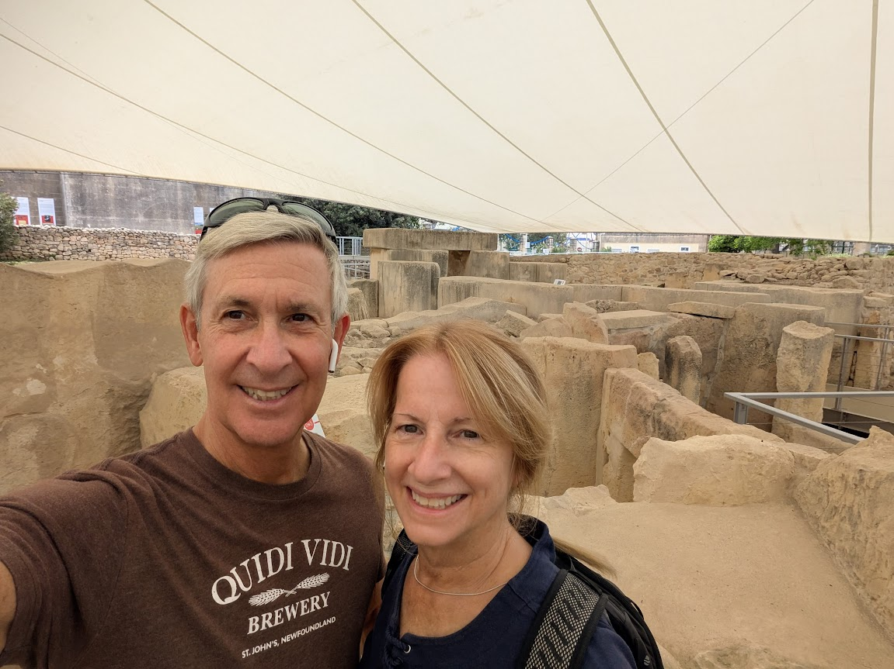

During our visit to the Paola neighbourhood, we dropped by the Ħal Tarxien Prehistoric Complex. This UNESCO World Heritage Site originates from around 3400 BC. Constructed in the Neolithic era, it predates the Great Pyramids of Egypt. This is the most ancient piece of civilization we've ever encountered. Truly impressive!