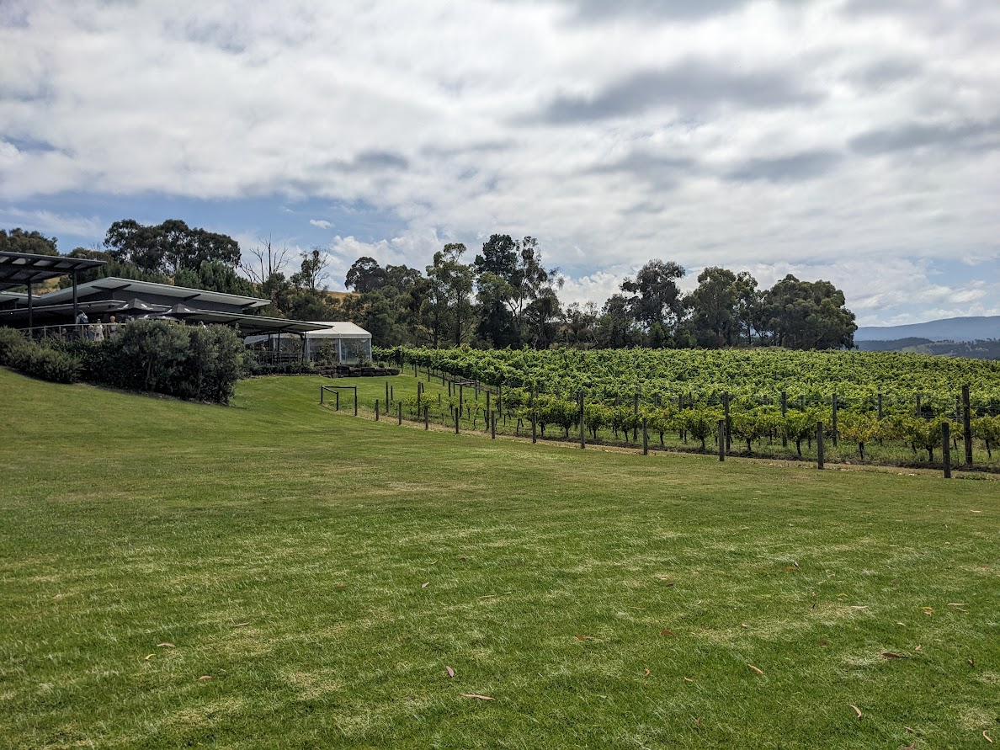
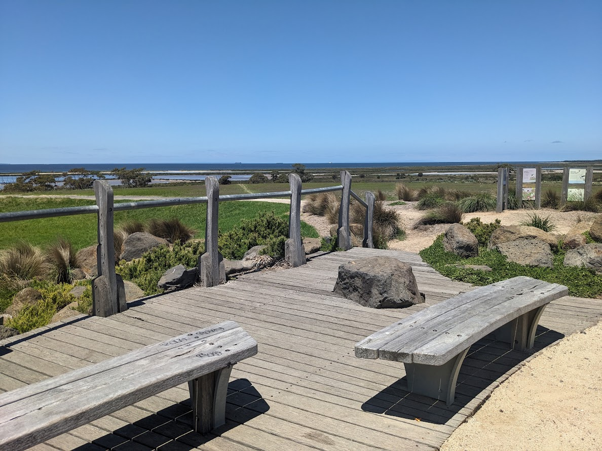
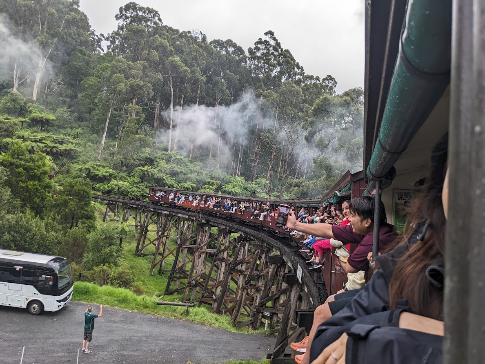
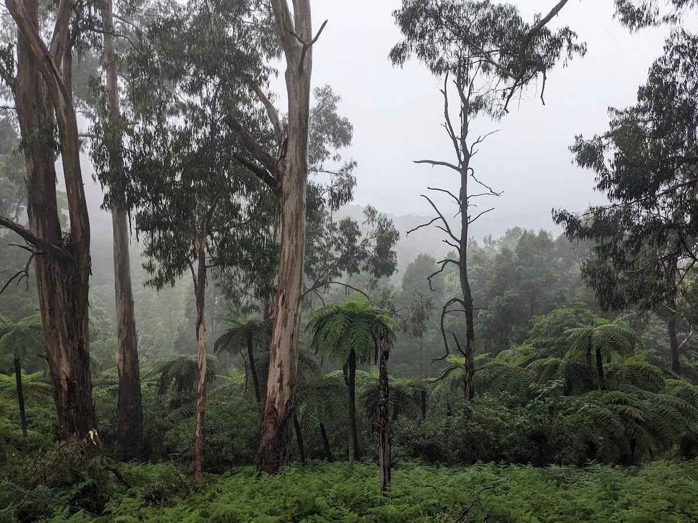
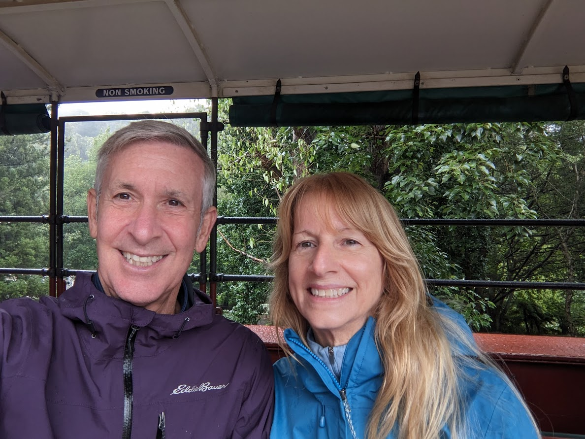
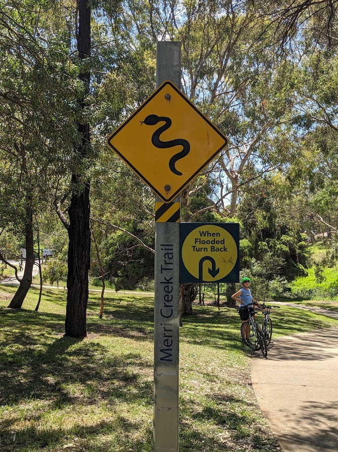

# Melbourne, well that was fun! - 27 January 2024

* cyrsullivan
* Jan 27, 2024
* 2 min read

Updated: Oct 2, 2025

It always amazes me how fast time flies, and 8 weeks just flew by. Life in Melbourne has been a treat. Unlike the more compact Sydney, the sprawling metropolis of Melbourne has kept us on the move. Fortunately it's extensive public transit system has allowed us to expand our travels into the far reaches of the city. Neighbourhoods like Laverton with its widespread wetlands, Belgrade with its lush forests and Frankston with its endless coastal walks were all within our grasp.

New Year's Eve in Melbourne was a très fun. We spent the day strolling the busy boardwalks of the Yarra River, taking in the energy and stopping for a bite to eat at one of the many riverfront bistros. The early evening was spent watching the 9:30 pm family fireworks at Fitzroy Gardens. At midnight, we toasted to 2024 and watched fireworks from our patio.

On a sunny day in early January we treated ourselves to a Yarra Valley Gourmet Ecotour with Go West Tours (<https://gowest.com.au/our-tours/yarra-valley-gourmet-tour/>). The tour included a green house tour with fruit and veggie tasting, wine tasting at two local wineries (including a gourmet lunch), a cheesery cheese tasting, and finished off with a chocolate tasting at Yarra Valley's own Willy Wonka-like chocolate factory, the Yarra Valley Chocolaterie. A full day and a full belly later, we retreated home, happy and ready for a nap.

Another lovely hike along the shores of Port Phillip meanders through the Cheetham Wetlands. Waterfowl abound with more black swans sightings in a day than we've seen in our lives.

A Christmas gift from Santa was a ride on the Puffing Billy Railway. The old steam train winds through the lush forests of Eastern Melbourne, with the added bonus of kids being able to sit on the window sills and hang out the sides.

After walking many of the Melbourne's hiking and biking trails, we decided to rent some bicycles from Velo Cycles. Conveniently located on a vast network of bike trails, the ride was free of traffic with the only dangers being snakes (as always) and flooding.

So Wednesday we get in a car and head out to explore the Great Ocean Road to Adelaide. Looking forward to driving on the left...