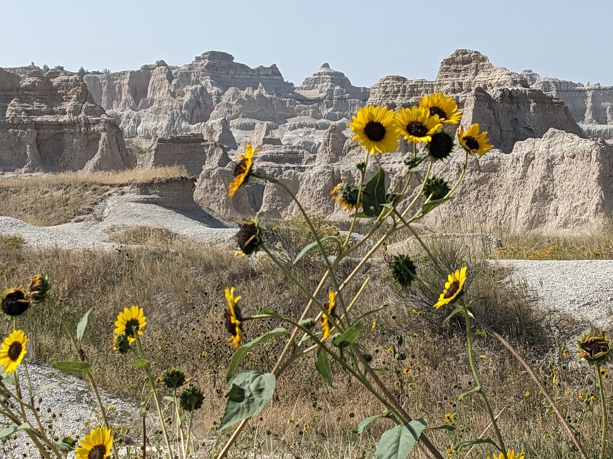
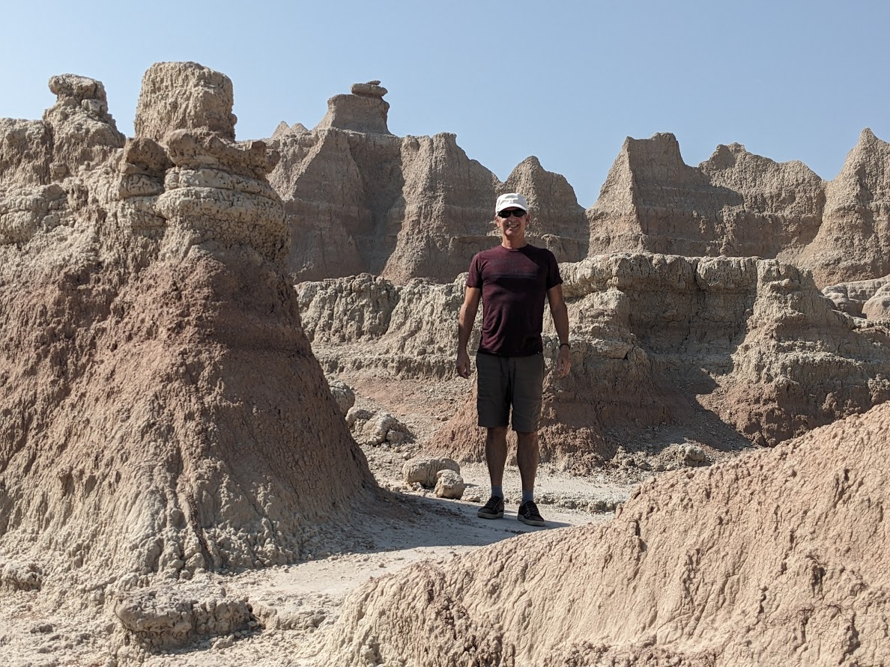
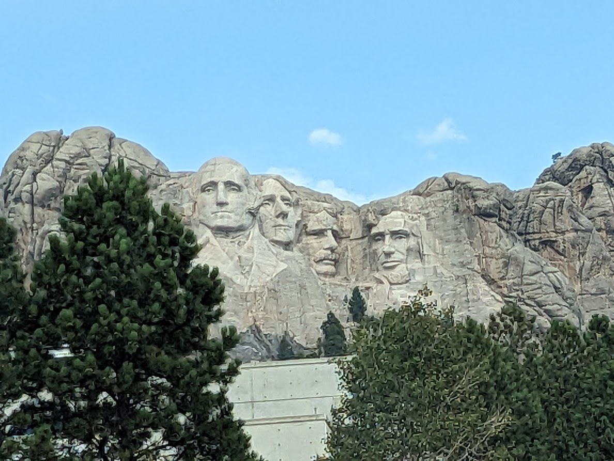
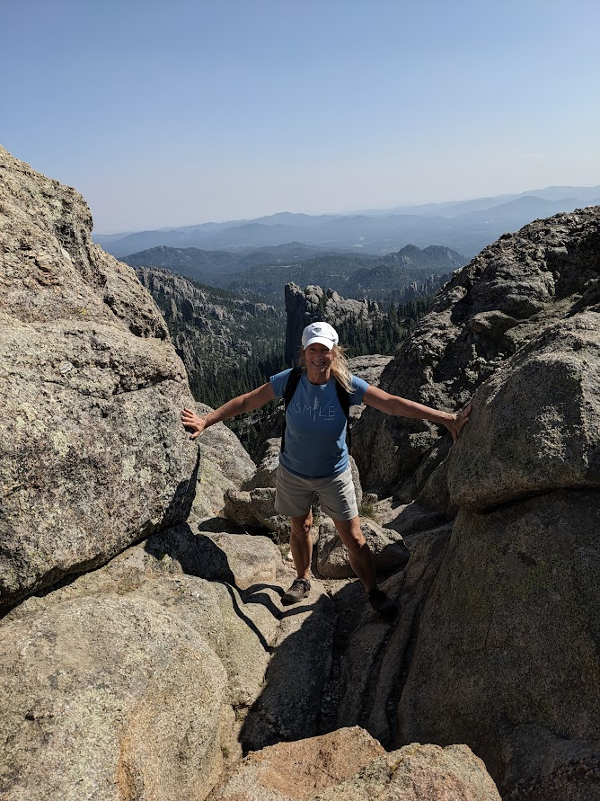
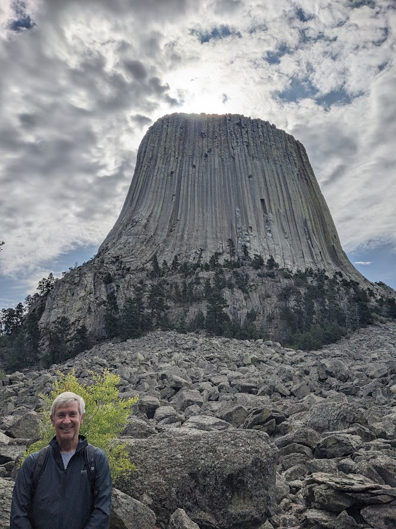
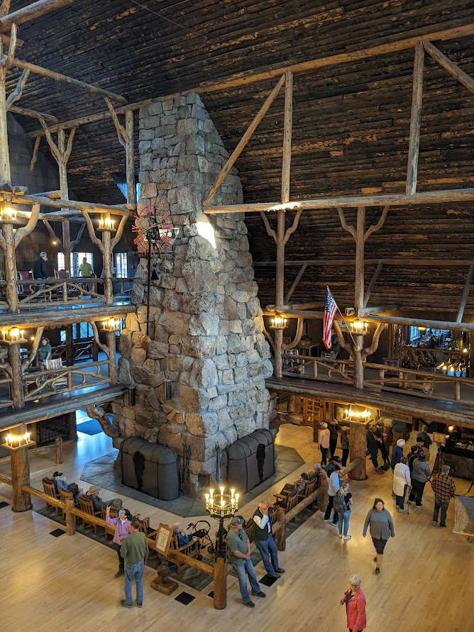
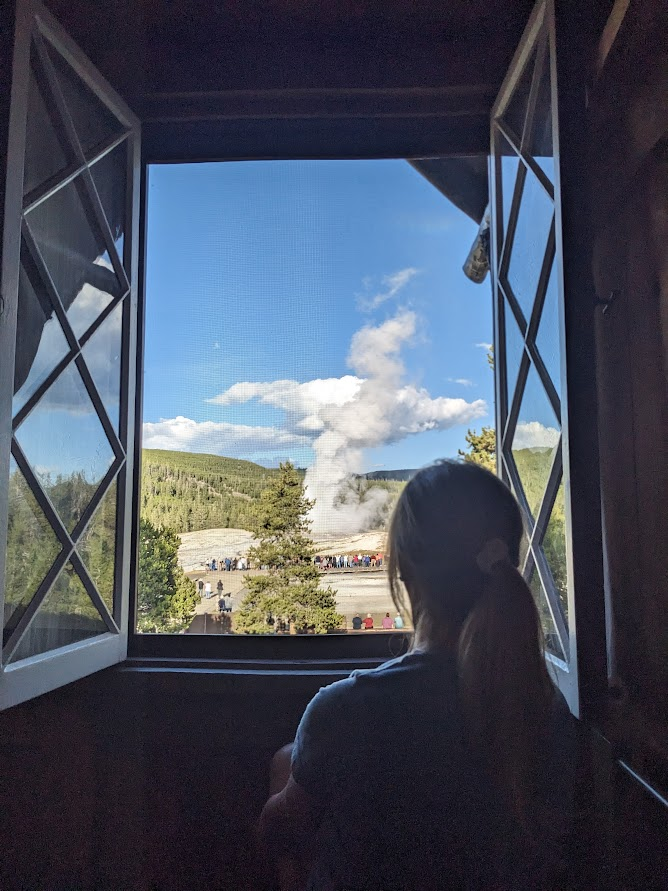
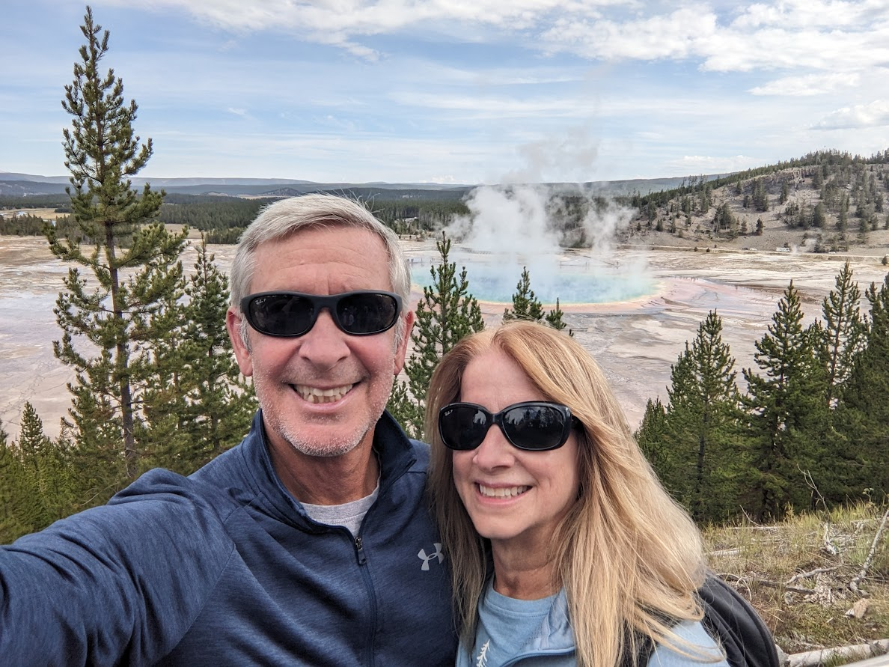

# Nomads - 30 Aug 2023

* cyrsullivan
* Sep 23, 2023
* 2 min read

Updated: Oct 2, 2025

Well, we've sold up the homestead and stored our "stuff". As of today we're Nomads, just a couple of tumbleweeds going wherever the winds take us. Time to head toward Vancouver to connect with our flight to Australia. Our first stop is Minneapolis to visit with brother Brian and friends. Here we go!

Badlands of South Dakota - 7 Sept 2023

Our stay in Minneapolis was short but a blast. Thank you Brian for the lovely hospitality and a jam packed social calendar. It was great to see everyone. Minneapolis is always a great place to visit.

Our next stop after Minneapolis was the Badlands of South Dakota. Part Star Trek movie set, part lunar landscape, it's for sure an eerie place to visit.

Black Hills of South Dakota - 8/9 Sept 2023

Next, the Black Hills in search of Rocky Raccoon. Sadly there were no sightings, but we did find these guys.

The Black Hill are alive with the sound of hiking poles. Our next stop, Sylvan Lake in the Custer State Park for a climb up the Little Devil's Tower Trail. An invigorating climb with quite the scramble to the top, but what a view!

Not to be left out, Devil's Tower was a must see on our list. The trail around the base provides a super 360 degree perspective. It was amazing to see the number of climbers scaling the sides of this massive monolith. Onward to Yellowstone.

On our way to Yellowstone we stayed in Cody. Met a crotchety old farmer sunning himself outside a local coffee shop. He spent his middle life working on Wall Street and had a rather dim view of today's accountants. He did offer us some sage advice, "buy Coke". Sandy responded with a wry smile, I like Coke. He shook his head and responded grimly, no, the stock, buy Coca Cola stock.

Yellowstone, Wyoming - 11/13 Sept 2023

We rolled into Yellowstone National Park and spent two nights at the historic Old Faithful Inn. It's a beautiful Montebello-esque structure that was surprisingly busy for mid-September.

Our rustic room afforded us a front row seat to the Faithful's faithful eruptions every 90 minute.

While in the park we managed to hike a couple of trails around what is know as the Grand Canyon of Yellowstone. Although not officially part of the Grand Canyon, Yellowstone's canyon is approximately 24 miles long, between 800 and 1,200 ft deep and from 0.25 to 0.75 mi wide. A bloody big canyon by most people's standards.

After the canyon hikes we followed a number of trails around the Grand Prismatic Spring, the largest hot spring in the United States, and the third largest in the world. Its colours match most of those dispersed in an optical prism: red, orange, yellow, green, and blue.

TIP: If you're planning to visit more than two National Parks in a single year, it's certainly worth purchasing a Nation Park Pass, <https://usparkpass.com>