# Run to the Barn - June 2024

* cyrsullivan
* Jul 15, 2024
* 2 min read

After 9 months away from our home base of Ottawa, we pulled up stakes in Kitsilano and began our 1 month trek back to Ontario. Our eastbound travels included 10 days in the Rockies, a few days with my sister in Edmonton, then on to Drumheller, Saskatoon and Winnipeg. From there we visited my brother in Minneapolis, and together we all visited the Henry Ford Museum in Dearborn, Michigan. It's been a must do on our to-do list for a while. From there, Niagara on the Lake, and on to Sandy's sister in Cobourg, then our old haunt Kingston. Finally after 10 months away, we rolled into our little Airbnb in the Glebe.

Our travels through the Rockies were, as expected, awesome. Although some of our time was spent scheduling hikes between intermittent rain, everyday afforded us time outside. Revelstoke stood out as a lovely spot to spend a few days. Not crowed, très relaxed and with great amenities. We stayed at the Courthouse Inn, a definite thumbs up.

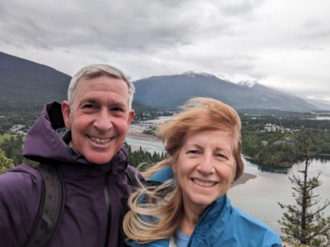

A distant view of Revelstoke for the top of the Boulder Mountain Lookout Trail

Our next stop was the Lake Louise Tea House Trail, a hike we completed 30 years ago. Unfortunately, the Lake Louise and Banff area was very busy, so we bunked down in Golden, about an hour away. Since our last visit, access to the trail head is only available via a shuttle bus from the Lake Louise Ski Resort, 20 minutes away. We booked the shuttle 2 days in advance but the earliest available seats were 3 pm. We were able to complete the hike, but some of the beauty and solitude we remembered was diminished by the crowds.

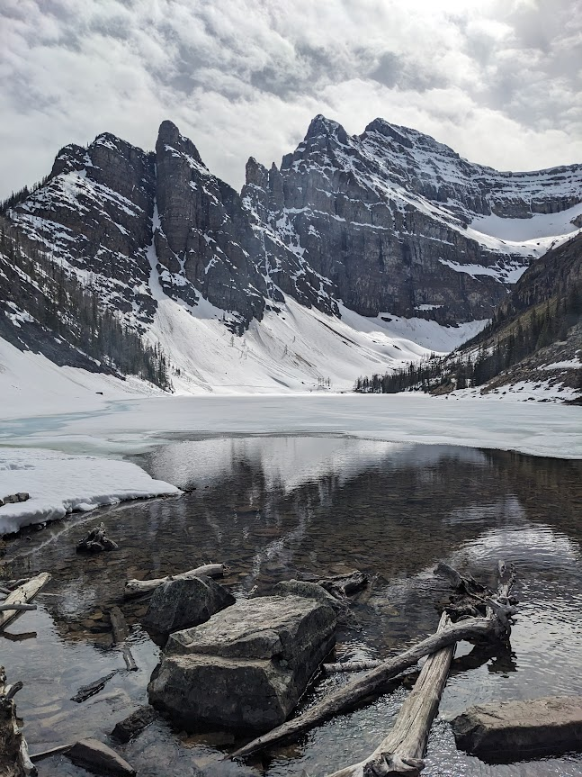

View towards the Plain of Six Glaciers from the Lake Louise Tea House.

With Lake Louise in the rear-view, we headed up the Glacier Parkway to the Jasper a much more subdued village. Views along the parkway and hikes in the Jasper area were stellar. For a good hoof, check out the Sulphur Skyline Trail nearby.

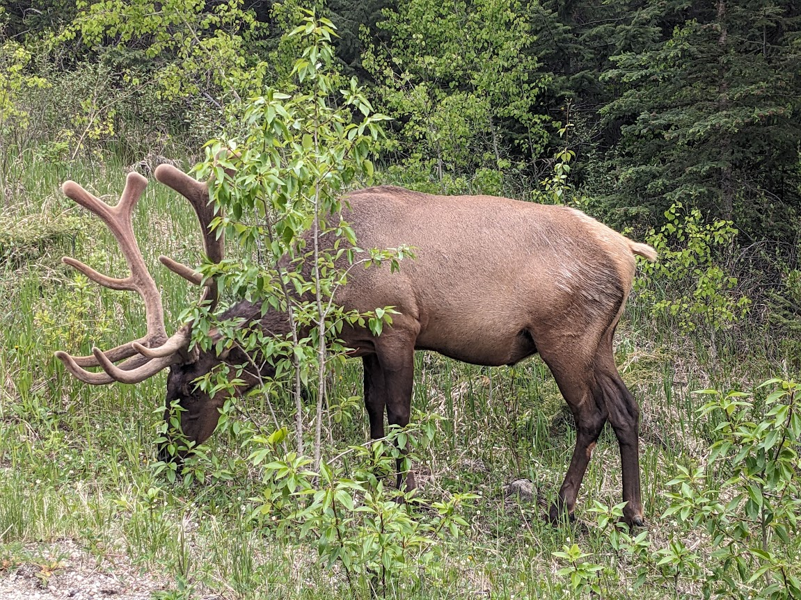

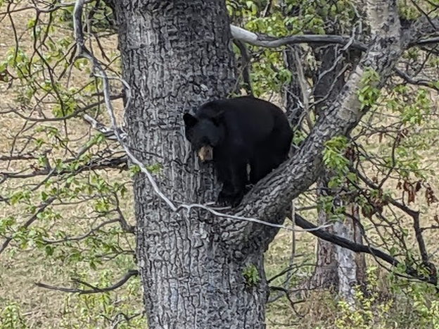

Some of the wildlife we spotted on the Glacier Parkway and around Jasper.

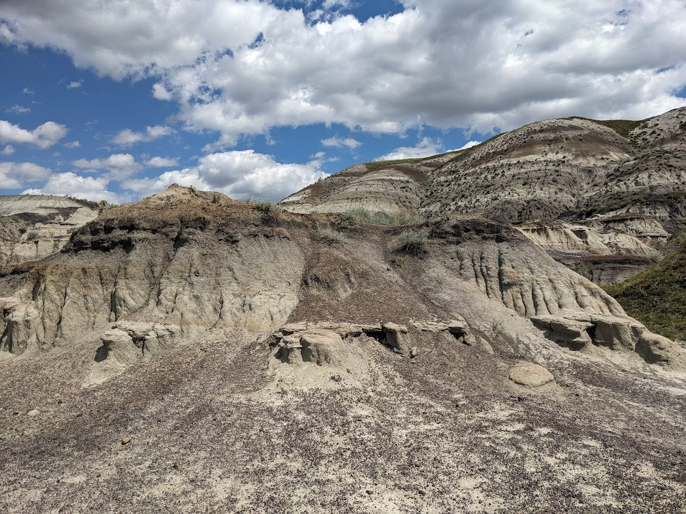

View of the Badlands along the Dinosaur Trail Loop near Drumheller

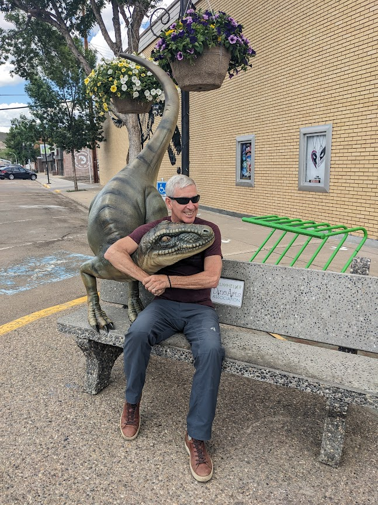

Roughhousing with the locals

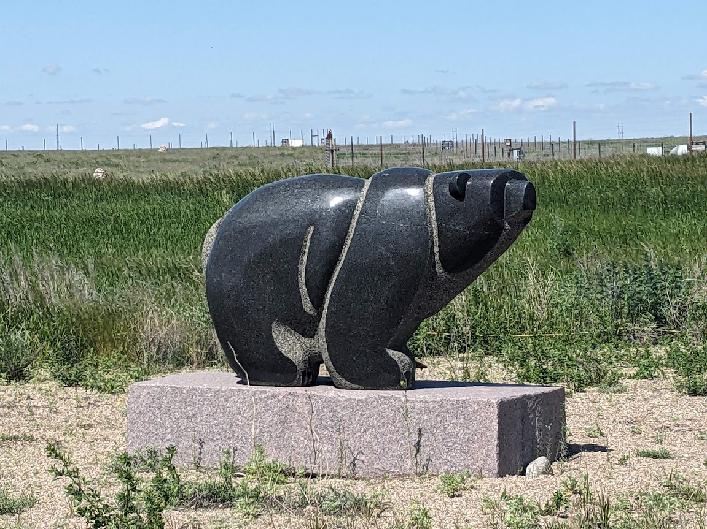

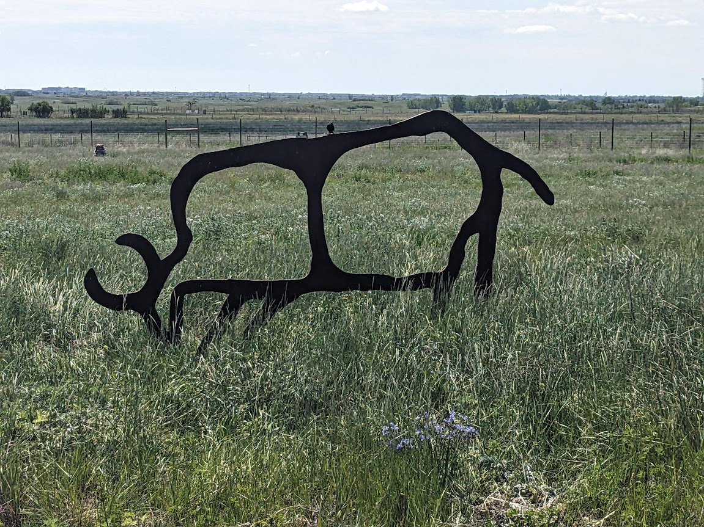

A few of the interesting art installations at the Wanuskewin Heritage Park near Saskatoon

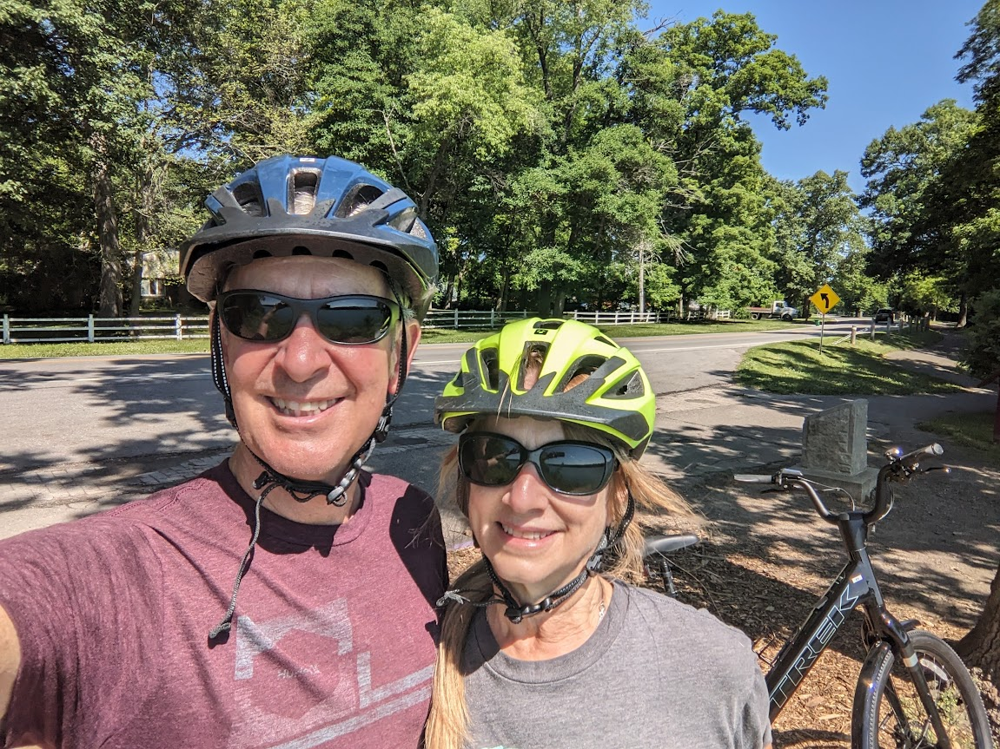

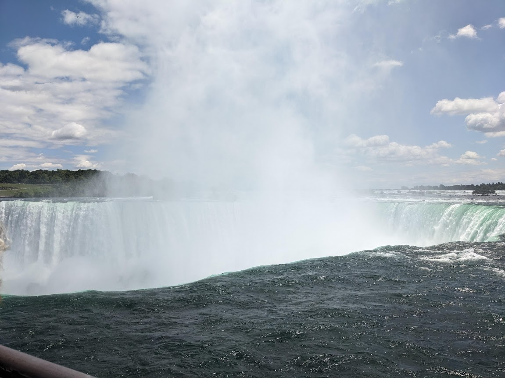

While in Niagara on the Lake, we rented a couple of e-bikes and cycled up to Niagara Falls

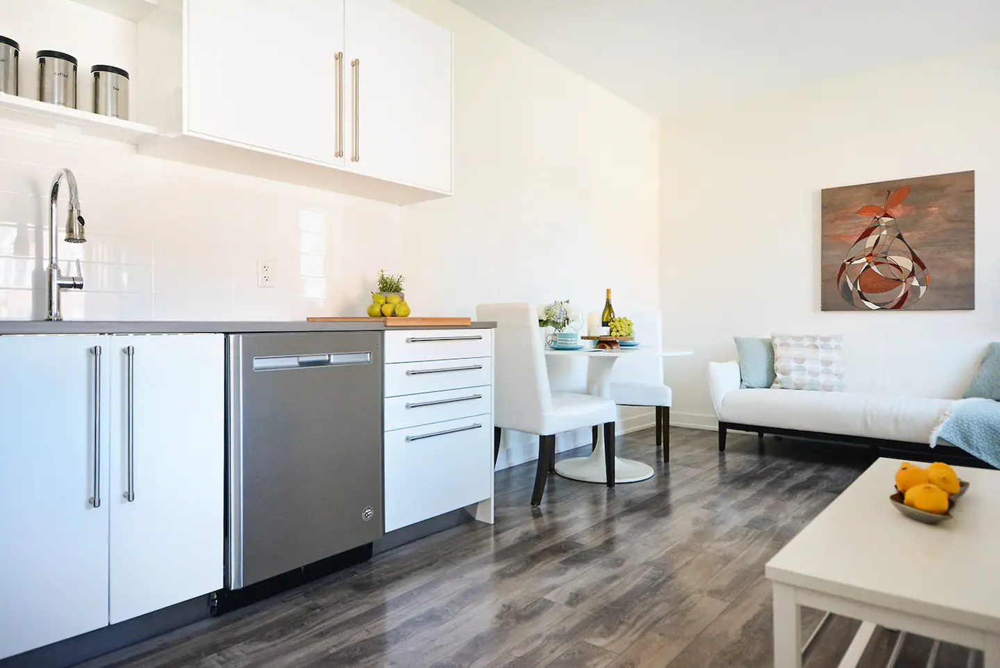

Back in Ottawa - Home Sweet Home for the next month.