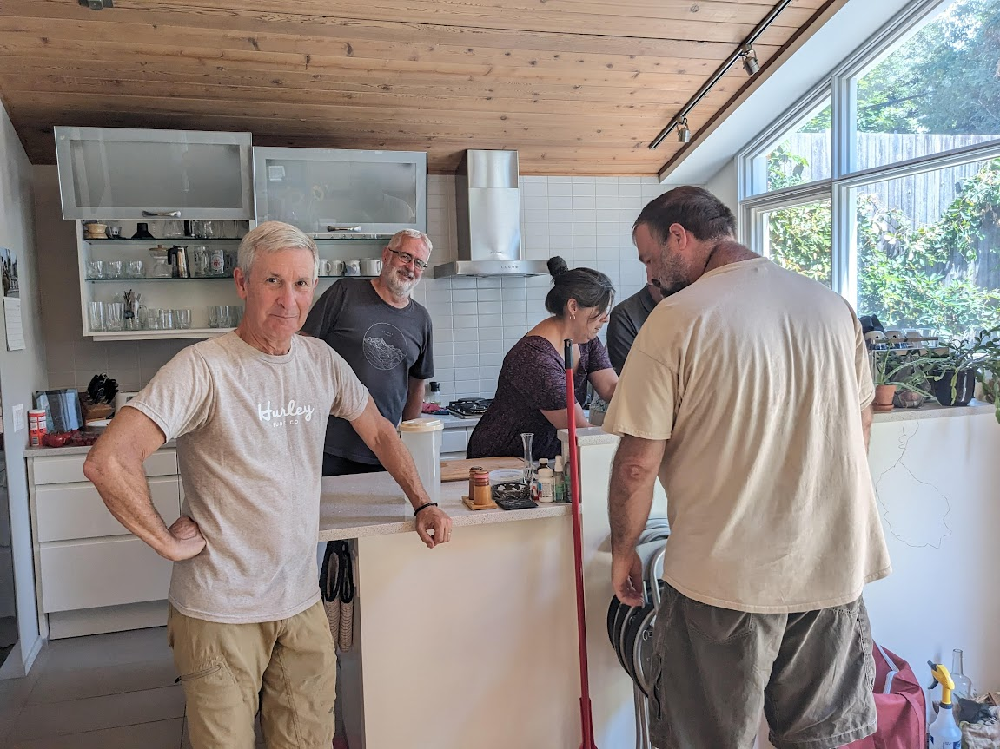
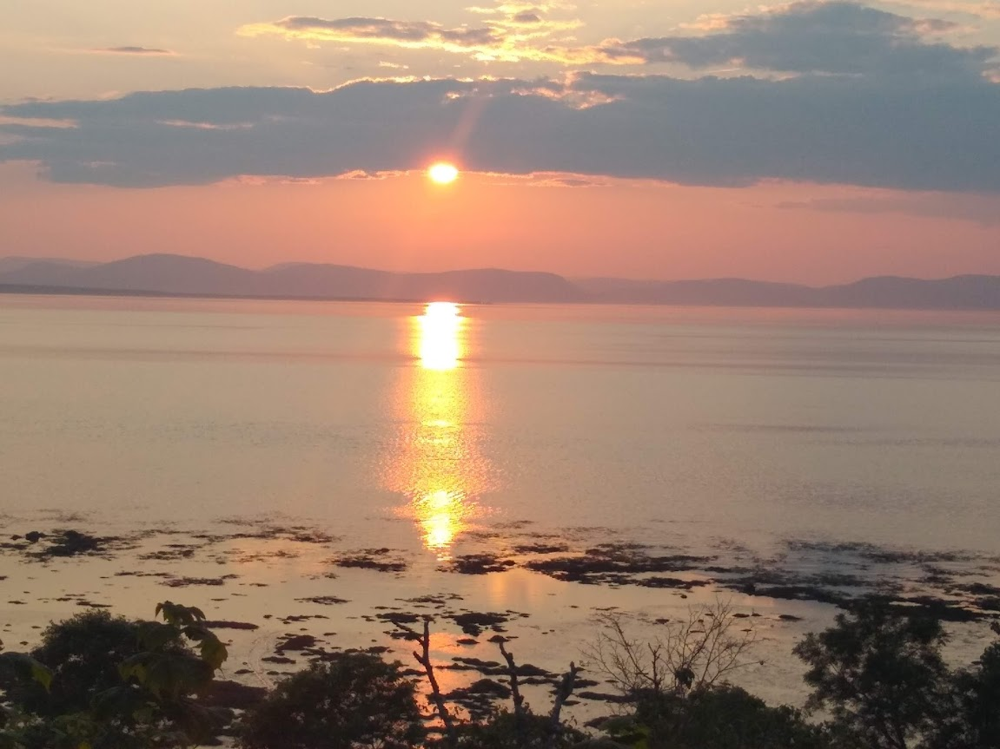
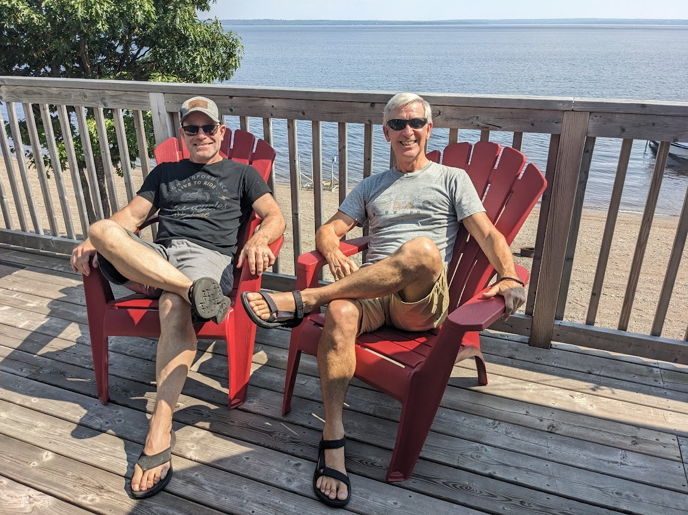
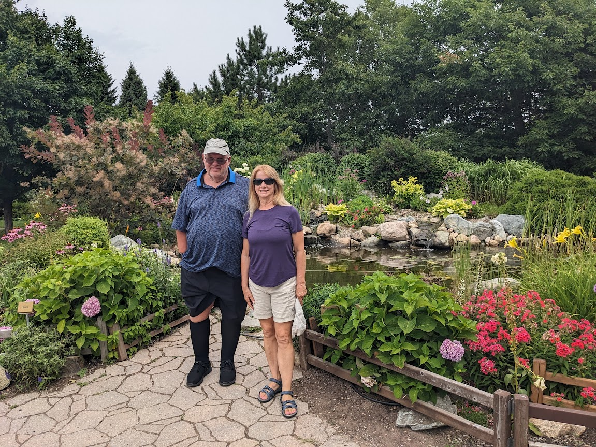
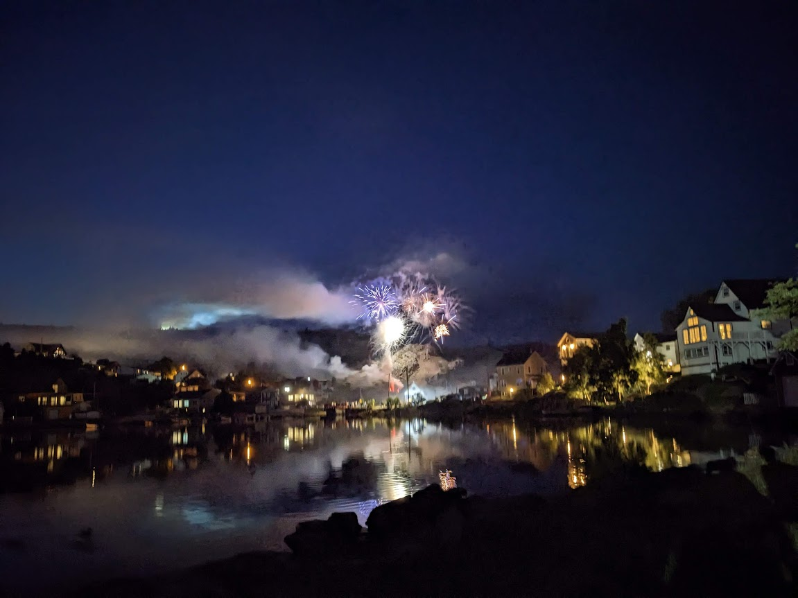
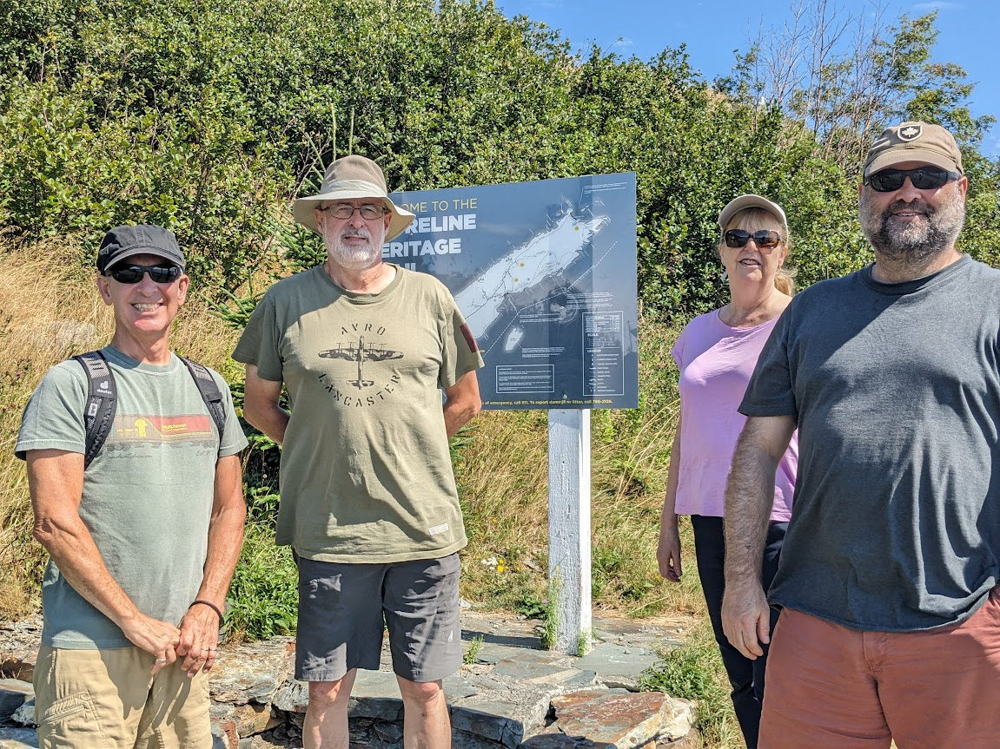
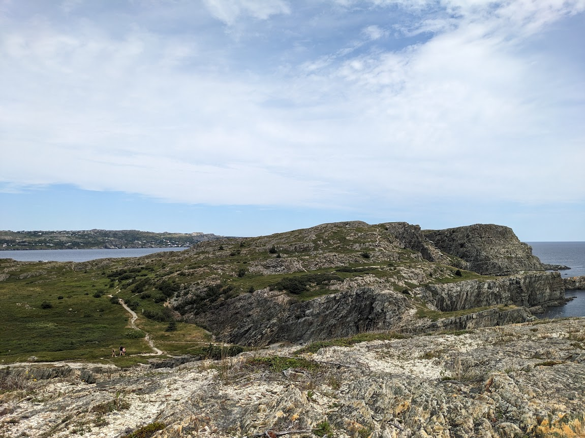
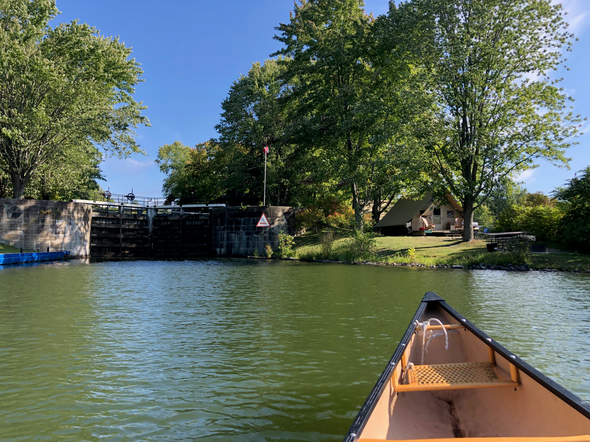

# Summer in Canada - 2024

* cyrsullivan
* Sep 12, 2024
* 2 min read

Well, summer has passed us by like a speeding train. We can still hear its whistle receding in the distance. We arrived in Ottawa June 30th and spent a month pitched up in a tidy little Airbnb in the Glebe. Much to our surprise, we were met by a wall of Sullivans. All of Terry's siblings had decided to occupy the city. Needless to say, between too numerous to mention family activities, scheduled appointments and just trying to link up with friends, it was August 1st and we were heading east.

On Canada Day we spent the morning watching the fly-by at Lebreton Flats and then spent the afternoon at Sandy's sister Sharon's place for a family BBQ.

Dinner with the Sullivan's at sister Carol's. Everyone pitched in

Our annual East Coast Loop follows a fairly regular pattern. Heading east, we spend the night at the Auberge de la Pointe with its lovely sunsets. From there, it's off to visit our friends Paul and Rachel's at their cottage in Shediac. Along the way we often pop in to Mark and Paola's cottage near Fredericton for coffee and treats. After Shediac, it's off to Halifax for a week before we head back to Ottawa.

Another lovely sunset from the Auberge de la Point veranda

Chill'n with Mark in New Brunswick

Enjoying a stroll with Paul in Irving's Botanical Garden, before hunting for ice cream

This year we decided to fly from Halifax to Newfoundland for a short visit with family and friend. The Rock is always a good time, and we were treated to consistently good weather.

Fireworks in Brigus after the annual Blueberry Festival

Heading out on the Mad Rocks hike with Terry's brother Pat, Mike and his lovely wife Judi

The scenery is spectacular along the trail and includes passing through

a number of re-settled fishing villages.

We arrived back in Ottawa August 19th. We spent the next three weeks connecting with friends and family, squeezing in a little camping and planning our upcoming trips.

Terry and brother Kevin camping at the Upper Brewers Locks oTENTik site

Before we knew it, it was September 12th and we were boarding a plane for our 10 week visit to Europe. The big take away from the summer's adventures: after being away from home for 10 months, two months home is not enough time to catch up with friends and family. Lesson observed, time will tell if it's learned!