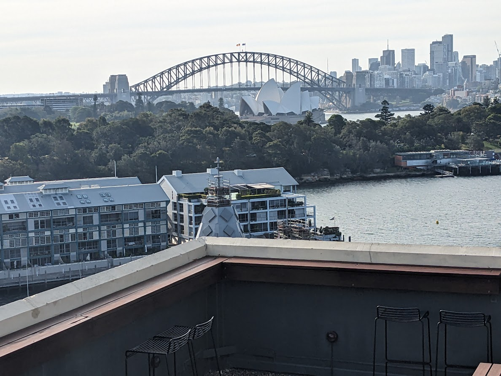

# Sydney - 1 Oct

* cyrsullivan
* Oct 3, 2023
* 1 min read

Updated: Oct 2, 2025

Just under 16 hrs after departing Vancouver, we arrived in Sydney mid-morning on the 1st of October. We're spending the first month in the neighbourhood of Potts Point. A hip and busy neighbourhood, it's an eclectic mix of pubs, shops and coffee bars perched high on a hill overlooking the Botanical Gardens and Sydney Opera House. Potts Point is a great launch point to explore the city.

We've booked ourselves into a little Airbnb with a lovely view from the living room, but its the rooftop patio and pool that definitely provide the money shot. We're looking forward to getting out and exploring the city.

