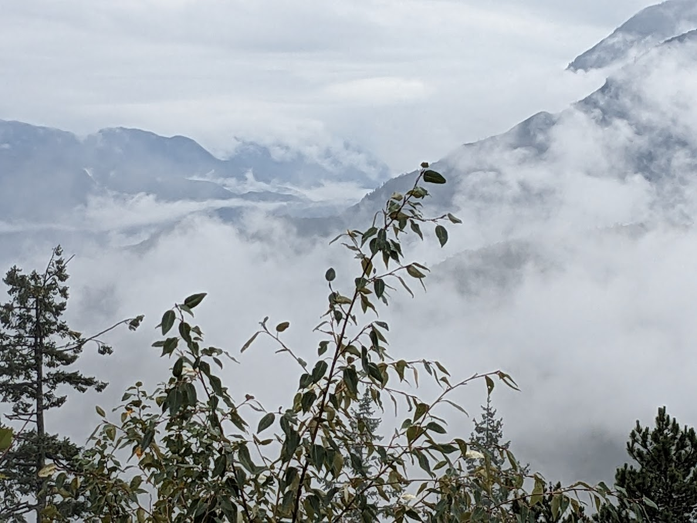
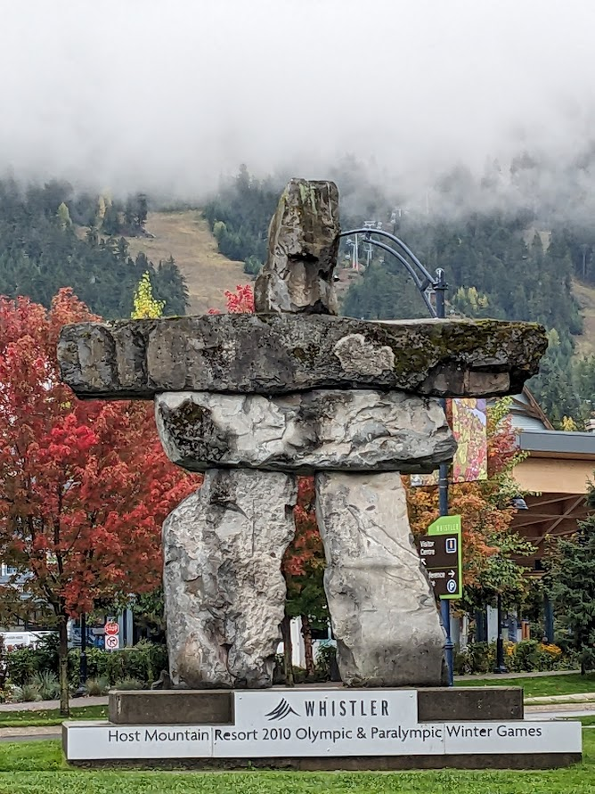
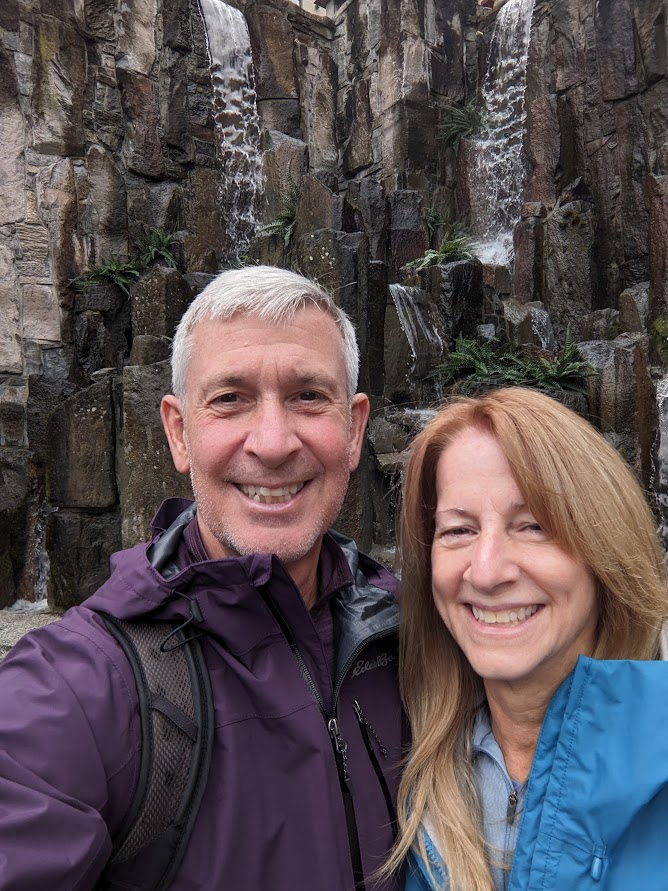

# Vancouver - 22 to 29 Sept

* cyrsullivan
* Sep 28, 2023
* 1 min read

Updated: Oct 2, 2025

I almost forgot. While in Kimberley we popped out for pizza at Stonefire Pizzeria. I ordered the Carnivore, no cheese on one side. Our waiter repeated the order back and I confirmed, no cheese on one side. It was a delicious pizza but when the bill came, I was surprised to see an $8 "Goat Cheese on one side" upgrade. Maybe it was my accent or just lost in translation?

We arrived in North Vancouver on the 22nd, just as an atmospheric river settled over the city for a week. We've heard about the rains of Vancouver and now we've had the pleasure to experience them. Rain coats required!

We did manage to get out for a few hikes and a number of strolls around the city between regular downpours and a drive up to Whistler for a tour of the village.

Put the car in storage this morning and walked away...truly tumbleweeds now. Off to Sydney tomorrow. Here comes the sun!

