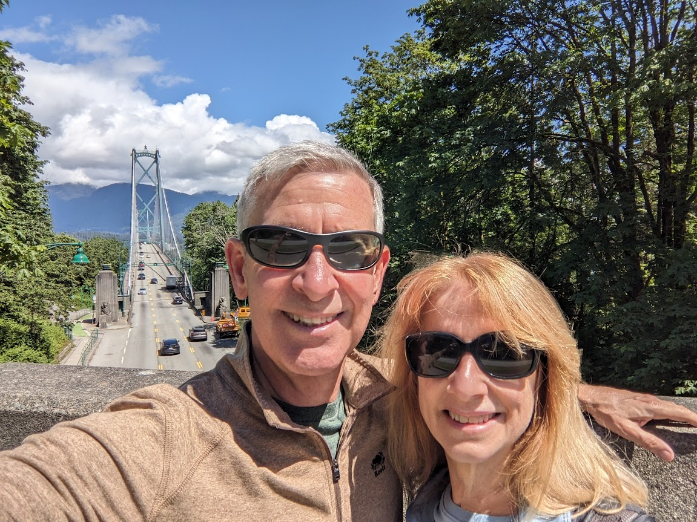
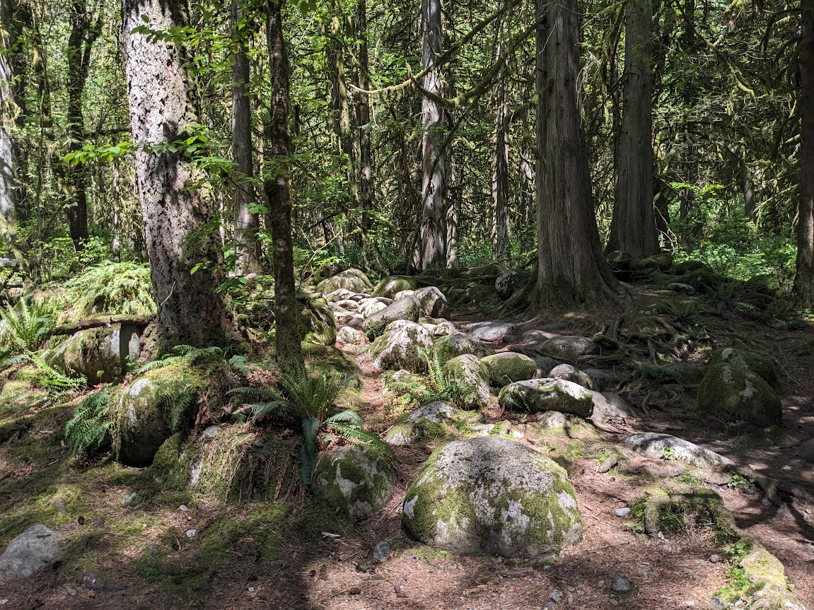
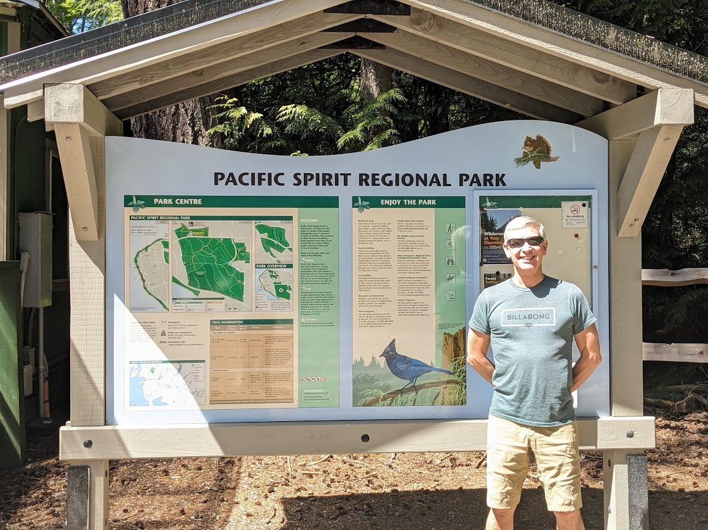
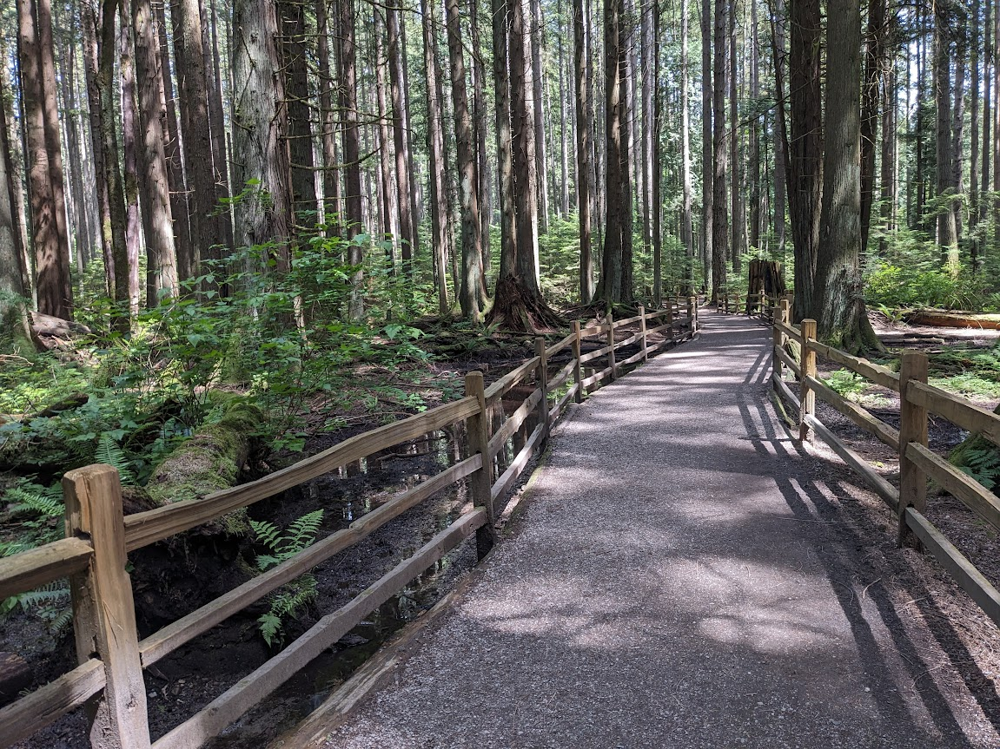
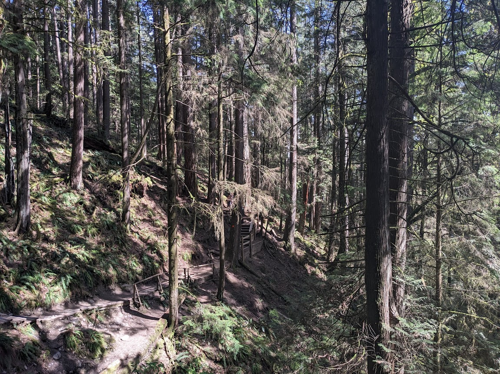
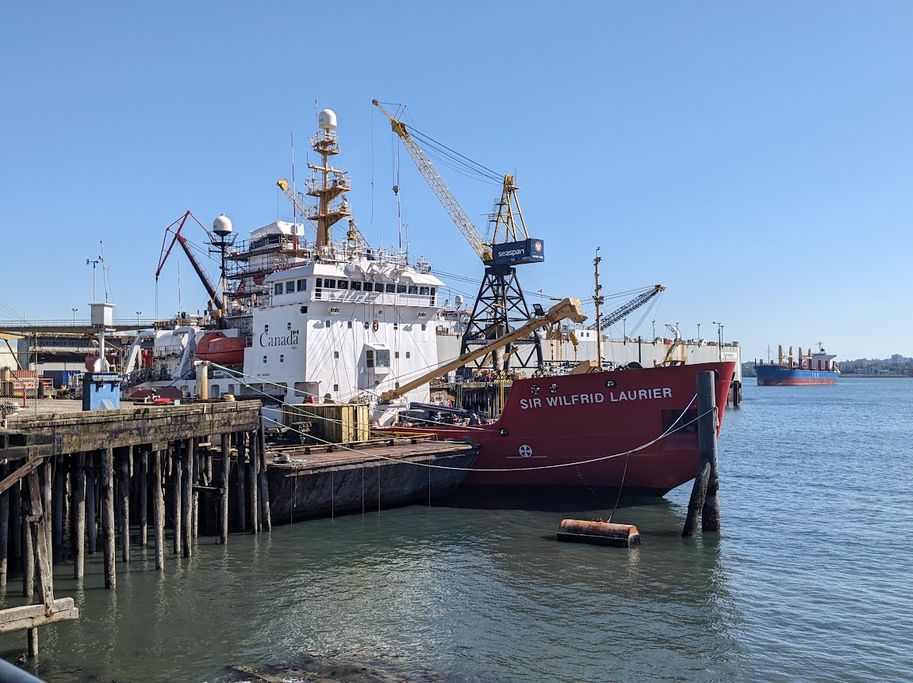

# Vancouver in May - 31 May 2024

* cyrsullivan
* Jun 13, 2024
* 1 min read

With May two weeks in the rear-view mirror, I’m a little negligent getting this post out. We spent the month of May in beautiful Vancouver, in a lovely Airbnb in Kitsilano. Our apartment was located on West Broadway, conveniently situated above a coffee shop and a chocolaterie. With great expectations for sunshine, we learned Vancouver has temperate oceanic climate. I guess, April showers bring May showers.

The month passed quickly, with much of our time spent strolling many of the neighbourhoods of Vancouver and its environs. Some of the standout walks included: Stanley Park, Lynn Canyon, Pacific Spirit Regional Park, Deep Cove, and Steveston Harbour. If you don’t mind a little drizzle, Vancouver is a great place to visit in the spring, just pack a rain coat.

"Temporary" marina just outside Stanley Park

Lion's Gate Bridge from one of the myriad of trails that crisscross Stanley Park

The lush dense forest in Lynn Canyon. Be sure to drop into the nearby Delany's Coffee House before or after your hike.

A fantastic urban forest in Kitsilano. Lush old growth rainforest, a pleasure to walk. (<https://www.vancouvertrails.com/trails/pacific-spirit-regional-park/>)

The park is riddled with kilometres of accessible trails.

Deep Cove is a picturesque little waterfront suburb of North Vancouver. The Quarry Rock Lookout is a great little hike with super views (<https://www.alltrails.com/trail/canada/british-columbia/quarry-rock-baden-powell-from-deep-cove>)

Feet from downtown Vancouver, Steveston is a working harbour that feels more like an out-port than a suburb of Vancouver. We were surprised to learn it was home to one of the largest international fish processing and canning plant at the turn of the century.