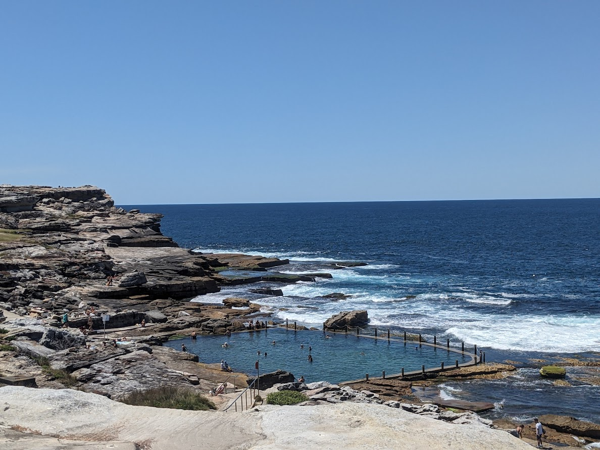
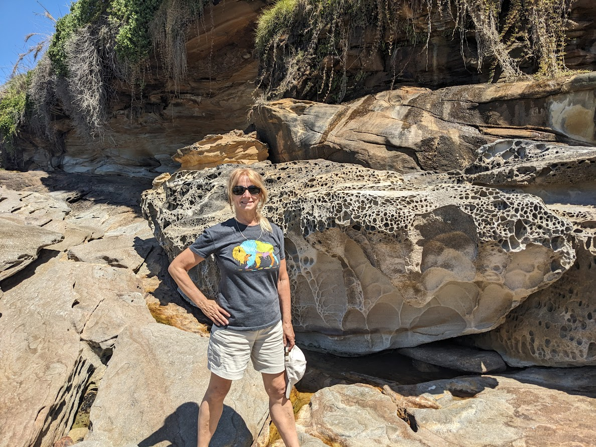
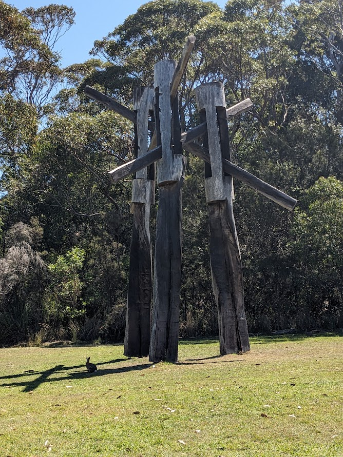
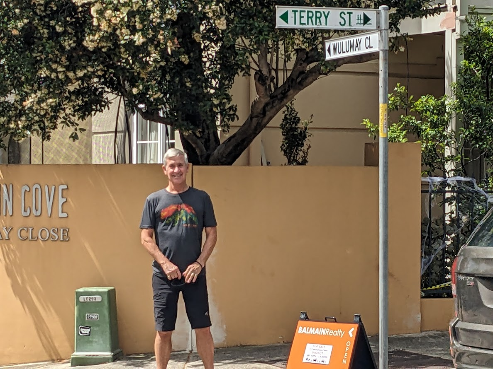
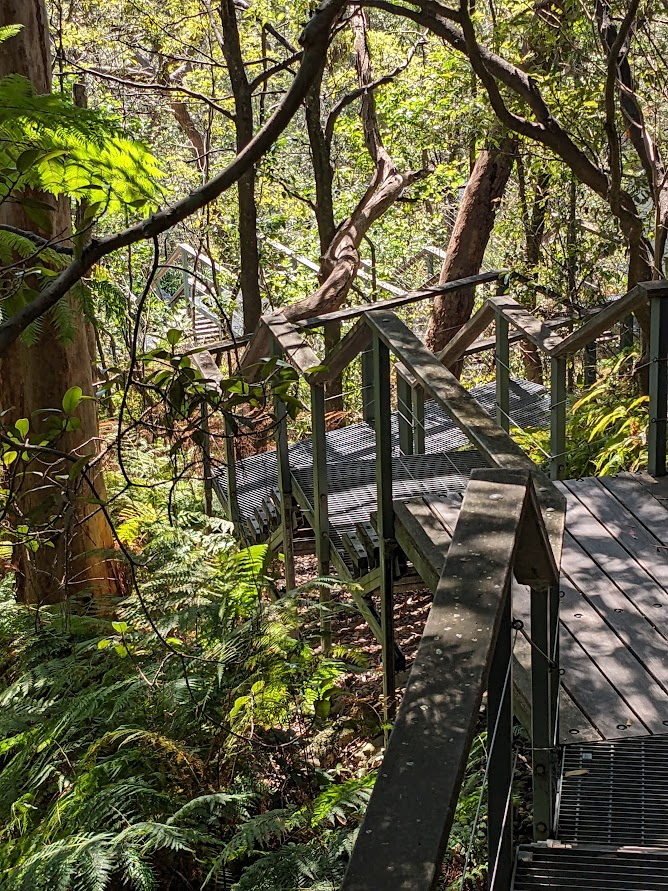
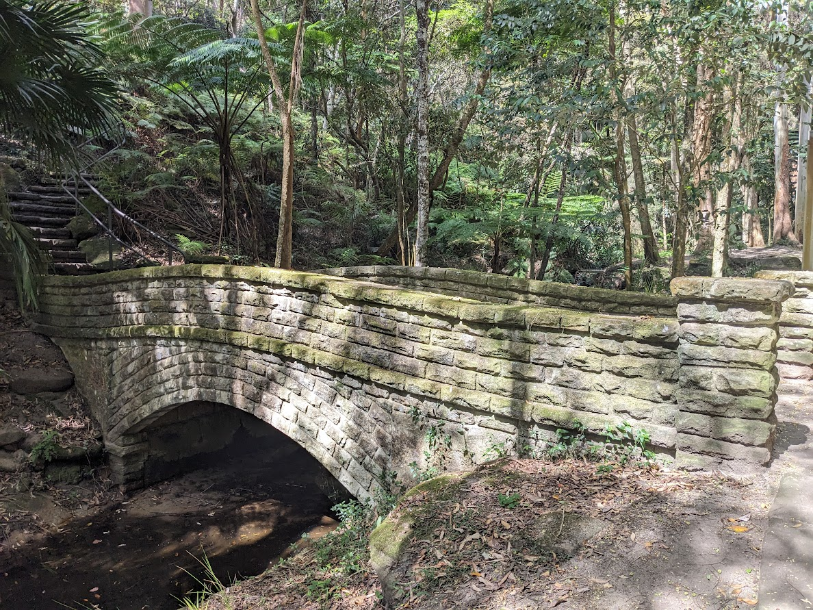
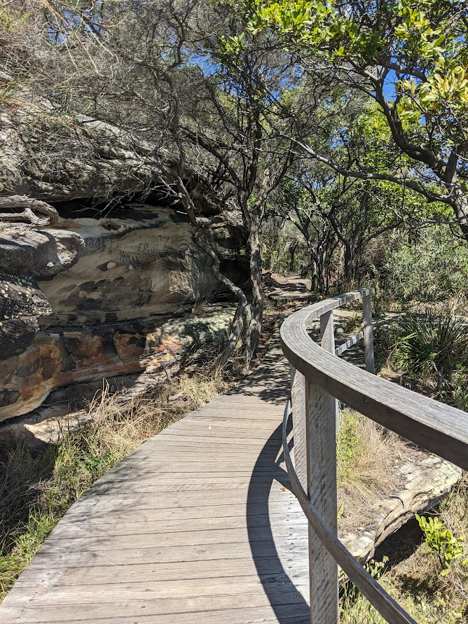

# Welcome to Chippendale - 1 Nov 2023

* cyrsullivan
* Nov 4, 2023
* 2 min read

Updated: Oct 2, 2025

Well, we've pulled up stakes in Potts Point and pitched up in Chippendale. A suburb of Sydney near the University and main train station, the neighbourhood is peppered with pubs, restaurants and coffee shops. It's very centralized and a great launch point for our daily walks and hikes.

The last couple of weeks seemed to have flown by. We've been getting out daily for walks around Sydney harbour, hikes along some of the coastal trails and just bumming around some of the many eclectic neighbourhoods of Sydney.

The coastal trail from Maroubra Beach to Coogee Beach is another section of the extended trail from Bondi Beach to Botany Bay. Like most of the trail, it is dotted with beautiful sweeping vistas, sandy beaches, ocean side saltwater pools and amazing geological formations. We stopped at the Mahon Pool pictured below and watched a couple of pods of whales splashing about around a few hundred meters off shore.

Most of the trail system is well marked but we thought we'd do a little off roading to get up close an personal with some interesting rock formations.

Along a section of trail running from the Sydney Zoo to Balmoral Beach we came across this art installation. There was no plaque or description so I guess it's left to the observer to interpret.

We took a stroll around Canada Bay, one of the many bays in Sydney Harbour, and came across Terry St. It's hard not to stop and take a picture.

Throughout most of our walks and hikes what is evident is the level of effort put into the creation and upkeep of the trails. They are consistently a pleasure to experience.

