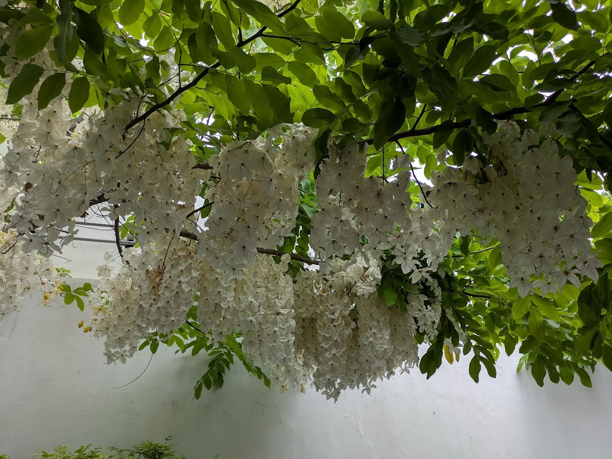
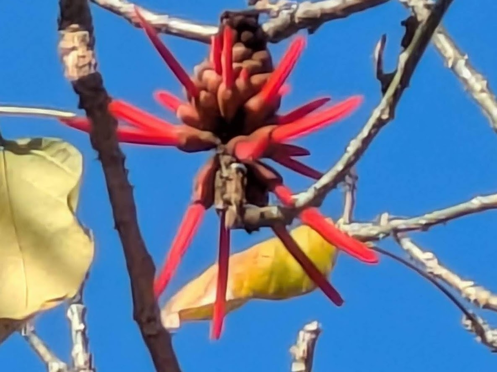

# 2025 

## Posts

::::{grid} 1 1 1 1

::: {card}Flower Fauna Food And Funny Xviii
:link:  /posts/flower-fauna-food-and-funny-xviii
:header: 
Post Date 2025-06-29

Prickly Pear and Paper flower. A great combination. Everywhere, Italy....

::: 

::: {card}Italy Spring 2025
:link:  /posts/italy-spring-2025
:header: 
Post Date 2025-06-29

After two leisurely weeks exploring beautiful Malta, we caught our flight to Sicily, Italy. Our itinerary for the next five weeks was rather full, but...

::: 

::: {card}Flora Fauna Food And Funny Xvii
:link:  /posts/flora-fauna-food-and-funny-xvii
:header: 
Post Date 2025-06-04

The Paperflower, of the bougainvillea family....

::: 

::: {card}Malta Spring 2024
:link:  /posts/malta-spring-2024
:header: 
Post Date 2025-06-03

Ah, Europe! There's nothing quite like the old-world charm found here, and Malta exudes it. On the advice of several friends, we chose a charming Airb...

::: 

::: {card}Flora Fauna Food And Funny Xvi
:link:  /posts/flora-fauna-food-and-funny-xvi
:header: 
Post Date 2025-05-20

White shower tree in Bangkok...

::: 

::: {card}Flora Fauna Food And Fun Xv
:link:  /posts/flora-fauna-food-and-fun-xv
:header: 
Post Date 2025-05-11

Tiger's Claw Tree flowering in the Sydney Botanic Garden...

::: 

::: {card}Southeast Asia April 2025
:link:  /posts/southeast-asia-april-2025
:header: 
Post Date 2025-05-11

Our next destination was Southeast Asia, a region unfamiliar to us. With great expectations we boarded our Scoot Airline flight from Sydney to Singapo...

::: 

::: {card}Here Comes Spring Sydney 2025
:link:  /posts/here-comes-spring-sydney-2025
:header: 
Post Date 2025-05-05

Following an exciting tour of Tasmania, we found ourselves back in Newcastle, NSW for a week before returning to our old haunt, Potts Point, Sydney. T...

::: 

::: {card}Flora Fauna Food And Funny Xiv Aka Tasmania
:link:  /posts/flora-fauna-food-and-funny-xiv-aka-tasmania
:header: 
Post Date 2025-04-02

Huon pine trees. They have sweet-scented timber, high in natural oil that resists rot and insects. Super valuable to boat builders....

::: 

::: {card}In Search Of The Tasmanian Devil Febuary 2025
:link:  /posts/in-search-of-the-tasmanian-devil-febuary-2025
:header: 
Post Date 2025-04-02

After multiple visits to Australia, we felt it was time to explore Van Diemen's Land, the original name for Tasmania. Historically a penal colony for ...

::: 

::: {card}Flower Fauna Food And Funny Xiii
:link:  /posts/flower-fauna-food-and-funny-xiii
:header: 
Post Date 2025-03-11

Beauties at the Sydney Botanic!...

::: 

::: {card}Back In Potts Point Sydney Jan Feb 2025
:link:  /posts/back-in-potts-point-sydney-jan-feb-2025
:header: 
Post Date 2025-03-07

Following an exciting month in South America and a smooth flight over the South Pacific, we  arrived back in Sydney, Australia. As planned, we headed ...

::: 

::: {card}Flora Fauna Food And Funny Xii
:link:  /posts/flora-fauna-food-and-funny-xii
:header: 
Post Date 2025-02-19

The united colours of Patagonia...

::: 

::: {card}Touring South America Winter 2024
:link:  /posts/touring-south-america-winter-2024
:header: 
Post Date 2025-02-05

Following a hectic three weeks in Ottawa managing personal affairs and reconnecting with friends and family, including a Cyr Family Christmas in Cobou...

::: 

::: {card}Flower Fauna Food And Fun X
:link:  /posts/flower-fauna-food-and-fun-x
:header: 
Post Date 2025-02-04

This crane has had enough of the pond....

::: 

::: {card}Flower Fauna Food And Funny Xi
:link:  /posts/flower-fauna-food-and-funny-xi
:header: 
Post Date 2025-02-04

Dragon Tree in La Linea, Spain near Gibalter....

::: 

::::
